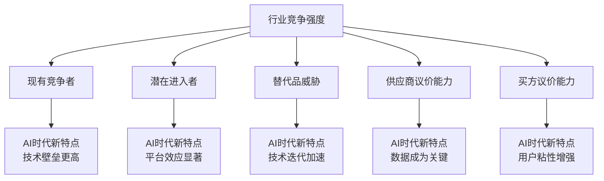
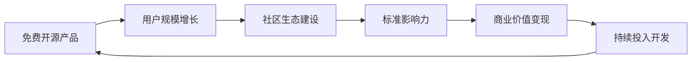
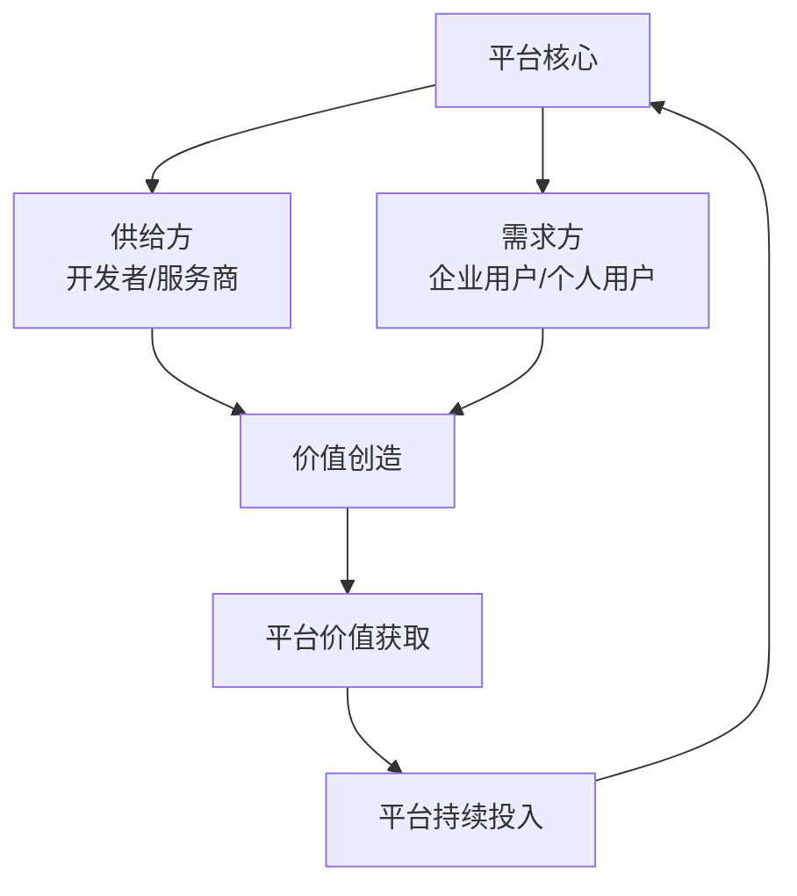
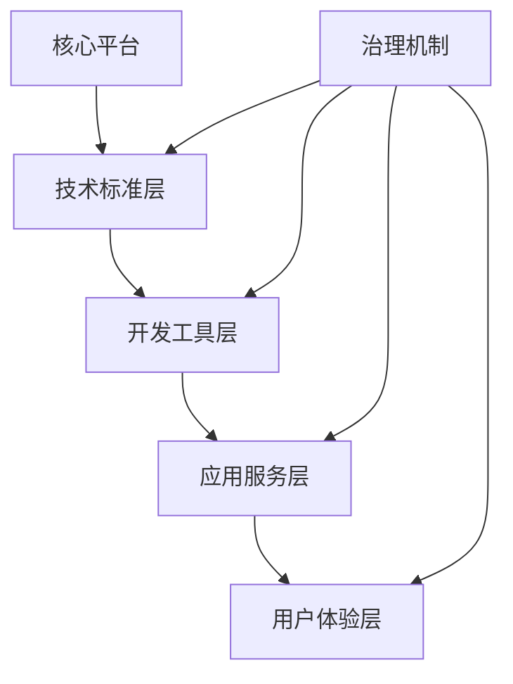
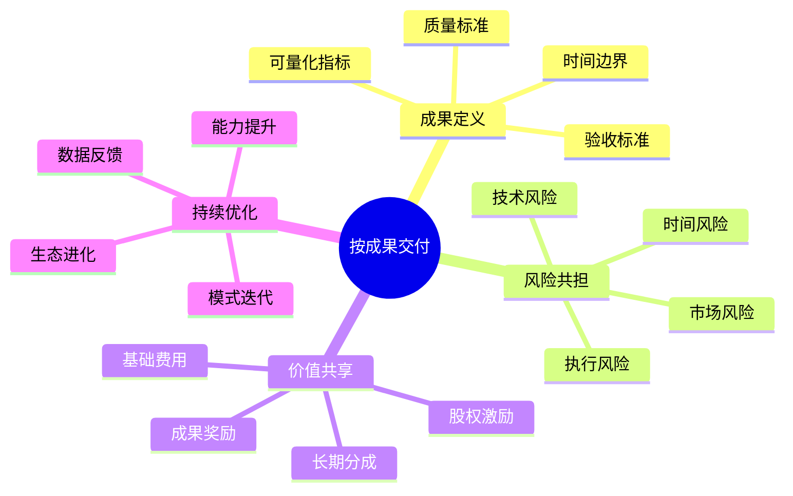
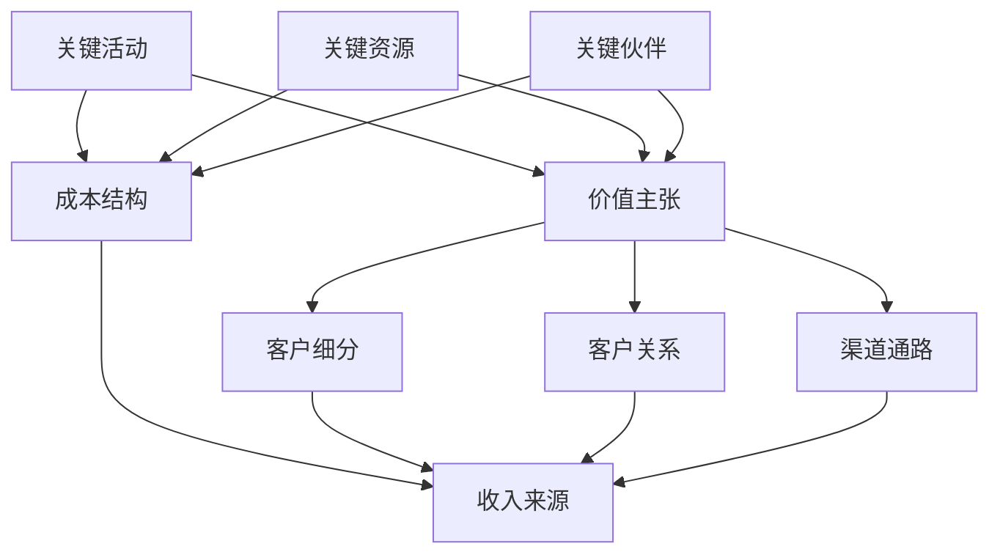
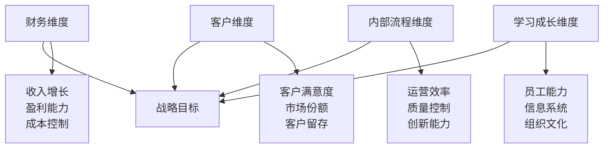
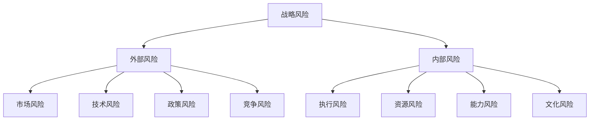
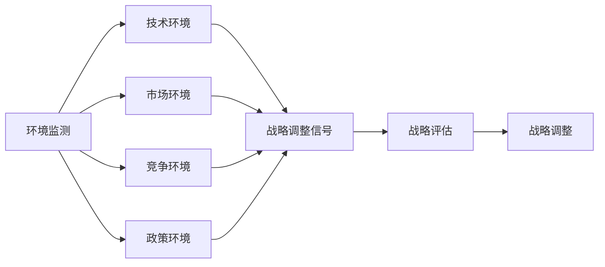

# 商业战略知识体系

## 🎯 现代商业战略理论基础

### 战略思维的演进
**从工业时代到数字时代的战略转变**
- **工业时代**：规模经济、垂直整合、成本领先
- **信息时代**：核心竞争力、价值链、差异化
- **数字时代**：平台经济、生态系统、网络效应
- **AI时代**：数据驱动、智能化、按成果交付

### 核心战略框架

#### 波特五力模型的现代应用

#### 价值链重构理论
- **传统价值链**：线性价值创造过程
- **价值网络**：多方协作的价值创造
- **价值生态系统**：自组织的价值创造网络
- **按成果交付模式**：以结果为导向的价值交付

## 📊 开源商业战略专论

### 开源商业模式的战略逻辑

#### 开源价值创造机制

#### 开源商业化路径
1. **技术服务模式**：RedHat模式，提供企业级支持服务
2. **双许可模式**：MySQL模式，开源版本+商业许可
3. **SaaS化模式**：GitLab模式，开源软件+云服务
4. **平台生态模式**：Docker模式，开源标准+生态变现
5. **按成果交付模式**：COSE模式，标准化+成果保证

### 开源项目的竞争战略

#### 差异化竞争策略
- **技术差异化**：独特的技术架构和创新
- **生态差异化**：更完善的开发者生态
- **标准差异化**：成为行业标准的制定者
- **服务差异化**：更好的用户体验和服务

#### 成本领先策略
- **开发成本优势**：开源协作降低开发成本
- **运营成本优势**：社区自治降低运营成本
- **获客成本优势**：免费产品降低获客成本
- **维护成本优势**：社区贡献降低维护成本

## 🌐 平台战略与生态系统

### 平台商业模式设计

#### 双边市场理论

#### 网络效应类型
- **直接网络效应**：用户越多，对每个用户价值越大
- **间接网络效应**：一边用户增加，提升另一边用户价值
- **数据网络效应**：用户越多，数据越丰富，产品越智能
- **社会网络效应**：用户的社交网络增强产品价值

### 生态系统治理

#### 生态系统架构设计

#### 治理机制设计
- **技术治理**：代码贡献、版本管理、质量标准
- **社区治理**：社区规则、冲突解决、激励机制
- **商业治理**：合作伙伴管理、收入分配、知识产权
- **生态治理**：生态规则、准入标准、退出机制

## 💡 商业模式创新

### 按成果交付模式深度解析

#### 模式核心要素

#### 实施关键要素
- **成果标准化**：建立可量化的成果评估体系
- **能力标准化**：通过标准化保证交付能力
- **流程标准化**：标准化的项目管理和交付流程
- **质量标准化**：统一的质量控制和保证机制

### 创新商业模式评估

#### 商业模式画布

#### 模式创新评估标准
- **价值创造评估**：是否创造了新的价值
- **差异化评估**：是否具有明显的差异化优势
- **可持续性评估**：是否具有长期可持续性
- **可扩展性评估**：是否具有规模化潜力
- **可防御性评估**：是否具有竞争壁垒

## 🎯 战略执行与管理

### 战略执行框架

#### 平衡计分卡方法

#### OKR目标管理
- **目标设定**：明确、可衡量、有挑战性
- **关键结果**：量化的成果指标
- **定期回顾**：季度回顾和调整
- **透明公开**：全组织透明的目标管理

### 战略风险管理

#### 风险识别框架

#### 风险应对策略
- **风险规避**：避免高风险的战略选择
- **风险缓解**：采取措施降低风险概率和影响
- **风险转移**：通过保险、合作等方式转移风险
- **风险接受**：在风险可控的情况下接受风险

## 📈 战略绩效评估

### 关键绩效指标体系

#### 财务指标
- **收入增长率**：年度收入增长百分比
- **毛利率**：毛利润占收入的比例
- **净利率**：净利润占收入的比例
- **ROI/ROE**：投资回报率/净资产收益率

#### 市场指标
- **市场份额**：在目标市场中的占有率
- **客户获取成本**：获得新客户的平均成本
- **客户生命周期价值**：客户在整个生命周期的价值
- **客户满意度**：客户对产品服务的满意程度

#### 运营指标
- **运营效率**：关键运营流程的效率指标
- **质量指标**：产品质量和服务质量指标
- **创新指标**：研发投入、新产品收入占比等
- **员工指标**：员工满意度、流失率、能力发展

### 战略调整机制

#### 环境监测系统

#### 战略调整原则
- **数据驱动**：基于客观数据进行调整
- **快速响应**：对环境变化快速响应
- **渐进调整**：避免剧烈的战略变化
- **学习导向**：从调整中学习和改进 