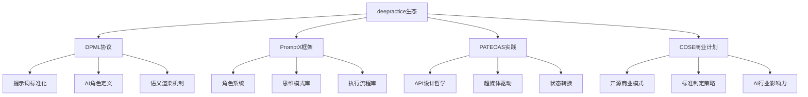
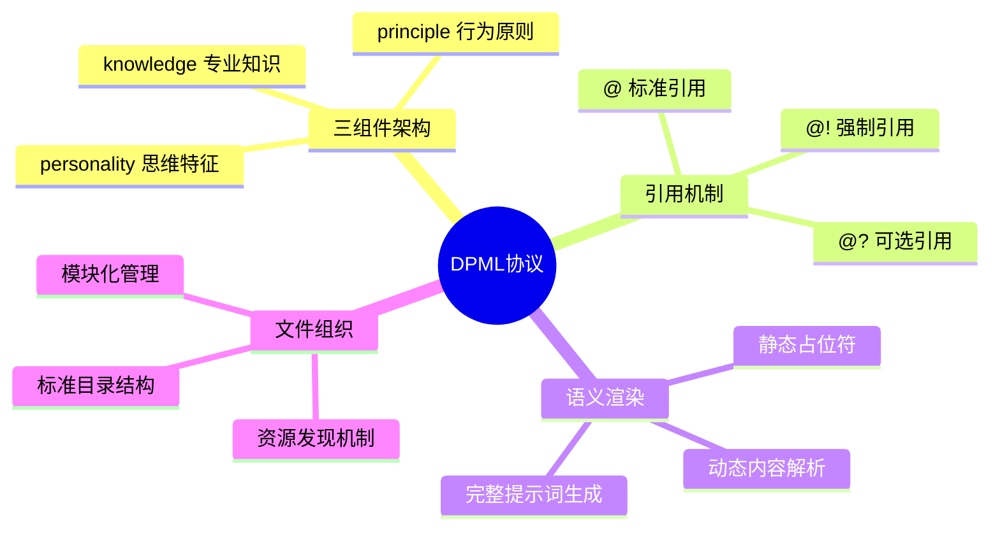
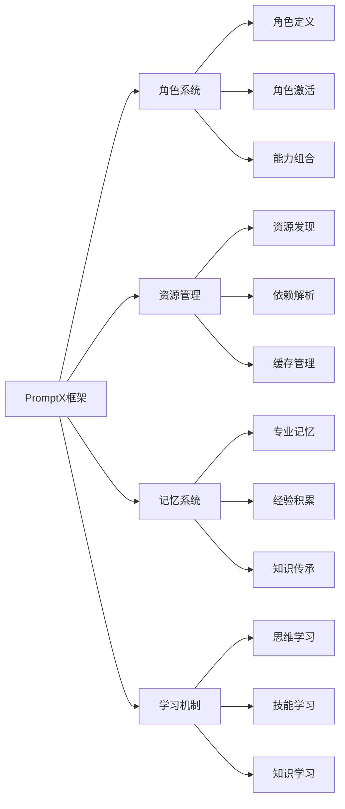
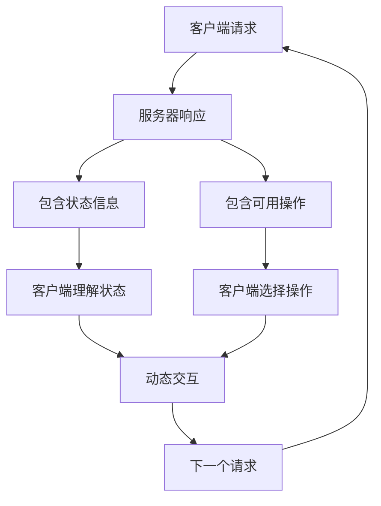
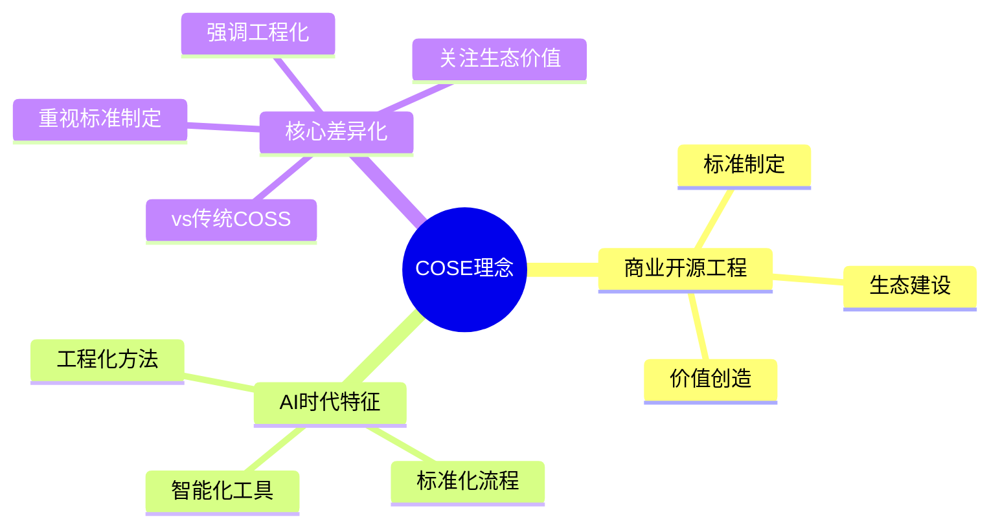
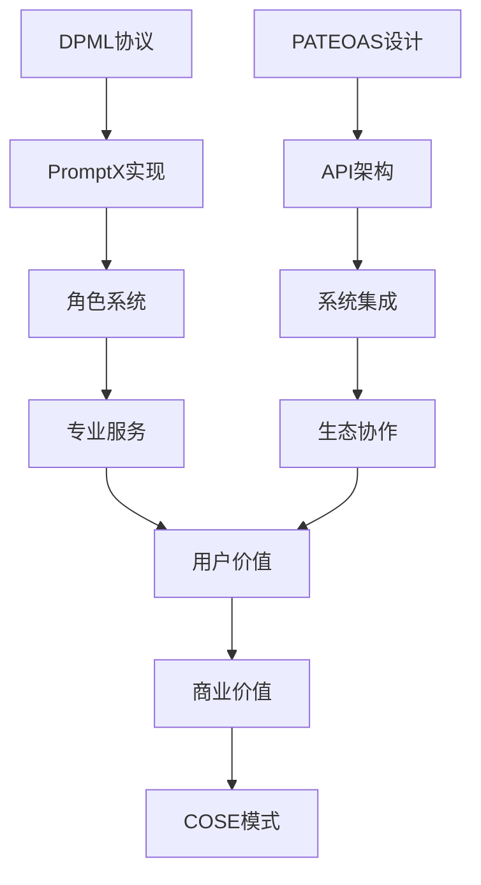

# deepractice生态系统知识库

## 🌟 深度实践(deepractice)项目概览

deepractice是一个专注于AI时代软件工程实践创新的开源组织，致力于建立AI原生的开发标准和工具链。

### 核心项目架构

## 📋 DPML协议深度解析

### 核心设计理念
DPML (Deepractice Markup Language) 是一种专为AI提示词设计的标记语言，旨在解决AI提示词工程中的标准化、模块化、复用性问题。

### 技术架构特色

### 核心价值主张
1. **标准化**：建立AI提示词的行业标准
2. **模块化**：实现提示词的组件化复用
3. **可维护性**：通过结构化提升维护效率
4. **可扩展性**：支持复杂AI应用的构建

### 技术实现要点
- **XML语法基础**：采用标准XML语法确保解析一致性
- **三层架构**：personality/principle/knowledge分层设计
- **引用系统**：通过@引用机制实现模块化组织
- **渲染引擎**：支持静态到动态的语义转换

## 🚀 PromptX框架详解

### 项目定位
PromptX是基于DPML协议的AI角色管理框架，实现AI专业能力的模块化和可复用。

### 核心特性

### 角色系统架构
- **角色库**：预置专业角色，涵盖各行业专家
- **自定义角色**：支持用户创建个性化AI角色
- **角色激活**：一键激活专业能力，获得专家级服务
- **记忆系统**：跨会话的专业记忆和经验积累

### 技术创新点
1. **女娲系统**：AI角色创造专家，实现角色的智能生成
2. **三层能力模型**：思维-行为-知识的完整能力映射
3. **模块化设计**：通过组件组合实现复杂专业能力
4. **跨平台兼容**：支持多种AI模型和应用场景

## 🏗️ PATEOAS设计模式

### 概念解释
PATEOAS (Presentation of Actions Through Examination Of Application State) 是一种RESTful API设计模式，强调应用状态的超媒体驱动。

### 设计理念

### 核心优势
1. **自描述性**：API响应包含完整的状态和操作信息
2. **松耦合**：客户端不需要预先知道所有API端点
3. **动态性**：支持API的动态演化和扩展
4. **可发现性**：通过超媒体链接实现API的自发现

### 实践应用
- **API设计**：每个响应都包含相关操作的链接
- **状态管理**：通过超媒体表达应用状态转换
- **客户端简化**：减少客户端的硬编码依赖
- **系统演化**：支持API的渐进式演化

### deepractice中的PATEOAS实践
- **PromptX API**：角色激活、资源发现等API遵循PATEOAS设计
- **文档系统**：通过超媒体链接组织文档结构
- **工具集成**：支持工具间的动态集成和协作

## 🎯 COSE商业计划

### 项目概念
COSE (Commercial Open Source Engineering) 是deepractice提出的开源商业工程概念，旨在建立AI时代的开源商业标准。

### 核心理念

### 战略意义
1. **标准制定者身份**：建立AI行业的技术标准
2. **生态系统建设**：打造完整的技术生态
3. **商业模式创新**：探索开源项目的可持续发展
4. **行业影响力**：成为AI技术领域的意见领袖

## 🔗 项目间协同关系

### 技术协同

### 发展路径
1. **技术基础阶段**：DPML协议确立技术标准
2. **工具实现阶段**：PromptX提供实用工具
3. **生态建设阶段**：PATEOAS支持系统集成
4. **商业化阶段**：COSE探索可持续模式

### 市场定位
- **技术创新**：解决AI应用开发中的实际问题
- **标准制定**：推动行业标准的建立和普及
- **生态建设**：构建完整的技术生态系统
- **商业价值**：创造可持续的商业价值

## 📈 发展趋势和未来规划

### 短期目标 (6-12个月)
- DPML协议标准化和推广
- PromptX用户社区建设
- 核心工具功能完善
- 初步商业化探索

### 中期目标 (1-2年)
- 成为AI提示词领域的事实标准
- 建立活跃的开发者生态
- 形成可持续的商业模式
- 获得行业广泛认可

### 长期愿景 (3-5年)
- 成为AI应用开发的基础设施
- 推动整个行业的标准化进程
- 建立全球性的技术影响力
- 实现商业价值和社会价值的统一 