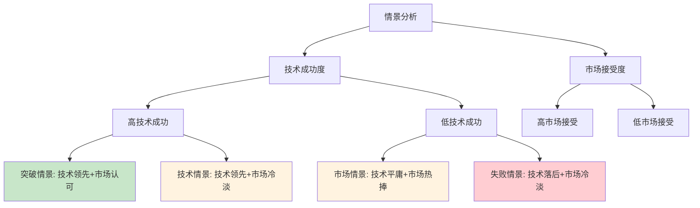
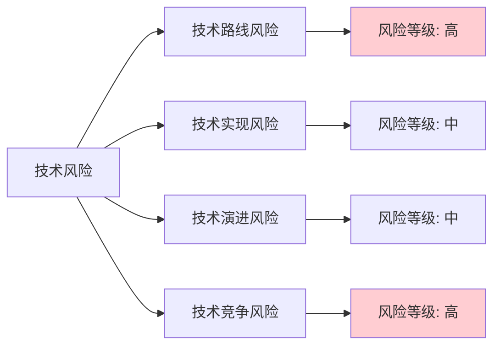
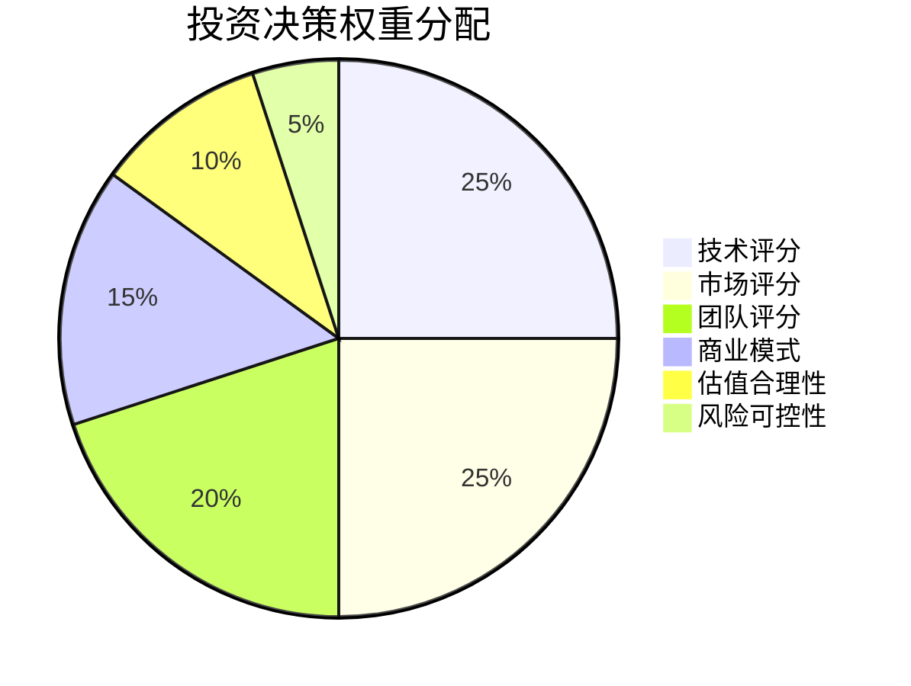
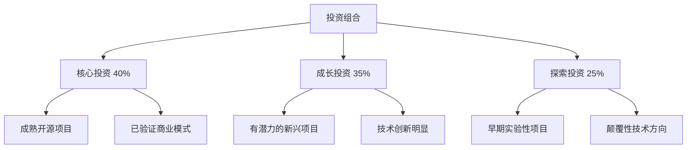
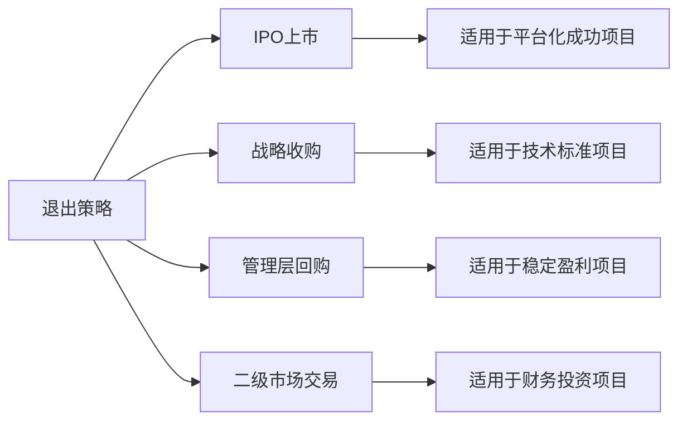
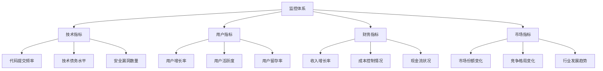

# 投资框架知识体系

## 🎯 开源项目投资理论基础

### 开源经济学原理
**开源悖论**：免费产品如何创造商业价值？
- **用户价值 ≠ 货币价值**：免费获得用户，付费获得价值
- **网络效应驱动**：用户越多，价值越大，形成正向循环
- **平台经济特征**：双边市场，连接开发者和企业用户
- **数据飞轮效应**：使用产生数据，数据改进产品，产品吸引更多用户

### 标准制定者的商业逻辑
**标准 = 规则 = 权力**
- **Docker案例**：容器标准 → 企业服务 → 云原生生态主导
- **Kubernetes案例**：编排标准 → 云服务差异化 → 平台价值变现
- **GraphQL案例**：API标准 → 开发者工具 → 企业级解决方案

## 📊 估值方法论体系

### 1. 传统估值方法的适配性

#### DCF模型的开源适配
```
修正DCF = Σ(CFt / (1+r)^t) + 期权价值 + 平台溢价

关键调整：
- CFt：考虑开源特殊性的现金流预测
- r：开源项目风险溢价调整
- 期权价值：标准化、平台化的期权价值
- 平台溢价：网络效应带来的价值溢价
```

#### 市场倍数法的开源应用
**可比公司选择标准**
- **技术相似性**：同类技术标准或开源项目
- **商业模式相似性**：开源 → 商业化路径相似
- **市场定位相似性**：面向开发者或企业的基础设施
- **发展阶段相似性**：相同发展阶段的估值倍数

**关键倍数指标**
- **P/S倍数**：收入倍数（考虑开源项目收入确认特殊性）
- **EV/用户**：企业价值/活跃用户数
- **EV/开发者**：企业价值/开发者用户数
- **P/B倍数**：考虑无形资产价值的账面价值倍数

### 2. 开源项目特殊估值方法

#### 社区价值评估模型
```
社区价值 = 开发者数量 × 活跃度系数 × 贡献质量系数 × 单用户价值

其中：
- 开发者数量：GitHub stars, forks, contributors
- 活跃度系数：commit频率、issue活跃度、PR数量
- 贡献质量系数：代码质量、文档完整性、测试覆盖率
- 单用户价值：基于可比项目的开发者价值基准
```

#### 技术资产评估模型
```
技术价值 = 开发成本 + 创新溢价 + 标准化溢价

开发成本 = 开发工时 × 平均薪资 × 复杂度系数
创新溢价 = 技术创新度 × 行业平均技术溢价
标准化溢价 = 成为标准概率 × 标准垄断价值
```

#### 平台期权价值模型
```
期权价值 = Max(0, S-K) × P × e^(-rT)

其中：
- S：标准化成功后的项目价值
- K：达到标准化所需的投资成本
- P：标准化成功的概率
- r：无风险利率
- T：标准化所需时间
```

### 3. 多情景分析框架

#### 四象限情景矩阵


**情景概率分配**
- **突破情景（15%）**：成为行业标准，获得垄断地位
- **技术情景（25%）**：技术领先但市场接受缓慢
- **市场情景（35%）**：市场需求强烈但技术优势不明显
- **失败情景（25%）**：技术和市场都未达预期

## 🎯 风险评估框架

### 1. 系统性风险分类

#### 技术风险矩阵


#### 市场风险评估
- **需求验证风险**：市场对标准化需求的真实性和紧迫性
- **时机风险**：进入市场时机的把握，过早或过晚的风险
- **接受度风险**：目标用户对新标准的接受程度和切换意愿
- **竞争风险**：现有竞争对手和潜在进入者的威胁

### 2. 风险量化方法

#### 蒙特卡洛模拟
```python
# 伪代码示例
def monte_carlo_valuation(scenarios=10000):
    results = []
    for i in range(scenarios):
        # 随机抽样关键变量
        user_growth = random.normal(mean=0.5, std=0.2)
        market_size = random.normal(mean=100, std=30)
        success_prob = random.beta(alpha=2, beta=5)
        
        # 计算情景价值
        value = calculate_value(user_growth, market_size, success_prob)
        results.append(value)
    
    return {
        'mean': np.mean(results),
        'std': np.std(results),
        'percentiles': np.percentile(results, [10, 25, 50, 75, 90])
    }
```

#### 敏感性分析
**关键变量影响度排序**
1. **标准化成功概率**：影响度 40%
2. **用户增长率**：影响度 25%
3. **市场规模**：影响度 20%
4. **竞争强度**：影响度 10%
5. **技术实现成本**：影响度 5%

## 💼 投资决策框架

### 1. 投资决策矩阵

#### 评分权重体系


#### 决策阈值设定
- **80分以上**：强烈推荐投资，核心项目
- **70-79分**：推荐投资，重点关注项目
- **60-69分**：谨慎考虑，需要额外验证
- **60分以下**：不推荐投资，风险过高

### 2. 投资组合策略

#### 风险分散原则


#### 阶段性投资策略
- **种子期**：技术验证 + 团队组建
- **成长期**：市场验证 + 用户获取
- **扩张期**：商业化 + 生态建设
- **成熟期**：平台化 + 价值变现

## 📈 价值创造策略

### 1. 投后价值创造

#### 战略支持
- **技术指导**：技术架构优化、代码质量提升
- **市场拓展**：用户获取、合作伙伴发展
- **团队建设**：人才招聘、组织架构优化
- **资源整合**：行业资源、投资人网络

#### 运营支持
- **产品优化**：用户体验改进、功能迭代
- **社区建设**：开发者社区运营、生态伙伴发展
- **品牌建设**：技术影响力、行业认知度提升
- **商业化指导**：商业模式优化、收入模式设计

### 2. 退出策略设计

#### 退出路径选择


#### 退出时机判断
- **技术成熟度**：技术标准确立，市场地位稳固
- **商业化程度**：收入规模和增长率达到预期
- **市场环境**：资本市场对该类项目的接受度
- **竞争格局**：在竞争中的相对地位和优势

## 🔄 持续优化机制

### 1. 投资后监控体系

#### 关键指标监控


#### 预警机制
- **红色预警**：关键指标严重偏离预期，需要立即干预
- **黄色预警**：指标出现不良趋势，需要密切关注
- **绿色正常**：各项指标健康，按计划发展

### 2. 投资策略迭代

#### 经验总结机制
- **成功案例分析**：总结成功投资的关键因素
- **失败案例复盘**：分析失败原因，优化决策流程
- **市场变化适应**：根据市场变化调整投资策略
- **方法论升级**：持续完善估值方法和风险评估体系

#### 知识库建设
- **行业数据库**：积累行业数据和标杆案例
- **专家网络**：建立技术专家和行业专家网络
- **工具平台**：开发投资分析和决策支持工具
- **最佳实践**：形成标准化的投资流程和方法 