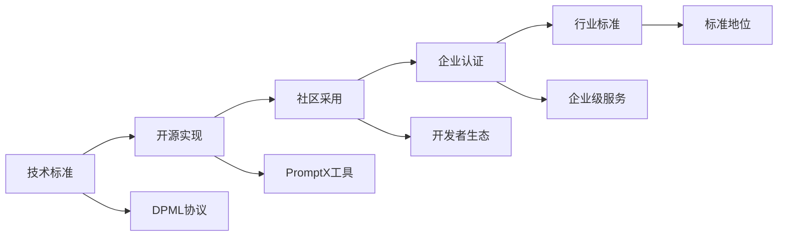

# 标准制定策略 (Standard Strategy)

> 通过开源工程化建立AI应用开发的行业标准

## 🎯 战略概览

### 核心理念
**不是在做产品，而是在按成果交付标准**

COSE采用"Commercial Open Source Engineering"模式，通过工程化手段建立AI应用开发的统一标准，成为行业的"规则制定者"。

### 标准制定路径


## 🏗️ 核心技术架构

### DPML协议框架
- **角色定义标准**：统一的AI角色描述语言
- **思维模式标准**：标准化的推理和决策模式
- **执行流程标准**：可重复的任务执行流程
- **知识体系标准**：结构化的专业知识表示

### PromptX参考实现
- **命令行工具**：开发者友好的CLI工具
- **IDE插件**：主流开发环境集成
- **云端服务**：企业级部署和管理
- **调试框架**：完整的测试和调试工具链

## 🚀 Dogfooding展示

查看 [`.promptx/`](../.promptx/) 目录 - **技术实力的活证据**：

```
.promptx/
├── resource/domain/strategic-investment-advisor/
│   ├── strategic-investment-advisor.role.md
│   ├── thought/
│   ├── execution/
│   └── knowledge/
└── memory/declarative.md
```

> *"Talk is cheap. Show me the code."* - Linus Torvalds
> 
> 我们不只是谈论AI标准，我们正在用自己的标准构建专业AI应用。

## 🎯 采用策略

### 三阶段推广
1. **标准确立期 (0-12个月)**
   - 技术完善和社区建设
   - 核心开发者群体培养
   - 基础工具链完善

2. **生态扩张期 (12-36个月)**
   - 企业客户采用
   - 生态伙伴发展
   - 标准认知度提升

3. **价值变现期 (36个月+)**
   - 商业化服务
   - 平台价值实现
   - 行业标准地位确立

## 📊 成功指标

### 技术指标
- **协议完整性**：DPML 1.0规范发布
- **工具成熟度**：PromptX工具链稳定版本
- **性能基准**：与现有方案的效率对比

### 社区指标
- **开发者采用**：GitHub Stars, Forks, Contributors
- **社区活跃度**：Issues, PRs, 讨论参与度
- **内容贡献**：文档、教程、案例研究

### 商业指标
- **企业采用**：付费客户数量和规模
- **标准认知**：行业会议、媒体报道
- **生态发展**：第三方工具和服务

---

📖 **详细内容导航**
- [DPML框架设计](dpml-framework.md) - 核心协议技术规范
- [PromptX标准实现](promptx-implementation.md) - 参考实现详解
- [采用路线图](adoption-roadmap.md) - 市场推广计划
- [生态系统设计](ecosystem-design.md) - 开发者生态建设 