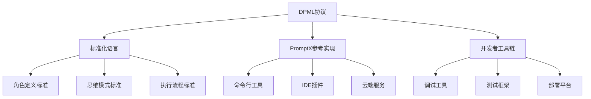
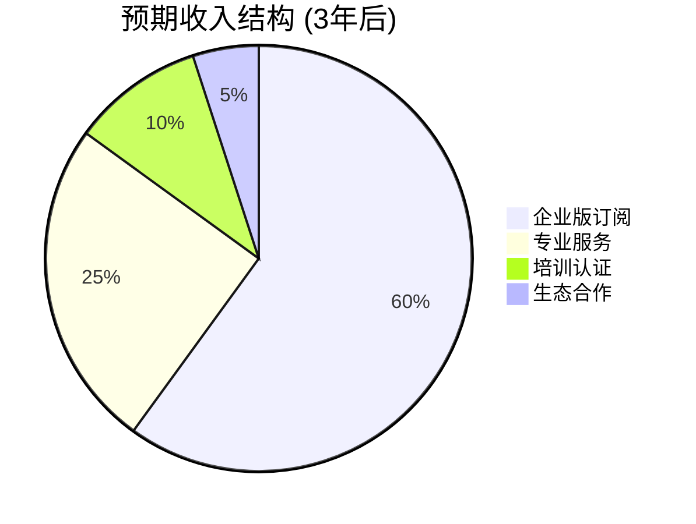
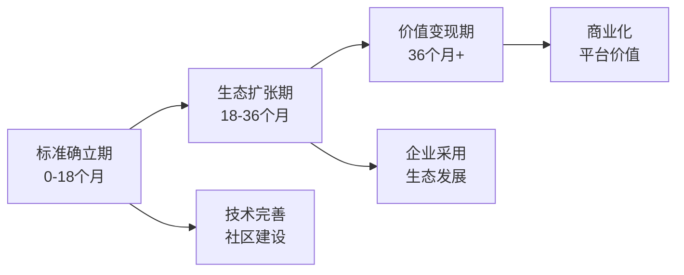
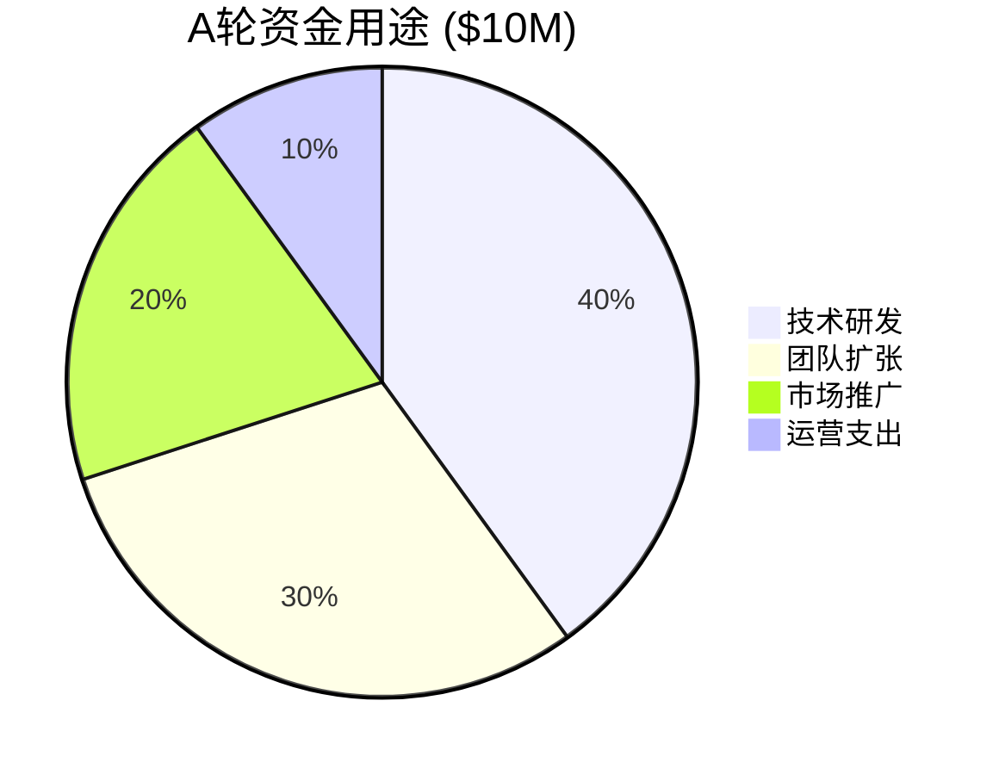

# COSE 投资商业计划书结构

## 📋 执行摘要 (Executive Summary)
### 核心价值主张
- **一句话描述**：COSE是AI应用开发的Docker，通过DPML协议建立行业标准
- **市场机会**：万亿级AI应用市场急需统一开发标准
- **解决方案**：开源驱动的标准制定 + 企业级商业化服务
- **竞争优势**：先发优势 + 开源基因 + 技术领先性
- **财务预测**：3年内ARR达到$50M，5年内IPO或被收购

## 🎯 问题与机会 (Problem & Opportunity)
### 市场痛点
- **碎片化严重**：各自为政，互操作性差，开发效率低下
- **标准缺失**：没有统一的AI应用开发标准和最佳实践
- **技术孤岛**：工具链分散，学习成本高，维护困难
- **质量参差**：缺乏标准化导致应用质量不一致

### 市场机会
- **市场规模**：AI应用开发工具市场预计2027年达到$500B
- **增长趋势**：年复合增长率35%，处于爆发式增长期
- **时机窗口**：AI标准化需求的临界爆发点
- **竞争空白**：标准制定者位置尚无明确领导者

## 💡 解决方案 (Solution)
### 技术架构

### 产品矩阵
- **DPML协议**：开源标准，免费使用
- **PromptX工具**：开源参考实现，社区版免费
- **企业版服务**：商业化产品，付费订阅
- **专业服务**：培训、咨询、定制开发

## 📈 商业模式 (Business Model)
### 收入模式

### 定价策略
- **开源免费**：DPML协议和基础工具完全开源
- **增值服务**：企业级功能、支持、培训等付费
- **生态分成**：第三方工具和服务的平台分成
- **标准授权**：大型企业的标准使用授权费

## 🏆 竞争分析 (Competition)
### 竞争格局
| 竞争对手 | 优势 | 劣势 | 我们的差异化 |
|---------|------|------|-------------|
| OpenAI API | 技术领先 | 封闭生态 | 开源标准化 |
| Anthropic | 安全性好 | 单一产品 | 全栈解决方案 |
| Google AI | 资源丰富 | 大厂封闭 | 社区驱动 |
| Microsoft | 生态完整 | 商业导向 | 开发者优先 |

### 竞争优势
- **先发优势**：率先提出AI应用开发标准概念
- **开源基因**：社区驱动，避免厂商锁定
- **技术创新**：DPML协议的独特性和先进性
- **生态思维**：构建完整的开发者生态系统

## 👥 团队介绍 (Team)
### 核心团队
- **CEO/CTO**：技术背景，开源项目经验
- **首席架构师**：DPML协议设计者
- **社区负责人**：开源社区运营专家
- **商业化负责人**：企业服务和商业化经验

### 顾问团队
- **技术顾问**：AI领域知名专家
- **商业顾问**：开源商业化成功案例
- **投资顾问**：熟悉基础设施投资

## 📊 市场策略 (Go-to-Market)
### 三阶段策略

### 用户获取策略
- **开发者社区**：GitHub、技术会议、开源贡献
- **企业客户**：直销团队、合作伙伴渠道
- **生态伙伴**：工具厂商、云服务商、系统集成商
- **品牌建设**：技术影响力、行业认知度

## 💰 财务预测 (Financial Projections)
### 5年财务预测
| 年份 | 用户数 | ARR | 毛利率 | 净利率 |
|------|--------|-----|--------|--------|
| Y1 | 10K | $2M | 70% | -50% |
| Y2 | 50K | $10M | 75% | -20% |
| Y3 | 200K | $50M | 80% | 10% |
| Y4 | 500K | $150M | 82% | 20% |
| Y5 | 1M | $300M | 85% | 25% |

### 关键指标
- **用户增长率**：月均20%增长
- **付费转化率**：5%（开源到付费）
- **客户留存率**：95%（企业客户）
- **获客成本**：$500（企业客户）

## 🎯 资金需求 (Funding)
### 融资计划
- **种子轮**：$2M（已完成/进行中）
- **A轮**：$10M（技术完善+团队扩张）
- **B轮**：$30M（市场扩张+国际化）
- **C轮**：$80M（生态建设+并购）

### 资金用途

## 📈 发展里程碑 (Milestones)
### 关键里程碑
- **6个月**：DPML 1.0发布，1000+开发者
- **12个月**：企业版上线，10+付费客户
- **18个月**：生态伙伴10+，ARR $5M
- **24个月**：国际化启动，ARR $20M
- **36个月**：IPO准备，ARR $100M

## 🚀 退出策略 (Exit Strategy)
### 退出路径
- **IPO上市**：3-5年后，ARR达到$100M+
- **战略收购**：被云服务商或大型软件公司收购
- **管理层回购**：如果发展稳定，考虑MBO

### 可比案例估值
- **Docker**：$20亿估值（容器标准）
- **Kubernetes**：被Google收购后价值$100亿+
- **GraphQL**：Facebook开源后生态价值$50亿+

## 🔍 风险分析 (Risk Analysis)
### 主要风险
- **技术风险**：DPML协议的技术路线选择
- **市场风险**：开发者和企业的接受度
- **竞争风险**：大厂推出竞争性标准
- **执行风险**：团队扩张和运营管理

### 风险缓解
- **技术多样化**：支持多种AI模型和平台
- **用户验证**：持续的用户调研和反馈
- **差异化定位**：强化开源社区优势
- **团队建设**：引入有经验的管理团队

## 📞 联系方式 (Contact)
- **项目网站**：https://github.com/deepractice/COSE
- **创始人邮箱**：[创始人邮箱]
- **商务合作**：[商务邮箱]
- **投资咨询**：认同COSE理念的投资人，欢迎通过Issues深度交流 