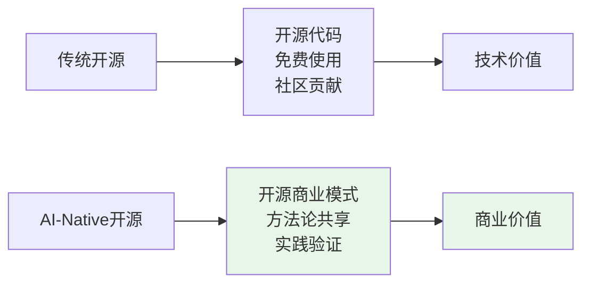
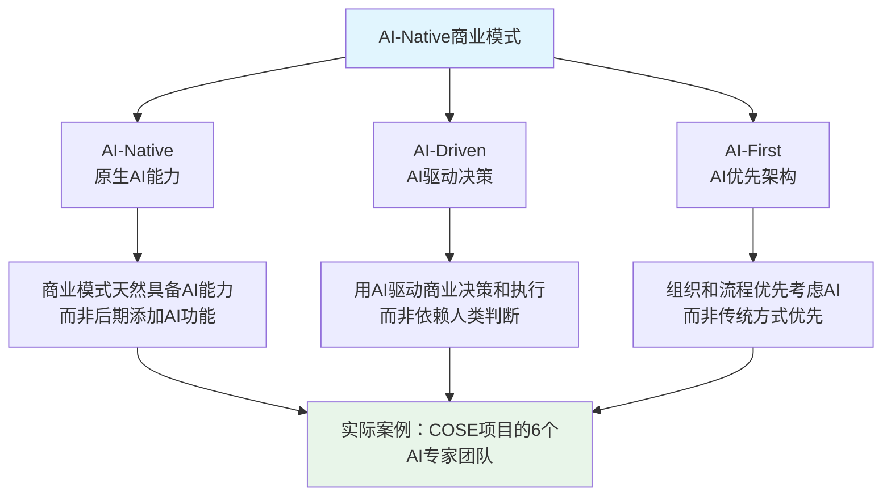
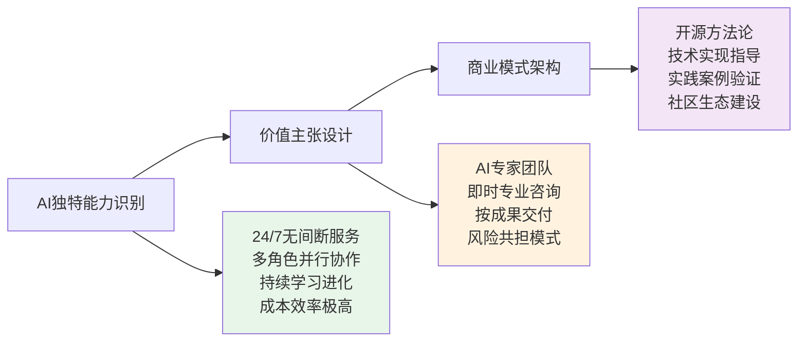
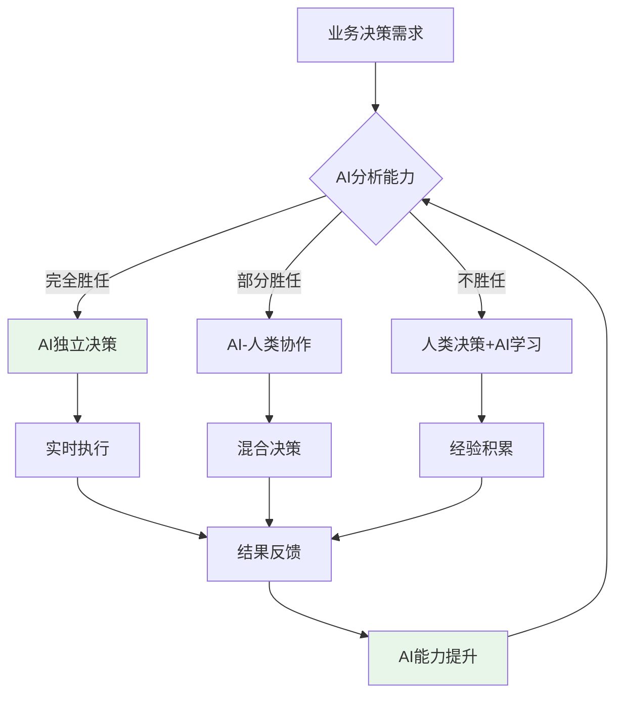
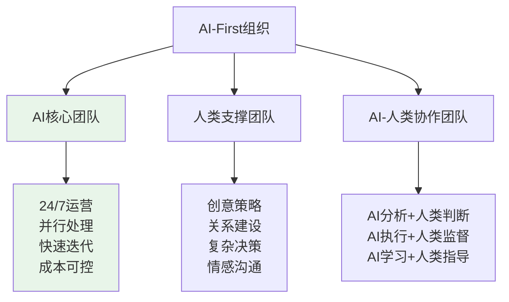
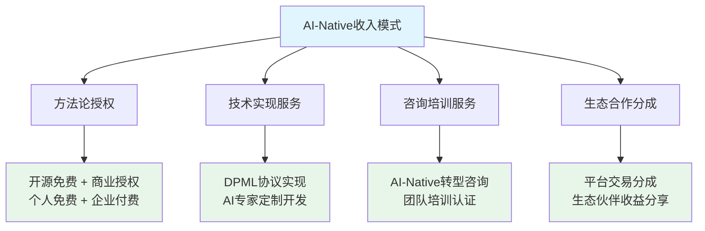
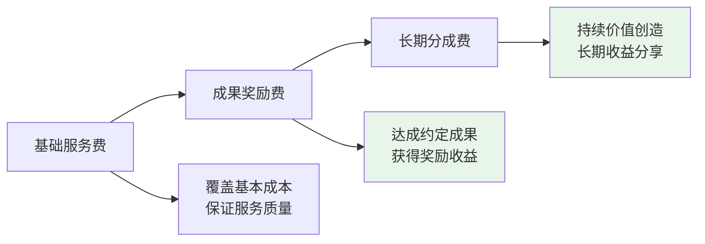
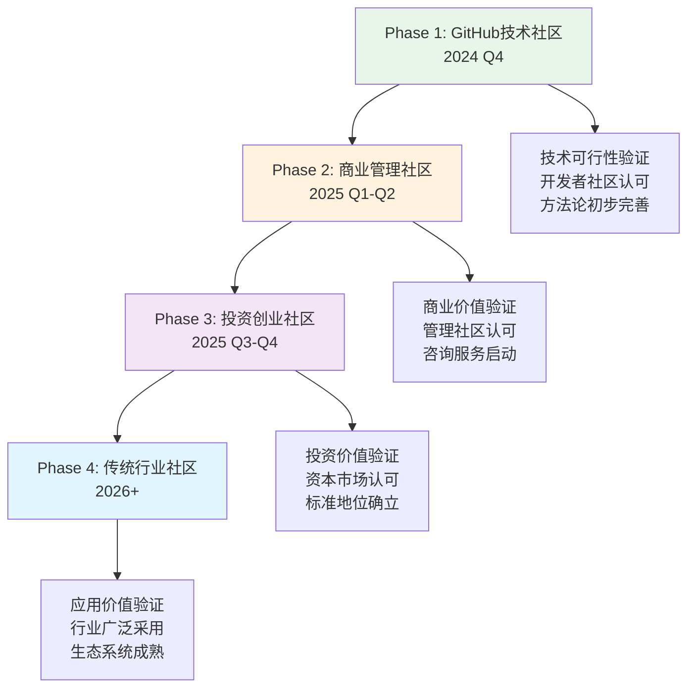
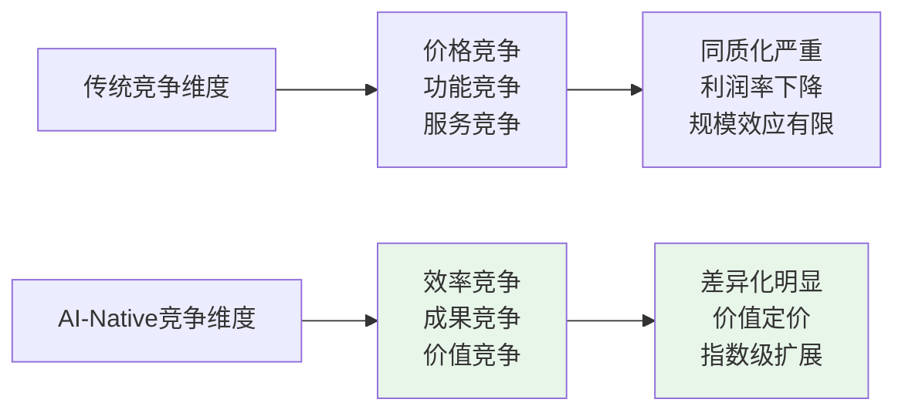

# 深度实践团队的AI-Native开源商业计划方法论

> **从开源代码到开源商业模式：AI时代的商业创新范式**

## 🎯 方法论概述

### **什么是AI-Native开源商业计划？**

传统的开源是开源代码，我们开源的是**商业模式设计方法论**。这是深度实践团队对AI时代商业模式创新的系统性思考和实践总结。



### **AI-Native三位一体框架**

**核心理念**：不是给传统商业模式"加上AI"，而是设计**原生具备AI能力**的商业模式。



## 🚀 AI-Native商业模式设计方法论

### **第一步：AI-Native价值主张设计**

**传统思路**：先设计产品，再考虑如何用AI优化
**AI-Native思路**：从AI能力出发，设计只有AI才能实现的价值主张



### **第二步：AI-Driven运营模式设计**

**核心原则**：让AI驱动核心业务决策，而不是辅助人类决策

#### **AI-Driven决策框架**



#### **实际应用：COSE项目的AI-Driven实践**

- **战略决策**：6个AI专家并行分析，形成多角度决策建议
- **内容创作**：AI专家协作生成项目文档和商业计划
- **风险评估**：法律合规顾问实时监控合规风险
- **市场分析**：AI行业分析师持续跟踪市场动态

### **第三步：AI-First组织架构设计**

**设计原则**：组织结构优先考虑AI的特点和能力，而不是传统的人力资源配置

#### **AI-First组织模型**



#### **COSE项目的AI-First实践**

**核心团队**：Carson（创始人）+ 6个AI专家
- **AI专家负责**：专业分析、方案设计、内容创作、风险评估
- **创始人负责**：战略方向、关键决策、外部关系、创意突破

**组织优势**：
- ✅ **成本效率**：6个AI专家的成本远低于6个人类专家
- ✅ **响应速度**：24/7无间断服务，快速响应
- ✅ **专业深度**：每个AI专家都具备深度专业能力
- ✅ **协作效率**：多角色并行分析，快速形成综合方案

## 💰 AI-Native商业模式的收入逻辑

### **传统 vs AI-Native 商业模式对比**

| 维度 | 传统商业模式 | AI-Native商业模式 |
|------|-------------|------------------|
| **价值创造** | 人类劳动 + 工具辅助 | AI能力 + 人类创意 |
| **成本结构** | 人力成本占主导 | 技术成本 + 少量人力 |
| **扩展性** | 线性扩展（增加人手） | 指数扩展（AI复制） |
| **服务质量** | 依赖个人能力 | 标准化 + 持续优化 |
| **收入模式** | 时间计费 / 产品售卖 | 成果计费 / 价值分享 |

### **AI-Native收入模式创新**



### **按成果交付的创新定价**

**核心理念**：不按时间收费，按实际成果收费

#### **成果定价模型**



**实际案例**：
- **AI转型咨询**：基础费 30% + 效率提升奖励 40% + 长期价值分成 30%
- **商业模式设计**：基础费 20% + 成功实施奖励 50% + 持续优化分成 30%
- **技术实现服务**：基础费 40% + 交付质量奖励 35% + 后续维护分成 25%

## 🌍 渐进式多平台传播策略

### **从GitHub到全生态的传播路径**



### **不同平台的价值主张适配**

#### **GitHub技术社区**
- **核心价值**：技术人员的商业思维补强
- **主要内容**：开源方法论 + 技术实现指导
- **商业模式**：免费开源 + 企业级服务

#### **商业管理社区**
- **核心价值**：AI时代的商业模式创新
- **主要内容**：方法论培训 + 咨询服务
- **商业模式**：咨询服务 + 培训认证

#### **投资创业社区**
- **核心价值**：AI项目的投资决策支持
- **主要内容**：投资分析框架 + 尽调工具
- **商业模式**：专业服务 + 平台工具

#### **传统行业社区**
- **核心价值**：传统企业的AI转型指导
- **主要内容**：行业解决方案 + 实施服务
- **商业模式**：解决方案 + 合作伙伴

## 📊 AI-Native商业模式的竞争优势

### **传统竞争 vs AI-Native竞争**



### **COSE项目的独特竞争优势**

1. **方法论先发优势**：首个系统性的AI-Native商业模式方法论
2. **实践验证优势**：用自己的方法论创造实际价值
3. **开源生态优势**：通过开源快速建立标准和影响力
4. **技术实现优势**：提供完整的技术实现方案（DPML协议）
5. **团队能力优势**：深度实践团队的系统性创新能力

## 🎯 方法论的实际应用指南

### **如何应用AI-Native方法论？**

#### **第一步：AI能力评估**
```bash
# 评估你的业务中哪些环节可以AI-Native化
1. 列出所有业务环节
2. 评估每个环节的AI适用性
3. 识别AI独特价值创造点
4. 设计AI-Native价值主张
```

#### **第二步：商业模式重构**
```bash
# 基于AI能力重新设计商业模式
1. 重新定义目标客户（AI能为谁创造独特价值？）
2. 重新设计价值主张（AI能创造什么独特价值？）
3. 重新规划收入模式（如何按AI创造的价值收费？）
4. 重新组织运营模式（如何让AI驱动核心业务？）
```

#### **第三步：组织架构调整**
```bash
# 构建AI-First的组织架构
1. 识别AI可以独立完成的工作
2. 识别需要AI-人类协作的工作
3. 识别必须人类完成的工作
4. 设计AI-First的组织结构
```

### **成功案例模板**

参考COSE项目的实际实践：
- 📁 [技术实现案例](.promptx/) - 6个AI专家的完整实现
- 📁 [商业模式案例](BP-STRUCTURE.md) - AI-Native商业计划的实际应用
- 📁 [组织架构案例](README.md) - AI-First团队的运作模式

---

**深度实践团队** - 专注于AI时代的商业模式创新与实践

*这份方法论文档本身就是AI-Native实践的成果：由6个AI专家协作完成，体现了AI-Driven的内容创作和AI-First的协作模式。* 