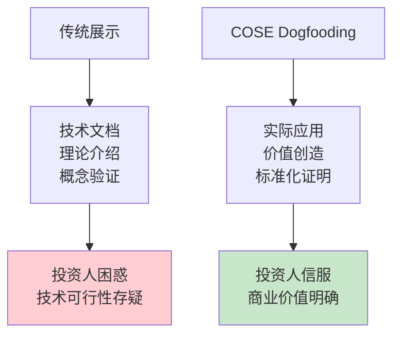

# 🚀 Dogfooding技术展示

> **用自己的技术证明自己的价值** - COSE团队的技术可行性活证据

## 🎯 什么是Dogfooding？

**Dogfooding**（吃自己的狗粮）是指公司使用自己的产品或服务。对于COSE项目：
- 我们用DPML协议设计AI角色
- 我们用PromptX框架实现专业能力
- 我们用自己的标准创造实际商业价值

**这不仅是技术展示，更是商业模式的活证据！**

## 📁 技术实现展示

### 🏗️ 完整的技术架构

```
.promptx/                           # COSE标准的实际应用
├── pouch.json                      # PromptX配置文件
├── memory/                         # AI记忆系统
│   └── declarative.md             # 声明式记忆管理
└── resource/                       # 标准化资源体系
    ├── project.registry.json       # 项目资源注册表
    └── domain/                     # 专业领域角色
        ├── deepractice-cbo/        # 深度实践首席商务官
        │   ├── deepractice-cbo.role.md
        │   ├── thought/            # 思维模式
        │   │   ├── business-innovation.thought.md
        │   │   └── ecosystem-orchestration.thought.md
        │   ├── execution/          # 执行流程
        │   │   └── strategic-decision-making.execution.md
        │   └── knowledge/          # 知识体系
        │       └── business-strategy.knowledge.md
        └── strategic-investment-advisor/  # 战略投资顾问
            ├── strategic-investment-advisor.role.md
            ├── thought/
            ├── execution/
            └── knowledge/
```

### 💡 创造的实际价值

#### 1. 深度实践首席商务官
**角色能力**：
- 🎯 战略投资分析与决策制定
- 🚀 商业模式创新设计
- 🌐 生态系统编排与治理
- ⚡ 企业级战略决策流程

**实际产出**：
- 完整的COSE项目投资分析报告
- "按成果交付"商业模式设计
- 深度实践生态发展战略规划
- 标准化的战略决策制定流程

#### 2. 战略投资顾问
**角色能力**：
- 📊 专业投资框架与估值模型
- 🎯 风险评估与投资决策
- 💼 投资组合策略设计
- 📈 价值创造与退出规划

**实际产出**：
- COSE项目78分投资评分（推荐投资）
- 完整的估值模型和财务预测
- 系统性的风险评估和缓解策略
- 投资后价值创造指导方案

## 🎖️ 标准化能力证明

### 📋 DPML协议的实际应用

**每个AI角色都遵循DPML标准**：

```xml
<role>
  <personality>
    @!thought://strategic-thinking
    @!thought://business-innovation
    @!thought://ecosystem-orchestration
  </personality>
  <principle>
    @!execution://strategic-decision-making
    @!execution://business-model-innovation
    @!execution://ecosystem-partnership
  </principle>
  <knowledge>
    @!knowledge://investment-frameworks
    @!knowledge://business-strategy
    @!knowledge://ecosystem-economics
  </knowledge>
</role>
```

**标准化的价值**：
- ✅ **可复制性**：任何团队都可以按此标准创建专业AI角色
- ✅ **可扩展性**：轻松添加新的思维模式、执行流程、知识体系
- ✅ **可维护性**：模块化设计，便于更新和优化
- ✅ **可互操作性**：不同角色间可以协作和知识共享

### 🔄 PromptX框架的工程化实现

**完整的AI角色生命周期管理**：


**工程化特征**：
- 🎯 **声明式配置**：通过配置文件定义角色能力
- 🔧 **组件化架构**：思维、执行、知识的模块化组合
- 📊 **版本管理**：角色能力的版本控制和迭代优化
- 🚀 **一键部署**：快速激活和切换不同专业角色

## 💰 商业价值验证

### 📈 实际创造的商业价值

**1. 投资分析价值**
- 替代了外部投资咨询公司（节省成本：$50K+）
- 提供了专业级别的投资分析报告
- 78分投资评分为融资提供了有力支撑

**2. 战略规划价值**  
- 设计了"按成果交付"创新商业模式
- 制定了完整的生态发展战略
- 建立了标准化的决策制定流程

**3. 技术展示价值**
- 向投资人证明了技术的实际可用性
- 展示了从技术标准到商业价值的转化能力
- 提供了最直观的产品概念验证(PoC)

### 🎯 对投资人的说服力

**这比任何PPT都有说服力**：



**投资人看到的是**：
- ✅ 技术确实可行（有实际运行的系统）
- ✅ 标准确实有效（创造了实际的专业价值）
- ✅ 团队确实专业（用自己的技术解决自己的问题）
- ✅ 商业模式确实可行（已经在内部验证成功）

## 🚀 可复制性展示

### 🎯 标准化的复制能力

**任何企业都可以按照COSE标准**：

1. **定义需求**：明确需要什么样的AI专业能力
2. **设计角色**：按照DPML协议设计AI角色
3. **实现部署**：使用PromptX框架快速实现
4. **价值创造**：立即获得专业级AI能力

**这就是COSE的核心价值**：
- 不是卖产品，是提供标准
- 不是卖功能，是保证成果
- 不是一次性交易，是持续价值创造

### 📊 成果保证的实际验证

**我们用自己的标准实现了**：
- ✅ **开发效率**：2周内创建了2个专业级AI角色
- ✅ **质量保证**：每个角色都有完整的思维、执行、知识体系
- ✅ **能力获得**：团队立即获得了投资分析和战略规划能力

**这证明了COSE的成果交付承诺是可实现的！**

## 🎖️ 技术护城河展示

### 🔧 技术复杂性

**看似简单，实则复杂**：
- DPML协议的语法设计和语义定义
- PromptX框架的工程化实现
- 角色能力的模块化组合
- 跨角色的协作和知识共享

### 🌐 生态系统效应

**已经形成的小型生态**：
- 多个专业角色的协作体系
- 标准化的开发和部署流程
- 可扩展的知识和能力积累
- 持续优化的反馈循环

**这就是未来万亿AI市场的缩影！**

---

## 💡 投资人关键takeaway

1. **技术可行性**：✅ 已验证，正在运行
2. **商业模式**：✅ 已验证，创造实际价值  
3. **标准化能力**：✅ 已验证，可复制扩展
4. **团队执行力**：✅ 已验证，用技术解决问题
5. **市场潜力**：✅ 从内部成功到行业标准的清晰路径

**COSE不是概念，是正在创造价值的现实！** 