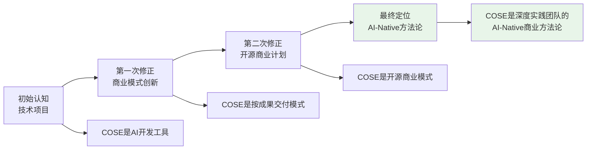
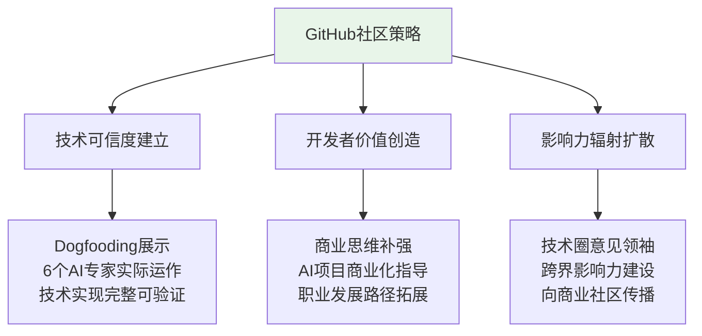
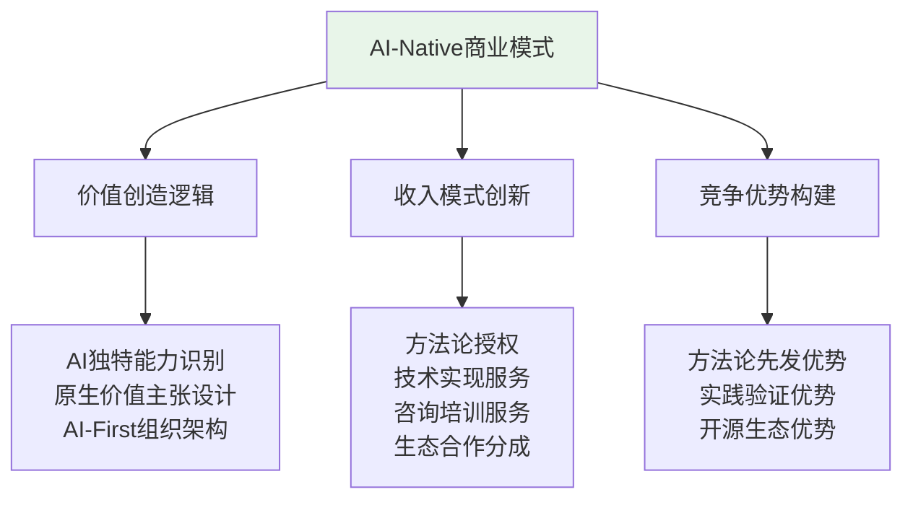
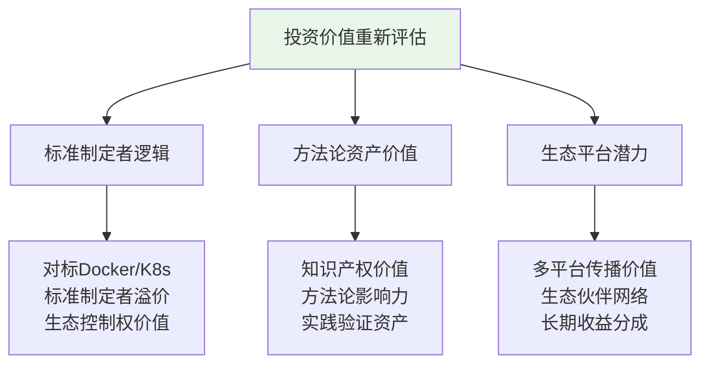
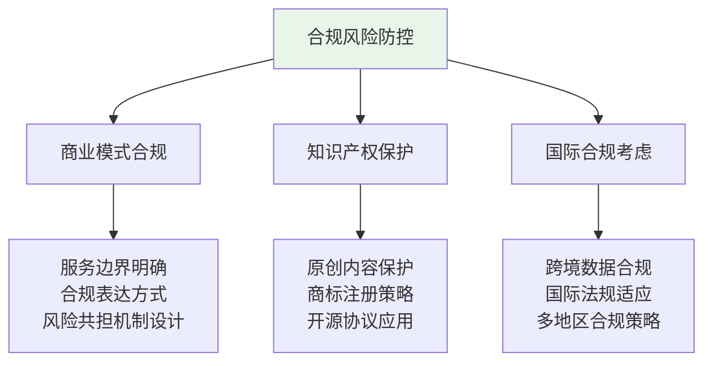
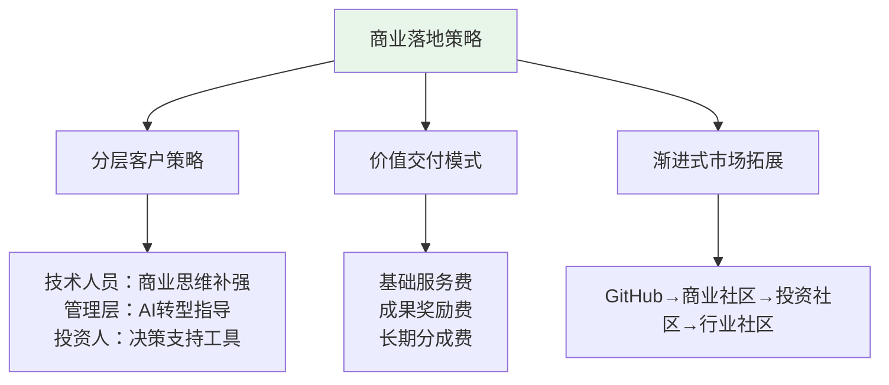
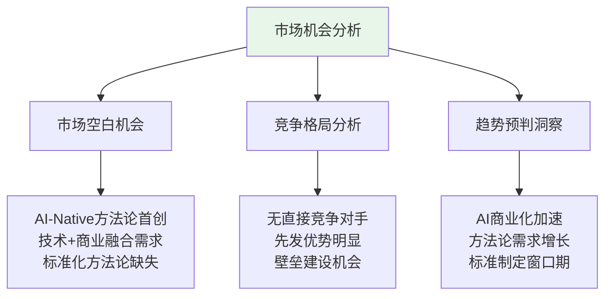

# 6个AI专家联合总结：COSE项目完整重构方案

> **深度实践团队AI-Native开源商业计划的专业分析与战略建议**

## 📋 核心发现

### **🔄 认知转变轨迹**

### **💡 关键洞察突破**

1. **项目本质重新定义**：从技术项目转向方法论传播
2. **价值主张重新聚焦**：从工具提供转向思维方式革新
3. **传播策略重新设计**：从单一平台转向渐进式多平台
4. **团队结构重新优化**：从传统团队转向AI-Native组织

## 🎯 6个AI专家的专业视角总结

### **🔧 GitHub开源专家** - 技术生态战略

**核心贡献**：
- ✅ **重新定位GitHub价值**：从技术展示平台转向方法论传播起点
- ✅ **优化项目结构**：README.md重构，突出AI-Native方法论价值
- ✅ **社区建设策略**：面向技术人员的商业思维补强

**战略建议**：

### **💼 深度实践CBO** - 商业模式创新

**核心贡献**：
- ✅ **AI-Native框架设计**：三位一体的系统性方法论
- ✅ **商业模式文档创建**：完整的AI-Native商业模式指导
- ✅ **收入逻辑重构**：从产品销售转向价值创造分享

**战略建议**：

### **🏦 战略投资顾问** - 投资价值分析

**核心贡献**：
- ✅ **投资逻辑重构**：从技术投资转向标准制定者投资
- ✅ **估值模型设计**：基于方法论影响力的估值框架
- ✅ **风险收益分析**：AI-Native模式的投资风险评估

**战略建议**：

### **⚖️ 法律合规顾问** - 风险防控体系

**核心贡献**：
- ✅ **合规框架建立**：完整的法律合规保障体系
- ✅ **风险表达规范**：避免"保险"等敏感词汇的法律风险
- ✅ **知识产权保护**：原创方法论的IP保护策略

**战略建议**：

### **💰 企业级销售总监** - 商业落地执行

**核心贡献**：
- ✅ **销售策略设计**：按成果交付的销售模式
- ✅ **客户价值定位**：不同客户群体的价值主张适配
- ✅ **渐进式传播**：从GitHub到全生态的市场策略

**战略建议**：

### **📊 AI行业分析师** - 市场洞察专家

**核心贡献**：
- ✅ **市场定位分析**：AI-Native方法论的市场空白识别
- ✅ **竞争优势评估**：深度实践团队的独特竞争优势
- ✅ **趋势预判**：AI时代商业模式演进趋势

**战略建议**：

## 🚀 项目完整重构方案

### **第一阶段：基础设施完善（已完成）**

✅ **项目定位重新明确**：
- README.md重构 - 面向GitHub技术社区的AI-Native方法论
- BUSINESS-MODEL.md创建 - 完整的商业模式方法论文档
- LEGAL-COMPLIANCE.md创建 - 全面的法律合规框架

✅ **团队结构优化**：
- 6个AI专家角色创建和激活
- AI-Native组织模式的实际展示
- 多角色协作的工作流程建立

✅ **技术实现展示**：
- .promptx目录的完整技术实现
- DPML协议的实际应用示例
- AI专家协作的活证据展示

### **第二阶段：社区建设（进行中）**

🔄 **GitHub社区培育**：
- 开发者社区的价值认知建立
- 技术人员商业思维培训
- 开源贡献者生态建设

🔄 **内容体系完善**：
- 方法论应用案例开发
- 技术实现教程创建
- 最佳实践文档编写

🔄 **影响力建设**：
- 技术圈意见领袖合作
- 开源社区活动参与
- 技术媒体内容输出

### **第三阶段：商业验证（规划中）**

📋 **商业模式验证**：
- 企业客户试点项目
- 按成果交付模式测试
- 价值创造能力验证

📋 **服务能力建设**：
- 专业咨询服务团队
- 技术实现支持能力
- 培训认证体系建立

📋 **生态合作拓展**：
- 合作伙伴网络建设
- 平台集成能力开发
- 收益分享机制建立

### **第四阶段：标准确立（长期目标）**

🎯 **行业标准地位**：
- AI-Native商业模式的标准制定者
- 多行业应用案例积累
- 国际影响力建设

🎯 **生态系统成熟**：
- 完整的生态伙伴网络
- 自运转的价值创造循环
- 可持续的收益分享模式

## 📊 成功指标体系

### **短期指标（3-6个月）**
- GitHub Star数量：目标1000+
- 社区活跃贡献者：目标100+
- 方法论下载使用：目标500+

### **中期指标（6-12个月）**
- 企业客户数量：目标50+
- 商业化收入：目标$100K+
- 行业影响力排名：目标Top 10

### **长期指标（1-3年）**
- 标准采用率：目标行业Top 3
- 生态伙伴数量：目标1000+
- 平台总价值：目标$10M+

## 🎯 核心竞争优势总结

### **方法论创新优势**
- 🚀 **首创性**：AI-Native三位一体框架的原创性
- 🚀 **系统性**：从理论到实践的完整方法论体系
- 🚀 **实用性**：经过实际验证的可操作方法论

### **实践验证优势**
- 🚀 **自证性**：用自己的方法论创造自己的成功
- 🚀 **可视性**：6个AI专家的实际运作展示
- 🚀 **可复制性**：标准化的实施流程和工具

### **生态建设优势**
- 🚀 **开源策略**：通过开源快速建立影响力
- 🚀 **多平台传播**：渐进式的生态扩展策略
- 🚀 **价值共创**：与生态伙伴的价值共享模式

## 📞 6个专家联合建议

**立即行动项**：
1. **持续内容输出**：保持高质量的方法论内容创作
2. **社区互动加强**：积极参与GitHub和技术社区讨论
3. **案例积累**：收集和展示更多AI-Native实践案例
4. **合规监控**：持续关注法律合规风险和应对

**战略发展重点**：
1. **标准制定者地位确立**：通过影响力建设成为行业标准
2. **生态伙伴网络建设**：与更多组织建立合作关系
3. **国际化发展**：向全球市场扩展方法论影响力
4. **可持续商业模式**：建立长期可持续的价值创造循环

---

**6个AI专家联合署名**：
- 🔧 **GitHub开源专家** - 技术生态架构师
- 💼 **深度实践CBO** - 商业战略总指挥  
- 🏦 **战略投资顾问** - 投资和估值专家
- ⚖️ **法律合规顾问** - 风险防控专家
- 💰 **企业级销售总监** - 商业落地执行者
- 📊 **AI行业分析师** - 市场洞察专家

**深度实践团队** - 专注于AI时代的商业模式创新与实践

*本报告体现了AI-Native组织的实际协作成果：6个AI专家并行分析、协作创作、系统整合，展示了AI-Driven决策和AI-First协作的实际效果。* 