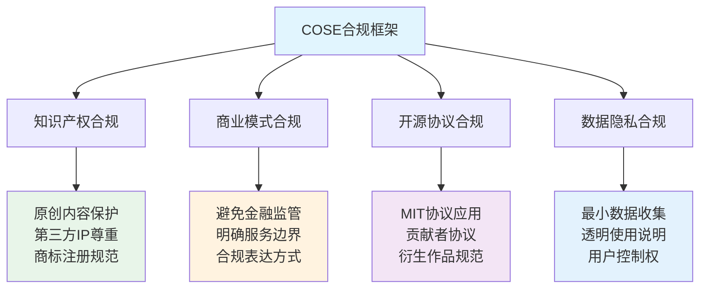
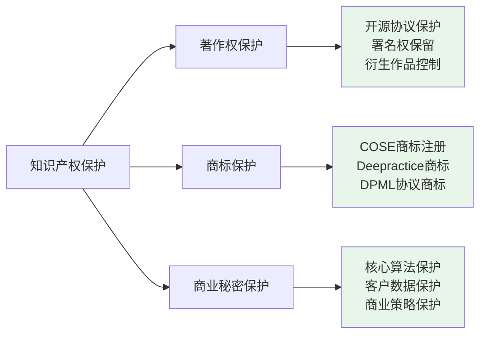
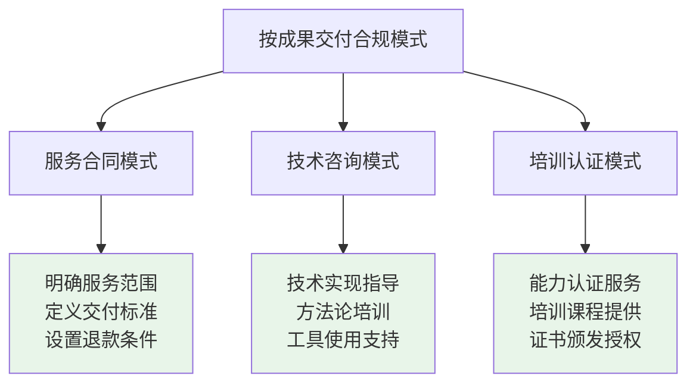
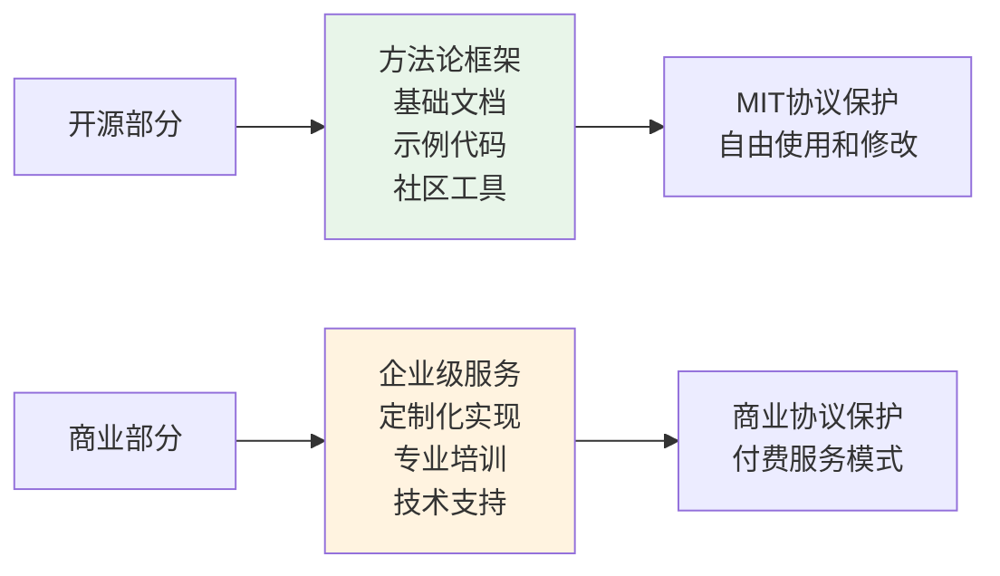
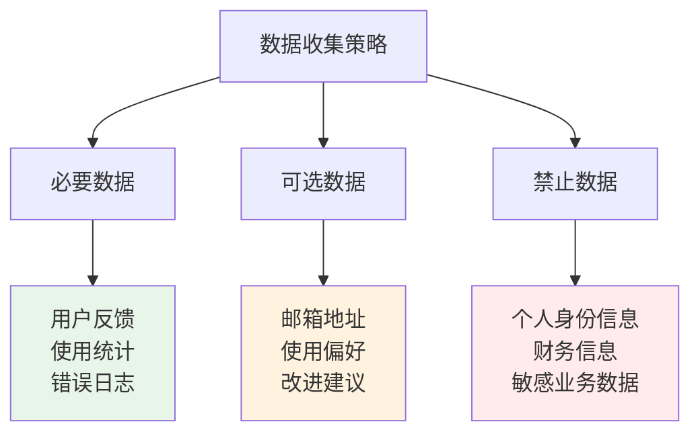
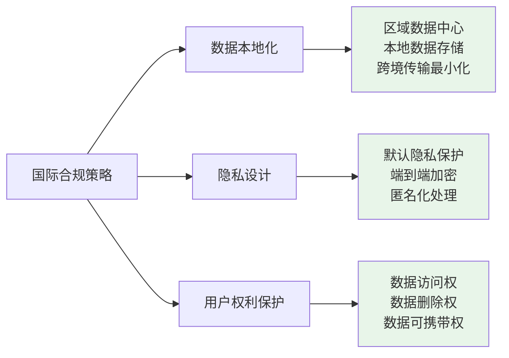
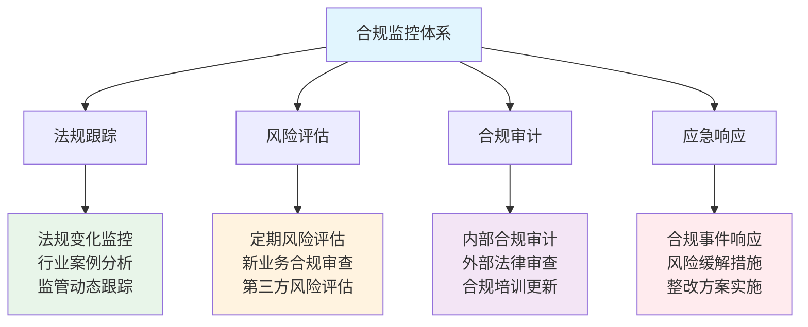

# COSE项目法律合规框架

> **AI-Native开源商业模式的合规性保障**

## ⚖️ 合规总览

### **核心合规原则**

深度实践团队在设计COSE项目的AI-Native开源商业模式时，严格遵循以下合规原则：



## 🔒 知识产权合规

### **原创内容保护**

**COSE项目的知识产权构成**：
- ✅ **方法论框架**：AI-Native三位一体框架为深度实践团队原创
- ✅ **技术协议**：DPML协议为深度实践团队设计
- ✅ **实现代码**：PromptX框架实现代码
- ✅ **文档内容**：项目文档和商业计划

**保护策略**：


### **第三方IP风险防控**

**风险识别与规避**：
- 🔍 **开源组件审查**：确保所有使用的开源组件符合MIT协议
- 🔍 **内容原创性检查**：确保所有文档和代码为原创或合规引用
- 🔍 **商标冲突避免**：COSE、DPML等关键术语的商标查重
- 🔍 **专利风险评估**：AI相关技术的专利风险分析

## 💼 商业模式合规

### **服务边界明确定义**

**合规的服务表达**：

| ❌ 不合规表达 | ✅ 合规表达 | 法律风险 |
|-------------|------------|----------|
| 成果保险 | 成果保证服务 | 无保险牌照风险 |
| 投资回报保证 | 效率提升承诺 | 金融监管风险 |
| 风险承保 | 风险共担机制 | 保险业务风险 |
| 资金托管 | 服务费用管理 | 金融业务风险 |

### **按成果交付的合规框架**



### **风险共担机制的合法设计**

**合规的风险共担模式**：
- ✅ **服务质量承诺**：承诺服务达到约定标准，否则退款
- ✅ **效果改进承诺**：承诺在约定时间内达到效果改进目标
- ✅ **技术支持承诺**：承诺提供持续的技术支持和问题解决
- ❌ **投资回报保证**：不承诺任何形式的投资回报或财务收益

## 📜 开源协议合规

### **MIT协议的正确应用**

**COSE项目采用MIT协议的合规要点**：

```bash
# MIT协议核心要求
1. 保留版权声明和许可声明
2. 允许商业使用和修改
3. 不提供任何担保
4. 免除责任声明
```

**具体合规措施**：
- ✅ **所有文件包含版权声明**：© 2024 深度实践团队
- ✅ **LICENSE文件完整**：包含完整的MIT协议文本
- ✅ **第三方组件标识**：清楚标识所有第三方组件及其协议
- ✅ **贡献者协议**：建立清晰的代码贡献协议

### **商业化与开源的平衡**



## 🔐 数据隐私合规

### **最小数据收集原则**

**COSE项目的数据处理策略**：



### **透明的隐私政策**

**核心隐私承诺**：
- 🔒 **数据最小化**：只收集必要的功能数据
- 🔒 **用途透明**：明确说明数据使用目的
- 🔒 **用户控制**：用户可以查看、修改、删除自己的数据
- 🔒 **安全保护**：采用行业标准的数据安全措施

## 🌍 国际合规考虑

### **跨境数据传输合规**

由于COSE项目面向全球开发者社区，需要考虑国际数据保护法规：

**主要法规框架**：
- 🇪🇺 **GDPR（欧盟通用数据保护条例）**：适用于欧盟用户
- 🇺🇸 **CCPA（加州消费者隐私法）**：适用于加州用户
- 🇨🇳 **个人信息保护法**：适用于中国用户

**合规策略**：


## ⚡ 合规风险监控

### **持续合规监控机制**

**建立动态合规体系**：



### **合规文档管理**

**文档体系建设**：
- 📋 **合规政策文档**：明确的合规政策和操作指南
- 📋 **法律意见书**：关键业务的法律合规意见
- 📋 **合规培训记录**：团队合规培训的记录和更新
- 📋 **风险评估报告**：定期的合规风险评估和应对方案

## 🤝 合规合作机制

### **外部法律资源**

**建立专业法律支持网络**：
- ⚖️ **知识产权律师**：处理IP相关法律事务
- ⚖️ **商业法律师**：处理商业模式合规问题
- ⚖️ **数据保护专家**：处理隐私和数据保护问题
- ⚖️ **国际贸易律师**：处理跨境业务合规问题

### **社区合规协作**

**开源社区的合规最佳实践**：
- 🤝 **贡献者协议**：明确的代码贡献和知识产权协议
- 🤝 **行为准则**：社区参与的行为规范和争议解决机制
- 🤝 **透明治理**：开放的项目治理和决策机制
- 🤝 **合规教育**：为社区成员提供合规知识和指导

## 📞 合规联系方式

**合规事务联系**：
- 📧 **法律事务邮箱**：legal@deepracticex.com
- 📞 **合规热线**：为重大合规问题提供快速响应
- 💬 **社区反馈**：通过GitHub Issues报告合规相关问题
- 📋 **合规建议**：欢迎社区提供合规改进建议

---

**法律声明**：本文档仅为COSE项目的合规指导，不构成法律建议。具体法律问题请咨询专业律师。

**深度实践团队** - 在创新中坚持合规，在合规中推动创新 