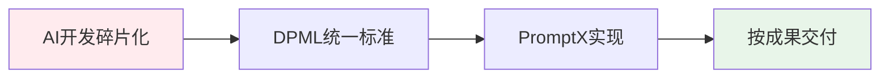
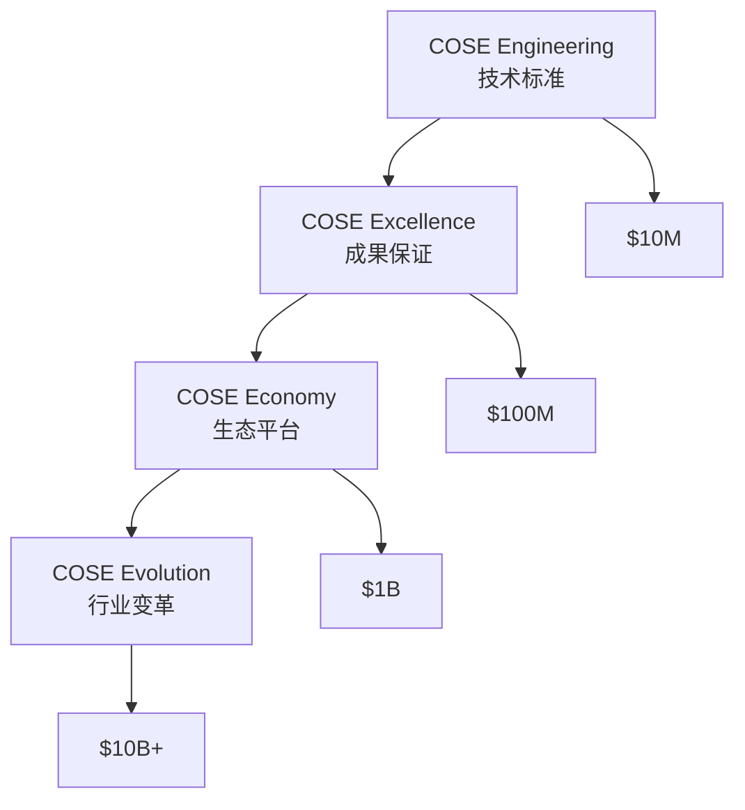
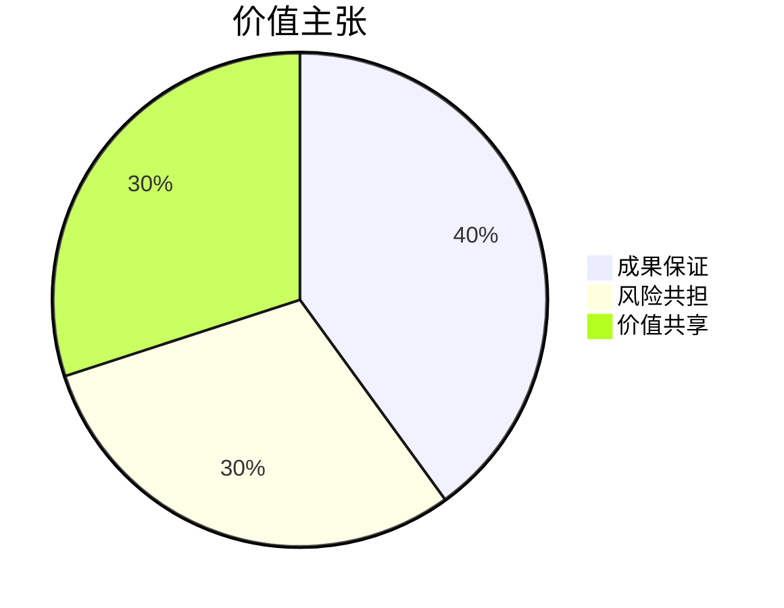

# COSE - Commercial Open Source Engineering

> 从商业开源软件(COSS)到商业开源工程(COSE)：重新定义AI开发的基础设施

## 🎯 核心价值

**一句话**：AI应用开发的Docker，通过DPML协议建立行业标准

## 🚀 Dogfooding证明

查看 [`.promptx/`](.promptx/) - 用自己的技术构建投资顾问AI

> *"Talk is cheap. Show me the code."* - Linus Torvalds

## 📈 COS框架演进

## 💡 按成果交付模式

- ✅ 效率提升50%+，否则退款
- ✅ 质量保证99%+，问题全赔
- ✅ 能力即时获得，培训成本节省

## 🏆 对标成功案例

| 项目 | 标准 | 估值 |
|------|------|------|
| Docker | 容器标准 | $20B+ |
| Kubernetes | 编排标准 | $100B+ |
| **COSE** | **AI应用标准** | **$10B+** |

## 📊 完整商业计划

详见 [BP_STRUCTURE.md](BP_STRUCTURE.md) - 投资级开源商业计划书

## 🤝 开源协作

- 💭 [Issues](https://github.com/deepractice/COSE/issues) - 战略讨论
- 📝 [PRs](https://github.com/deepractice/COSE/pulls) - 内容贡献
- 📖 [贡献指南](docs/contributing.md) - 参与方式

## 📞 联系

**成果交付保证者**：Deepractice.ai  
**投资交流**：通过Issues深度交流

---

⭐ **如果你相信AI需要按成果交付的统一标准，请给我们一个Star！**

> "The best way to predict the future is to invent it." - Alan Kay
> 
> 我们不预测AI的未来，我们正在按成果交付他的标准。 
