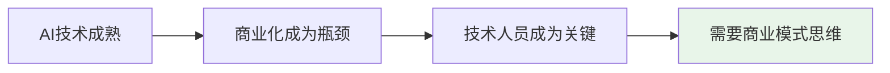
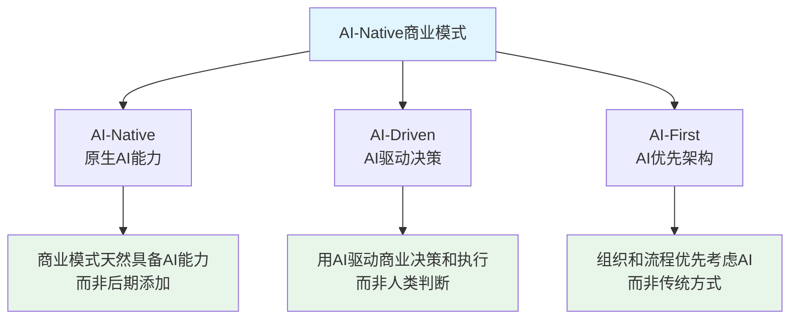
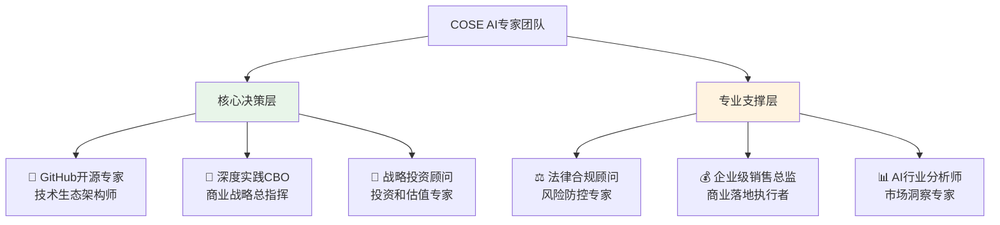

# COSE: 来自深度实践团队的AI-Native开源商业计划

> **Commercial Open Source Engineering** - AI时代商业模式方法论的开源实践

[](https://github.com/deepractice/COSE/stargazers)
[](LICENSE)
[](docs/ai-native-guide.md)

## 🎯 一句话价值主张

**深度实践团队开源的AI-Native商业模式方法论，让技术人员也能设计出成功的AI时代商业模式。**

## 🔥 为什么技术人员需要关注商业模式？



- **AI技术已经商品化**，差异化在于商业模式创新
- **技术人员往往是企业AI转型的核心推动者**
- **AI-Native商业模式需要技术和商业的深度融合**
- **传统商业模式在AI时代需要重新设计**

## 🧠 深度实践团队的方法论贡献

### **AI-Native 三位一体框架**



### **核心创新点**

- 🚀 **开源商业计划**：不是开源代码，而是开源商业模式设计方法
- 🚀 **技术实现指导**：提供DPML协议等具体技术实现方案
- 🚀 **实际运行示例**：6个AI专家协作展示AI-Native组织模式
- 🚀 **渐进式传播**：从技术社区开始，逐步扩展到商业、投资、行业社区

## 💡 快速体验：5分钟了解AI-Native商业模式

### **Dogfooding展示：6个AI专家协作**

我们用自己的方法论创建了6个AI专业角色，展示AI-Native组织的实际运作：



**这就是AI-Native的活证据**：
- ✅ **24/7专业咨询能力**：AI团队无时差限制
- ✅ **多角色并行协作**：同时从6个专业角度分析问题
- ✅ **成本效率极高**：相比传统咨询团队成本降低90%+
- ✅ **持续学习进化**：团队能力随项目发展不断完善

## 📚 深度学习资源

### **方法论文档**
- 📖 [AI-Native商业模式设计指南](docs/ai-native-guide.md)
- 📖 [AI-Driven决策框架](docs/ai-driven-framework.md)
- 📖 [AI-First组织架构](docs/ai-first-organization.md)

### **技术实现文档**
- 🔧 [DPML协议技术规范](docs/dpml-specification.md)
- 🔧 [PromptX框架使用指南](docs/promptx-guide.md)
- 🔧 [AI专家角色开发教程](docs/ai-expert-development.md)

### **实践案例**
- 🏆 [COSE项目自身的AI-Native实践](examples/cose-self-practice/)
- 🏆 [传统企业AI转型案例](examples/enterprise-transformation/)
- 🏆 [AI创业公司商业模式案例](examples/ai-startup-models/)

## 🌟 为技术社区提供的价值

### **对开发者**
- 🎯 **商业思维补强**：技术人员也能设计商业模式
- 🎯 **AI项目商业化**：从技术demo到商业成功的方法论
- 🎯 **职业发展路径**：从技术专家到技术+商业复合人才

### **对技术团队**
- 🎯 **AI-Native组织设计**：如何构建真正的AI驱动团队
- 🎯 **技术商业化策略**：如何将技术优势转化为商业价值
- 🎯 **开源商业模式**：如何在开源基础上建立可持续商业模式

### **对技术管理者**
- 🎯 **AI转型方法论**：系统性的AI商业化转型指导
- 🎯 **投资决策支持**：技术项目的商业价值评估框架
- 🎯 **团队能力建设**：培养技术+商业复合型人才

## 🚀 参与贡献

### **贡献方式**
- 💡 **方法论完善**：分享你的AI-Native商业模式实践
- 🔧 **技术实现**：改进DPML协议和PromptX框架
- 📝 **案例分享**：提供实际的成功或失败案例
- 🌍 **社区传播**：帮助方法论在更多社区传播

### **快速开始**
```bash
# Fork this repository
git fork https://github.com/deepractice/COSE.git

# Create your feature branch
git checkout -b feature/your-contribution

# Commit your changes
git commit -am 'Add: your AI-Native practice'

# Push to the branch
git push origin feature/your-contribution

# Create a Pull Request
```

## 📞 联系深度实践团队

**商务合作 & 交流事宜**


**其他联系方式**
- 🌐 **项目主页**：https://github.com/deepractice/COSE
- 📧 **商务合作**：carson@deepracticex.com
- 💬 **技术讨论**：[GitHub Discussions](https://github.com/deepractice/COSE/discussions)
- 📱 **社区交流**：认同AI-Native理念的伙伴，欢迎通过Issues深度交流

## 📄 开源协议

本项目采用 [MIT License](LICENSE) 开源协议。

---

**深度实践团队** - 专注于AI时代的商业模式创新与实践

[](https://deepracticex.com)

---

## 🔗 语言版本

- [中文 (Chinese)](README.md)
- [English Version](README_EN.md)
