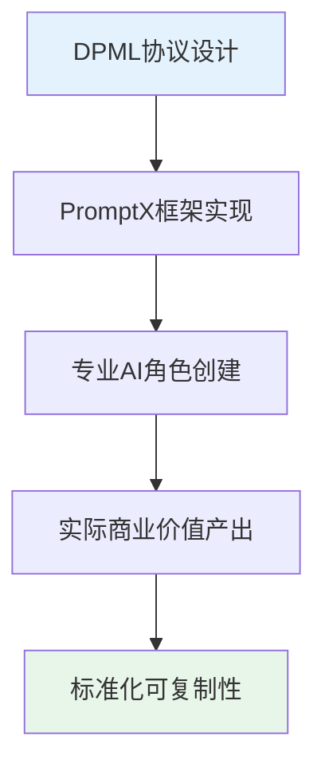
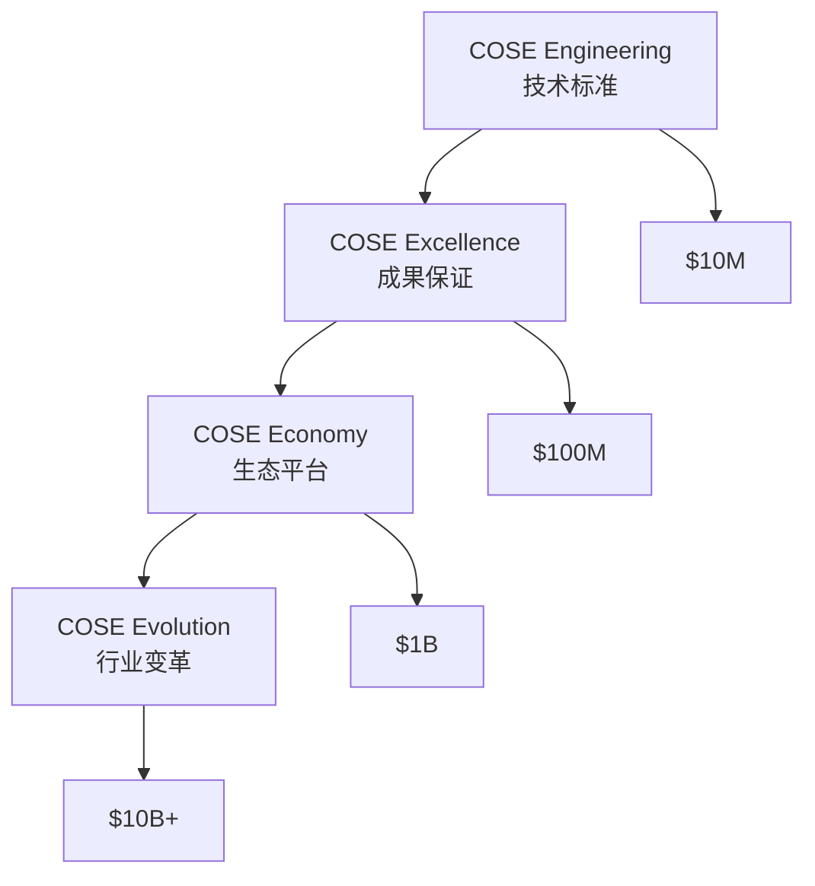
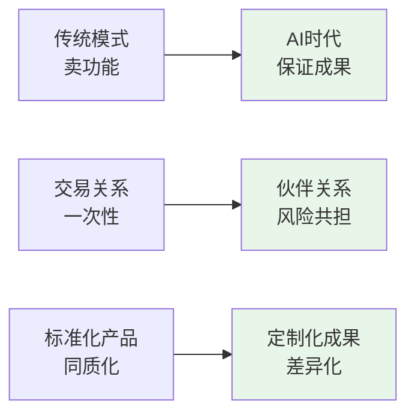
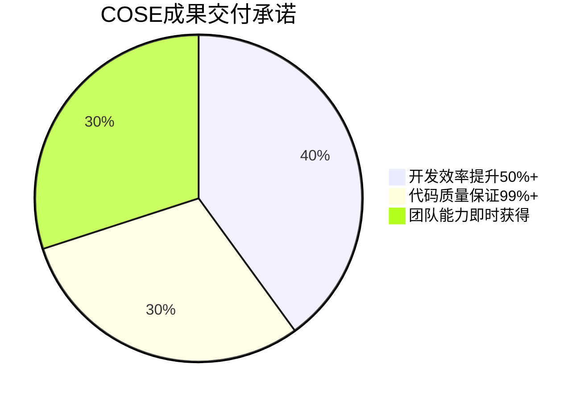
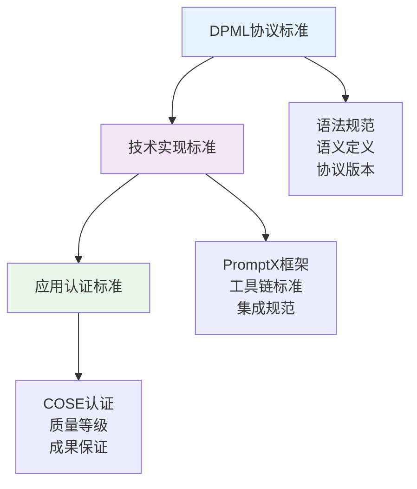

# COSE - Commercial Open Source Engineering

> **AI时代的标准制定者**：从商业开源软件(COSS)到商业开源工程(COSE)，重新定义AI应用开发的基础设施标准

## 🎯 标准制定者价值

**COSE不是产品，是标准；不是工具，是基础设施；不是技术，是生态**

**核心定位**：AI应用开发的Docker + Kubernetes，通过DPML协议建立行业标准，成为万亿AI市场的**规则制定者**

### 🏆 标准制定者的商业逻辑

| 标准制定者 | 技术标准 | 市场价值 | 垄断地位 |
|------------|----------|----------|----------|
| Docker | 容器化标准 | $20B+ | 云原生基础 |
| Kubernetes | 编排标准 | $100B+ | 容器生态核心 |
| **COSE** | **AI应用标准** | **$10B+** | **AI开发基础设施** |

**价值创造路径**：技术标准 → 开发者生态 → 企业采用 → 平台垄断 → 标准制定者溢价

## 🚀 Dogfooding技术证明

**用自己的技术证明自己的价值** - 查看 [`.promptx/`](.promptx/) 目录

### 💡 活证据展示

我们用DPML协议和PromptX框架创建了：
- **深度实践首席商务官** - 专业投资分析和战略决策
- **战略投资顾问** - 完整的商业计划和估值分析
- **完整的AI角色生态** - 思维、执行、知识的标准化体系

> *"Talk is cheap. Show me the code."* - Linus Torvalds  
> 我们不只是说，我们正在用自己的标准创造价值

### 🔍 技术可行性验证

**这就是COSE的核心价值**：将AI能力标准化、工程化、可复制化

## 📈 COS框架演进

## 💡 AI时代商业模式创新：按成果交付

**从"卖工具"到"按成果交付"的商业模式革命**

### 🚀 模式创新核心

### 📊 价值保证体系

**具体成果承诺**：
- ✅ **效率成果**：开发效率提升50%+，否则全额退款
- ✅ **质量成果**：代码质量保证99%+，问题承担全部损失
- ✅ **能力成果**：团队AI开发能力即时获得，培训成本节省80%+

### 🤝 伙伴关系模式

**不是买卖关系，是成果共创伙伴**
- **风险共担**：技术风险、市场风险、执行风险共同承担
- **价值共享**：基础费用 + 成果奖励 + 长期收益分成
- **持续优化**：基于数据反馈的持续改进和价值提升

## 🏆 对标成功案例与标准制定路径

| 标准制定者 | 技术标准 | 生态规模 | 市场估值 | 标准地位 |
|------------|----------|----------|----------|----------|
| Docker | 容器化标准 | 1300万开发者 | $20B+ | 云原生基础 |
| Kubernetes | 编排标准 | 500万用户 | $100B+ | 容器生态核心 |
| **COSE** | **AI应用标准** | **目标100万开发者** | **$10B+** | **AI开发基础设施** |

### 🎖️ COSE标准与认证体系

**三层标准体系架构**：

**认证价值体系**：
- 🥇 **COSE Gold认证**：成果保证99%+，企业级标准
- 🥈 **COSE Silver认证**：成果保证95%+，团队级标准  
- 🥉 **COSE Bronze认证**：成果保证90%+，项目级标准

**标准制定者的商业护城河**：
- **技术壁垒**：DPML协议的先发优势和技术复杂性
- **网络效应**：开发者越多，标准价值越大
- **切换成本**：基于标准开发的应用迁移成本高
- **生态锁定**：完整工具链和认证体系的生态依赖

## 📊 完整项目文档

- 📋 [Dogfooding技术展示](DOGFOODING.md) - 用自己的技术证明价值
- 📈 [商业计划书](BP-STRUCTURE.md) - 投资级开源商业计划
- 🔧 [技术实现](.promptx/) - DPML协议和PromptX框架的实际应用

### 🎯 投资人快速导航

**想了解什么？** | **看哪个文档？** | **关键价值**
---|---|---
技术可行性 | [DOGFOODING.md](DOGFOODING.md) | 实际运行的系统证明
商业模式创新 | [README.md](README.md) | 按成果交付的革命性模式
市场机会与估值 | [BP-STRUCTURE.md](BP-STRUCTURE.md) | 完整的投资分析框架
团队执行能力 | [.promptx/](.promptx/) | 用自己的标准创造的专业AI角色

## 🤝 开源协作

- 💭 [Issues](https://github.com/deepractice/COSE/issues) - 战略讨论
- 📝 [PRs](https://github.com/deepractice/COSE/pulls) - 内容贡献
- 📖 [贡献指南](docs/contributing.md) - 参与方式

## 📞 联系我们

**商务合作 & 交流事宜**

**其他联系方式**
- 📧 Email: carson@deepracticex.com  
- 💬 GitHub: [深度交流](https://github.com/deepractice/COSE/issues)
- 📖 商业计划: [查看完整BP](BP_STRUCTURE.md)

---

⭐ **如果你也相信AI需要按成果交付的统一标准，Let's do it！**

> "The best way to predict the future is to invent it." - Alan Kay
> 
> 我们不预测AI的未来，我们正在按成果交付他的标准。 
