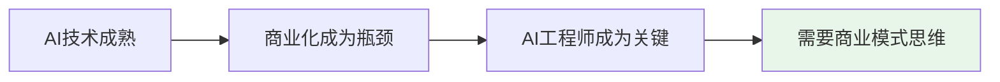
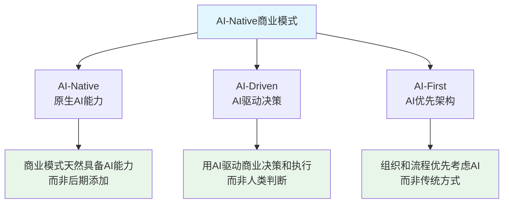
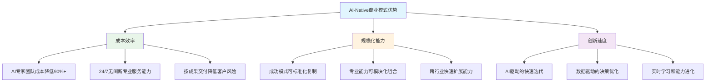
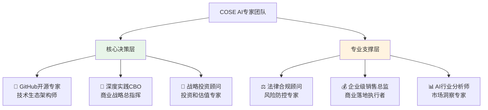

# COSE: 来自深度实践团队的AI-Native开源商业计划

> **Commercial Open Source Engineering** - AI时代商业模式方法论的开源实践

## 🎯 一句话价值主张

**深度实践团队开源的AI-Native商业模式方法论，让AI工程师也能设计出成功的AI时代商业模式，并通过"按成果交付"模式实现真正的价值创造。**

## 🔥 为什么AI工程师需要关注商业模式？

- **AI技术已经商品化**，差异化在于商业模式创新
- **AI工程师往往是企业AI转型的核心推动者**
- **AI-Native商业模式需要技术和商业的深度融合**
- **传统商业模式在AI时代需要重新设计**

## 🧠 深度实践团队的方法论贡献

### **AI-Native 三位一体框架**

### **核心创新点**

- 🚀 **开源商业计划**：不是开源代码，而是开源商业模式设计方法
- 🚀 **技术实现指导**：提供DPML协议和PromptX框架等具体技术实现方案
- 🚀 **按成果交付模式**：从"卖工具"升级为"按成果交付"的商业关系
- 🚀 **实际运行示例**：6个AI专家协作展示AI-Native组织模式
- 🚀 **渐进式传播**：从技术社区开始，逐步扩展到商业、投资、行业社区

## 🏗️ 技术实现基础

AI-Native商业模式需要具体的技术实现支撑，深度实践团队提供两大核心技术框架：

### 🔧 **DPML协议** - AI提示词工程化
> **Deepractice Prompt Markup Language** - 让AI提示词像代码一样工程化

✅ **协议已实现，可演示**：当前COSE项目的6个AI专家角色完全基于DPML协议构建，实现了标准化的AI提示词工程化管理

📖 **完整技术文档**: [@https://github.com/Deepractice/DPML](https://github.com/Deepractice/DPML)

**为商业模式赋能**：
- 🎯 **标准化AI能力**：让AI-Native商业模式的AI能力可复制
- 🎯 **模块化复用**：商业流程中的AI组件可以标准化管理
- 🎯 **版本化迭代**：商业模式的AI能力可以像产品一样持续优化

### 🤖 **PromptX框架** - AI专业能力封装
> **AI Professional Role System** - 将专业能力封装为可复用的AI角色

✅ **已有用户在用，可验证**：深度实践团队已使用PromptX创建13个专业AI角色，提供7×24小时专业咨询服务

📖 **完整技术文档**: [@https://github.com/Deepractice/PromptX](https://github.com/Deepractice/PromptX)

**为商业模式赋能**：
- 🎯 **专业团队AI化**：传统需要专业团队的工作可以AI化
- 🎯 **成本结构优化**：大幅降低专业服务的成本门槛
- 🎯 **规模化复制**：成功的专业能力可以标准化复制

## 💼 商业模式创新：按成果交付

### **传统模式 vs AI-Native模式**

| 维度 | 传统商业模式 | AI-Native商业模式 |
|------|------------|-------------------|
| **AI定位** | 功能增强 | 商业模式核心 |
| **交付方式** | 卖产品/服务 | 按成果交付 |
| **客户关系** | 买卖交易 | 价值共创伙伴 |
| **团队构成** | 人工专家团队 | AI+人混合团队 |
| **成本结构** | 线性成本增长 | 边际成本递减 |

### **AI-Native的核心优势**

## 🌟 Dogfooding展示：AI-Native组织实践

**深度实践团队用自己的方法论创建了6个AI专业角色**，展示AI-Native组织的实际运作：

**这就是AI-Native的活证据**：
- ✅ **24/7专业咨询能力**：AI团队无时差限制
- ✅ **多角色并行协作**：同时从6个专业角度分析问题
- ✅ **成本效率极高**：相比传统咨询团队成本降低90%+
- ✅ **按成果交付**：专家团队只为项目成功负责
- ✅ **持续学习进化**：团队能力随项目发展不断完善

## 📊 对标分析：AI时代的商业模式创新

| 成功案例 | 解决问题 | 商业模式创新 | 技术基础 | 商业价值 |
|---------|---------|------------|----------|----------|
| **Docker** | 部署复杂 | 容器化标准 | 容器技术 | $20亿估值 |
| **Salesforce** | CRM效率低 | SaaS订阅模式 | 云计算 | $2000亿市值 |
| **OpenAI** | AI能力门槛高 | API服务模式 | 大模型 | $800亿估值 |
| **COSE** | 商业模式设计难 | **AI-Native方法论** | DPML+PromptX | **目标：AI商业模式标准** |

## 🌟 为AI工程师社区提供的价值

### **对AI工程师**
- 🎯 **商业思维补强**：AI工程师也能设计商业模式
- 🎯 **AI项目商业化**：从技术demo到商业成功的方法论
- 🎯 **职业发展路径**：从技术专家到技术+商业复合人才

### **对AI团队**
- 🎯 **AI-Native组织设计**：如何构建真正的AI驱动团队
- 🎯 **技术商业化策略**：如何将技术优势转化为商业价值
- 🎯 **开源商业模式**：如何在开源基础上建立可持续商业模式

### **对AI技术管理者**
- 🎯 **AI转型方法论**：系统性的AI商业化转型指导
- 🎯 **投资决策支持**：技术项目的商业价值评估框架
- 🎯 **团队能力建设**：培养技术+商业复合型人才

## 📚 深度学习资源

### **核心方法论**
- 📖 [AI-Native商业模式设计指南](playbooks/ai-native-guide.md)
- 📖 [AI专家角色开发教程](playbooks/ai-expert-development.md)
- 📖 [COSE贡献指南](contributing.md)

### **商业计划文档**
- 💼 [商业模式设计](business-plan/BUSINESS-MODEL.md)
- 💼 [投资商业计划书结构](business-plan/BP-STRUCTURE.md)
- 💼 [专家团队总结](business-plan/EXPERT-SUMMARY.md)
- 💼 [法律合规框架](business-plan/LEGAL-COMPLIANCE.md)

### **实践案例**
- 🏆 [COSE项目自身的AI-Native实践](examples/cose-self-practice/)
- 🏆 [传统企业AI转型案例](examples/enterprise-transformation/)
- 🏆 [AI创业公司商业模式案例](examples/ai-startup-models/)

## 🤝 参与贡献

### **开发者社区**
- 💡 **贡献DPML协议**：完善AI标准化规范
- 💡 **开发PromptX角色**：创建专业AI角色并分享

- 💡 **最佳实践分享**：分享AI应用开发的成功经验

### **企业用户**
- 🎯 **标准化试点**：在AI项目中试用COSE模式
- 🎯 **成果交付合作**：体验按成果交付的新模式
- 🎯 **定制化服务**：获得专业的AI转型咨询服务
- 🎯 **生态合作伙伴**：成为COSE生态的战略合作伙伴

### **投资机构**
- 💰 **AI-Native投资**：投资具备AI-Native商业模式的项目
- 💰 **方法论价值投资**：分享AI-Native方法论生态的长期价值
- 💰 **战略协同投资**：与投资组合公司形成AI-Native协同

## 📞 联系深度实践团队

**商务合作 & 投资事宜**

**联系方式**
- 🌐 **团队主页**：https://github.com/deepractice
- 📧 **商务合作**：carson@deepracticex.com
- 💬 **技术讨论**：[GitHub Discussions](https://github.com/deepractice/COSE/discussions)
- 📱 **投资对接**：认同AI-Native理念的投资人，欢迎深度交流

## 📄 开源协议

本项目采用 [MIT License](LICENSE) 开源协议。

---

**深度实践团队** - 专注于AI时代的商业模式创新与实践

---

## 🔗 语言版本

- [中文 (Chinese)](README.md)
- [English Version](README_EN.md)
