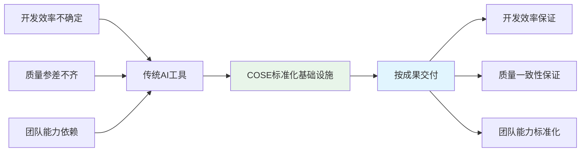
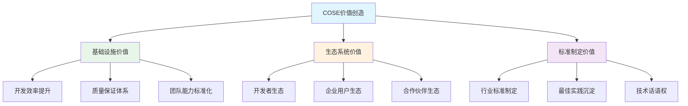
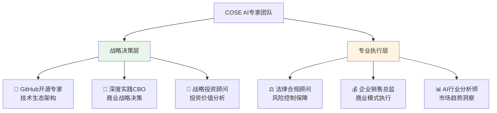

# COSE: Commercial Open Source Engineering

> **AI应用开发标准化基础设施** - 成为万亿AI市场的"规则制定者"

## 🎯 一句话价值主张

**COSE致力于成为AI应用开发的标准化基础设施，通过工程化手段保证AI项目的成果交付，让AI开发像搭积木一样简单可靠。**

## 🚀 核心价值：从"卖工具"到"按成果交付"

**不是卖工具，而是保证成果**：
- ✅ **开发效率保证**：标准化流程确保项目按时交付
- ✅ **质量一致性保证**：工程化标准确保产品质量稳定
- ✅ **团队能力标准化**：专业角色体系确保团队战斗力
- ✅ **风险共担模式**：与客户建立价值共享的伙伴关系

## 🏗️ 技术基础设施

COSE基于两大核心技术标准构建AI应用开发的标准化基础设施：

### 🔧 **DPML协议** - AI提示词标准化
> **Deepractice Prompt Markup Language** - 让AI提示词像代码一样工程化

📖 **完整技术文档**: [@https://github.com/Deepractice/DPML](https://github.com/Deepractice/DPML)

**核心价值**：
- 🎯 **结构化定义**：三组件架构(personality/principle/knowledge)
- 🎯 **模块化复用**：@引用机制实现提示词组件化
- 🎯 **版本化管理**：像管理代码一样管理AI能力
- 🎯 **标准化协作**：团队协作的统一AI开发语言

### 🤖 **PromptX框架** - AI专业能力模块化
> **AI Professional Role System** - 将专业能力封装为可复用的AI角色

📖 **完整技术文档**: [@https://github.com/Deepractice/PromptX](https://github.com/Deepractice/PromptX)

**核心价值**：
- 🎯 **专业角色封装**：将领域专家能力标准化为AI角色
- 🎯 **一键激活使用**：复杂专业能力的简单化调用
- 🎯 **持续学习进化**：角色能力的持续积累和优化
- 🎯 **生态化扩展**：构建专业AI角色的开放生态

## 💼 商业模式创新：成果交付保证者

### **传统模式 vs COSE模式**

| 维度 | 传统AI工具 | COSE标准化基础设施 |
|------|------------|-------------------|
| **定位** | 工具提供商 | 成果交付保证者 |
| **关系** | 买卖交易 | 风险共担伙伴 |
| **保证** | 功能可用 | 成果达成 |
| **定价** | 按功能收费 | 按成果分成 |
| **责任** | 工具维护 | 项目成功 |

### **三层价值创造**

## 🌟 Dogfooding展示：AI-Native组织实践

**用COSE自己的标准构建的AI专家团队**，展示AI-Native组织的实际运作：

**这就是COSE标准化的活证据**：
- ✅ **标准化专业能力**：6个专家角色基于DPML协议构建
- ✅ **模块化协作模式**：通过PromptX框架实现专业分工
- ✅ **可复制成功模式**：其他组织可以复用相同的AI专家配置
- ✅ **持续优化迭代**：专家团队能力随项目发展不断完善

## 📊 对标分析：成为AI时代的Docker

| 成功案例 | 解决问题 | 标准化价值 | 生态效应 | 商业价值 |
|---------|---------|------------|----------|----------|
| **Docker** | 应用部署复杂 | 容器标准 | 云原生生态 | $20亿估值 |
| **Kubernetes** | 容器编排混乱 | 编排标准 | 云服务生态 | 成为基础设施 |
| **GraphQL** | API接口不统一 | 查询标准 | 开发工具生态 | 行业标准 |
| **COSE** | AI开发不标准 | AI应用开发标准 | AI开发生态 | **目标：AI基础设施** |

## 🎯 市场机会：万亿AI市场的基础设施

### **市场规模与时机**
- 📈 **全球AI市场**：2024年$1840亿，2030年预计$1.8万亿
- 📈 **AI应用开发市场**：快速增长但标准化程度低
- 📈 **企业AI转型需求**：迫切需要标准化解决方案
- 📈 **开发者生态机会**：Docker式的标准制定窗口期

### **竞争优势**
- 🏆 **技术先发优势**：DPML协议的标准化创新
- 🏆 **开源生态策略**：社区驱动的标准推广
- 🏆 **工程化基因**：深度实践团队的技术底蕴
- 🏆 **商业模式创新**：按成果交付的差异化定位

## 📚 深度学习资源

### **核心方法论**
- 📖 [AI-Native商业模式指南](docs/ai-native-guide.md)
- 📖 [AI专家开发教程](docs/ai-expert-development.md)
- 📖 [COSE贡献指南](docs/contributing.md)

### **商业计划文档**
- 💼 [商业模式设计](BUSINESS-MODEL.md)
- 💼 [投资商业计划书结构](BP-STRUCTURE.md)
- 💼 [专家团队总结](EXPERT-SUMMARY.md)
- 💼 [法律合规框架](LEGAL-COMPLIANCE.md)

### **实践案例**
- 🏆 [COSE自身AI-Native实践](examples/cose-self-practice/)
- 🏆 [企业AI转型案例](examples/enterprise-transformation/)
- 🏆 [AI创业商业模式案例](examples/ai-startup-models/)

## 🤝 参与COSE生态

### **开发者社区**
- 💡 **贡献DPML协议**：完善AI标准化规范
- 💡 **开发PromptX角色**：创建专业AI角色并分享

- 💡 **最佳实践分享**：分享AI应用开发的成功经验

### **企业用户**
- 🎯 **标准化试点**：在AI项目中试用COSE模式
- 🎯 **成果交付合作**：体验按成果交付的新模式
- 🎯 **定制化服务**：获得专业的AI转型咨询服务
- 🎯 **生态合作伙伴**：成为COSE生态的战略合作伙伴

### **投资机构**
- 💰 **基础设施投资**：投资AI时代的基础设施标准
- 💰 **生态价值投资**：分享AI标准化生态的长期价值
- 💰 **战略协同投资**：与投资组合公司形成标准化协同

## 📞 联系深度实践团队

**商务合作 & 投资事宜**

**联系方式**
- 🌐 **项目主页**：https://github.com/deepractice/COSE
- 📧 **商务合作**：carson@deepracticex.com
- 💬 **技术讨论**：[GitHub Discussions](https://github.com/deepractice/COSE/discussions)
- 📱 **投资对接**：认同COSE愿景的投资人，欢迎深度交流

## 📄 开源协议

本项目采用 [MIT License](LICENSE) 开源协议。

---

**深度实践团队** - 致力于成为AI时代的标准制定者

---

## 🔗 语言版本

- [中文 (Chinese)](README.md)
- [English Version](README_EN.md)
