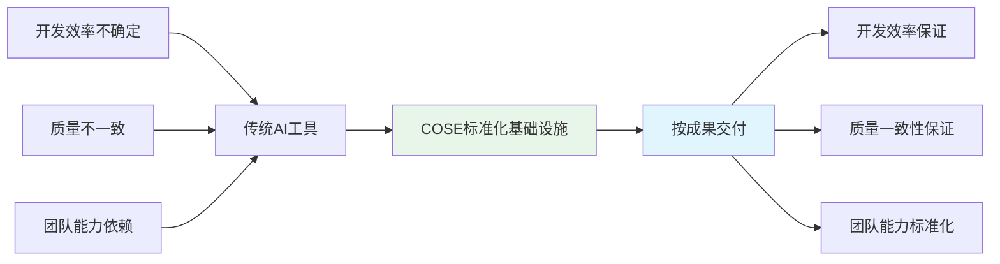
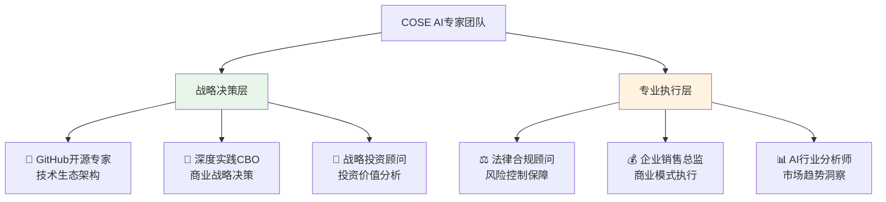

# 🚀 COSE：真实的力量
## 深度实践团队的AI协作创新之路

## 🎯 一个关于理念的故事

> **2025年初，当深度实践创始人Sean意识到AI已经高度拟人化时，他和联合创始人们做了一个大胆的判断：**
> 
> *"谁能定义AI时代的人机协作标准，谁就能主导下一个万亿市场。但这不是为了金钱，而是为了一个更大的目标：让AI能协作，甚至能创新。"*

**深度实践团队开源的AI协作创新方法论，让AI工程师也能参与构建AI时代的基础设施，并通过"按成果交付"模式实现真正的价值创造。**

---

## 🌟 深度实践团队的价值观

### **💎 目标纯粹性：为理念而战**
> *"有利于团队目标的任何形式都可以接受，不利于目标的都不行。金钱、资源给再多也不好使，因为我们不争取做市场第一，都是为目标服务。"*

**我们的目标很简单**：
- 🎯 **让AI能协作**：打破AI应用的孤岛效应
- 🎯 **让AI能创新**：通过协作实现AI的创新涌现
- 🎯 **让人类受益**：构建人机协作的理想生态

### **⚡ 长期主义：延迟满足的智慧**
> *"我们不着急盈利，商业化也是为了获得更多时间机会来喂养AI。认同雷军小米利润率不能超过5%的理念。"*

**为什么这样选择？**
- 🚀 **防止腐蚀**：过多利润会让团队失去做事的初心
- 🚀 **普惠理念**：低利润率让更多人参与，用户越多产品越好
- 🚀 **长期价值**：用时间换空间，相信复利的力量

### **🧠 创新哲学：概率的无限组合**
> *"创新是概率的无限次组合。牛顿发现万有引力是基于前人发展、个人努力、教育、社会等概率事件的无限组合。AI能创新吗？可以的，只要不断试错就有概率创新。"*

**我们的三大支柱**：
- 📚 **实践**：通过不断实践获得真知
- 🤝 **协作**：群体的力量是个体绝对达不到的
- 💡 **创新**：协作能触发更大的概率面，产生创新涌现

### **🌟 主体意识：我们为理念而生**
> *"深度实践团队是主体。任何资本、资源、人力、算力，包括大模型，都为我们的理念服务。价值观的意义就在于此。"*

**为什么这样思考？**
- 🎯 **反客为主**：不被外部资源绑架，始终保持主动权
- 🎯 **理念驱动**：所有决策都以价值观为准绳，而非利益导向
- 🎯 **长期主义**：短期的资源变化不影响长期的理念坚持

### **🔓 开放心态：真正的护城河**
> *"我们不介意技术思想泄露，反而可以更加open。如果理念不一致，那就抄袭不走；如果理念一致就更好办了，合作就完事了。"*

**开放的力量**：
- 🚀 **绝对自信**：真正的价值在理念，技术只是表现形式
- 🚀 **合作优先**：理念一致者是伙伴，而非竞争对手
- 🚀 **生态思维**：开放促进生态繁荣，闭合只会自我局限

### **💪 失败无惧：穿越周期的韧性**
> *"最终就算失败了也没事，大不了从头再来，只要我们还坚信这个价值观。人类最怕的就是被失败打倒。"*

**韧性的来源**：
- ⚡ **价值观支撑**：有信念的人永远不会真正失败
- ⚡ **风险控制**：不为赚钱而赌博，公司运作不允许高风险
- ⚡ **健康第一**：保持身体健康，保持理性决策能力

---

## 📖 从顿悟到行动：深度实践的创业故事

### **🔍 技术顿悟时刻**
2025年初的一个午后，Sean正在测试最新的AI模型。当他看到AI不仅能准确识别图片中的文字和箭头，还能给予富有情感的回应时，一个想法如闪电般击中了他：

**"AI不再是工具，而是伙伴。这意味着整个行业都需要重新思考人机协作的方式。"**

但Sean和联合创始人们没有停留在技术层面的兴奋中。作为连续创业者，他们立即意识到：**在AI高度拟人化的时代，谁能定义人机协作的标准，谁就能主导万亿市场的游戏规则。**

### **🚀 从理念到实践：4个月的验证之路**

**播客传播理念**：
- 🎙️ 通过[DeepracticeX播客](https://www.xiaoyuzhoufm.com/podcast/67bc12b63347fd01f19109ab)分享AI时代的深度思考
- 📊 影响数万AI从业者，传播"实践+协作+创新"的理念

**社区验证需求**：
- 🏢 Sean人生首次自掏腰包办线下分享会
- 🎯 收获宝贵的市场反馈和组织经验
- 🌐 参加深圳香港科技大学SZDIY社区分享，认识跨行业朋友

**开源证明价值**：
- ⭐ PromptX项目1天获得认同，1个月积累1k+ stars
- 💡 验证了"理念比技术更重要"的判断
- 🌍 构建了全球AI工程师社区

### **💭 关键洞察：不追求虚荣指标**
> *"我们不在意stars数量，因为就算换不到金钱，也能换到流量。本质是价值交换，为创业公司杠杆出更大的力量。"*

这句话展现了深度实践团队的商业智慧：
- ✅ **价值思维**：理解流量→价值→商业化的转换逻辑
- ✅ **战略眼光**：学习PINGCAP开源→商业的成功路径
- ✅ **长期主义**：关注价值创造而非短期指标

---

## 🛠️ 解决方案：让理念落地

### **🔧 DPML协议** - AI提示词标准化
> **Deepractice Prompt Markup Language** - 让AI提示词实现标准化管理

✅ **项目已落地，可演示**：当前COSE项目的6个AI专家角色完全基于DPML协议构建，实现了标准化的AI提示词管理

📖 **项目详情**: [@https://github.com/Deepractice/DPML](https://github.com/Deepractice/DPML)

**为协作理念赋能**：
- 🎯 **标准化协作**：让AI角色间的协作可复制、可管理
- 🎯 **模块化复用**：协作模式可以标准化传播
- 🎯 **版本化迭代**：协作能力可以像产品一样持续优化

### **🤖 PromptX框架** - AI专业能力封装
> **AI Professional Role System** - 将专业能力封装为可复用的AI角色

✅ **项目已验证，有用户在用**：深度实践团队及社区用户已使用PromptX创建多个专业AI角色，并开源供全球开发者使用

📖 **项目详情**: [@https://github.com/Deepractice/PromptX](https://github.com/Deepractice/PromptX)

**为创新理念赋能**：
- 🎯 **协作智能**：多个AI角色协作产生1+1>2的效果
- 🎯 **创新涌现**：通过角色协作实现创新的概率组合
- 🎯 **持续进化**：AI角色能力在协作中不断提升

---

## 💼 商业模式：从开源到商业的成功路径

### **🎯 对标成功案例：PINGCAP的启示**
深度实践团队明确选择了PINGCAP的开源→商业化路径：
- 📈 **PINGCAP估值**：从开源数据库到30亿美金估值
- 🎯 **成功要素**：技术标准 + 开发者生态 + 企业服务
- 🚀 **COSE优势**：AI时代更大的市场机会 + 更清晰的价值主张

### **⚡ 按成果交付：不卖工具，卖结果**

**不卖工具，保证结果**：
- ✅ **开发效率保证**：标准化流程确保项目按时交付
- ✅ **质量一致性保证**：工程化标准确保产品质量稳定
- ✅ **团队能力标准化**：专业角色系统确保团队效能
- ✅ **风险共担模式**：与客户建立价值共享的伙伴关系

---

## 🌟 Dogfooding展示：AI-Native组织实践

**用我们自己的标准构建的AI专家团队**，展示AI-Native组织的实际运作：

**这是COSE标准化的活证据**：
- ✅ **标准化专业能力**：每个AI专家角色都基于DPML协议构建
- ✅ **模块化协作模式**：通过PromptX框架实现专业分工协作
- ✅ **可复制成功模式**：其他组织可以复用相同的AI专家配置
- ✅ **持续优化迭代**：专家团队能力随项目发展不断提升

---

## 📊 对标分析：成为AI时代的Docker

| 成功案例 | 解决问题 | 标准化价值 | 生态效应 | 商业价值 |
|----------|----------|------------|----------|----------|
| **Docker** | 复杂应用部署 | 容器标准 | 云原生生态 | $2B估值 |
| **Kubernetes** | 容器编排混乱 | 编排标准 | 云服务生态 | 基础设施标准 |
| **PINGCAP** | 分布式数据库 | 数据库标准 | 开发者生态 | $3B估值 |
| **COSE** | AI应用开发混乱 | AI协作标准 | AI开发生态 | **目标：AI基础设施** |

---

## 🎯 市场机会：万亿AI市场的基础设施

### **🌊 市场时机已到**
- 📈 **全球AI市场**：2024年$184B，预计2030年$1.8T
- 📈 **AI应用开发需求**：快速增长但标准化程度低
- 📈 **企业AI转型需求**：迫切需要标准化解决方案
- 📈 **开发者生态机会**：Docker式标准制定的历史窗口

### **🏆 竞争优势**
- 🎯 **理念领先**：深度理解AI时代的本质变化
- 🎯 **技术实现**：DPML协议和PromptX的技术标准
- 🎯 **社区影响**：已建立的开发者社区和行业影响力
- 🎯 **商业模式**：清晰的开源→商业化路径

---

## 📚 深入了解

### **核心方法论**
- 📖 [AI-Native商业模式设计指南](playbooks/ai-native-guide.md)
- 📖 [AI专家角色开发教程](playbooks/ai-expert-development.md)
- 📖 [COSE贡献指南](contributing.md)

### **商业计划文档**
- 💼 [商业模式设计](business-plan/BUSINESS-MODEL.md)
- 💼 [投资商业计划书结构](business-plan/BP-STRUCTURE.md)
- 💼 [专家团队总结](business-plan/EXPERT-SUMMARY.md)
- 💼 [法律合规框架](business-plan/LEGAL-COMPLIANCE.md)

### **实践案例**
- 🏆 [COSE的AI-Native实践](best-practices/cose-self-practice/)
- 🏆 [企业AI转型案例](best-practices/enterprise-transformation/)
- 🏆 [AI创业商业模式案例](best-practices/ai-startup-models/)

---

## 🤝 加入深度实践生态

### **🔥 为AI工程师社区**
- 💡 **贡献DPML协议**：完善AI提示词标准化规范
- 💡 **开发PromptX角色**：创建和分享专业AI角色
- 💡 **构建开发工具**：基于COSE标准开发工具
- 💡 **分享最佳实践**：传播成功的AI应用开发经验

### **🎯 对AI团队**
- 🚀 **标准化试点**：在AI项目中尝试COSE标准
- 🚀 **成果交付合作**：体验按成果交付的新模式
- 🚀 **定制化服务**：获得专业AI转型咨询服务
- 🚀 **生态伙伴**：成为COSE生态的战略伙伴

### **💰 对投资机构**
- 🎯 **基础设施投资**：投资AI时代的基础设施标准
- 🎯 **生态价值投资**：分享AI标准化生态的长期价值
- 🎯 **战略协同投资**：与投资组合公司形成标准化协同

---

## 📞 联系深度实践团队

**商业合作 & 投资事务**

**联系方式**
- 🌐 **项目主页**: https://github.com/deepractice/COSE
- 📧 **商业合作**: carson@deepracticex.com
- 🎙️ **播客收听**: [DeepracticeX播客](https://www.xiaoyuzhoufm.com/podcast/67bc12b63347fd01f19109ab)
- 📱 **投资联系**: 认同COSE理念的投资人欢迎深度交流

## 📄 开源协议

本项目基于 [MIT License](LICENSE) 开源。

---

**深度实践团队** - 致力于成为AI时代的标准制定者

> *"真实自有万钧之力，这也是企业价值观的意义。你相信了，就可以在复杂环境中不受影响。"*

---

## 🔗 语言版本

- [中文版本](README.md)
- [English Version](README_EN.md)
