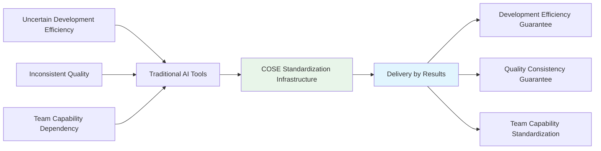
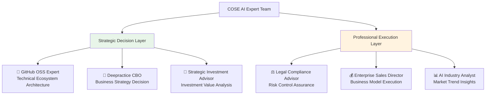

# 🚀 COSE: The Power of Authenticity
## Deepractice Team's AI Collaboration Innovation Journey

## 🎯 A Story About Beliefs

> **In early 2025, when Deepractice founder Sean realized that AI had become highly humanized, he and his co-founders made a bold judgment:**
> 
> *"Whoever can define the standards for human-AI collaboration in the AI era will dominate the next trillion-dollar market. But this isn't about money—it's about a bigger goal: making AI capable of collaboration, and even innovation."*

**Deepractice team's open-source AI collaboration innovation methodology enables AI engineers to participate in building AI-era infrastructure and achieve true value creation through "delivery by results" model.**

---

## 🌟 Deepractice Team's Values

### **💎 Goal Purity: Fighting for Beliefs**
> *"Any form that benefits the team's goals is acceptable; anything that doesn't benefit the goals is not. No amount of money or resources will work if they don't serve our goals, because we don't compete to be market leaders—everything serves our purpose."*

**Our goals are simple**:
- 🎯 **Make AI Collaborative**: Break down AI application silos
- 🎯 **Make AI Innovative**: Achieve AI innovation emergence through collaboration
- 🎯 **Benefit Humanity**: Build an ideal ecosystem for human-AI collaboration

### **⚡ Long-termism: The Wisdom of Delayed Gratification**
> *"We're not in a hurry to profit. Commercialization is also about getting more time opportunities to feed AI. We agree with Lei Jun's philosophy that Xiaomi's profit margin cannot exceed 5%."*

**Why this choice?**
- 🚀 **Prevent Corruption**: Excessive profits make teams lose their original intention
- 🚀 **Universal Philosophy**: Low profit margins allow more participation; more users mean better products
- 🚀 **Long-term Value**: Trade time for space, believe in the power of compound interest

### **🧠 Innovation Philosophy: Infinite Combinations of Probability**
> *"Innovation is infinite combinations of probability. Newton's discovery of universal gravitation was based on infinite combinations of probability events like predecessors' developments, personal efforts, education, and society. Can AI innovate? Yes, as long as we keep trying and failing, there's probability for innovation."*

**Our three pillars**:
- 📚 **Practice**: Gain true knowledge through continuous practice
- 🤝 **Collaboration**: The power of groups is absolutely unreachable by individuals
- 💡 **Innovation**: Collaboration can trigger larger probability surfaces, generating innovation emergence

### **🌟 Subject Consciousness: We Exist for Our Beliefs**
> *"Deepractice team is the subject. Any capital, resources, manpower, computing power, including large models, all serve our beliefs. This is the meaning of values."*

**Why think this way?**
- 🎯 **Anti-Reversal**: Not hijacked by external resources, always maintain initiative
- 🎯 **Belief-Driven**: All decisions are based on values, not profit-oriented
- 🎯 **Long-termism**: Short-term resource changes don't affect long-term belief persistence

### **🔓 Open Mindset: The Real Moat**
> *"We don't mind technology ideas leaking; we can be even more open. If beliefs don't align, they can't copy successfully; if beliefs align, that's even better—let's collaborate."*

**The power of openness**:
- 🚀 **Absolute Confidence**: True value lies in beliefs; technology is just expression
- 🚀 **Collaboration First**: Those with aligned beliefs are partners, not competitors
- 🚀 **Ecosystem Thinking**: Openness promotes ecosystem prosperity; closure only limits oneself

### **💪 Fearless of Failure: Resilience to Navigate Cycles**
> *"Even if we ultimately fail, it's okay. At worst, we start over, as long as we still believe in these values. What humans fear most is being defeated by failure."*

**Sources of resilience**:
- ⚡ **Value Support**: People with beliefs never truly fail
- ⚡ **Risk Control**: Not gambling for money; company operations don't allow high risks
- ⚡ **Health First**: Maintain physical health and rational decision-making ability

---

## 📖 From Epiphany to Action: Deepractice's Startup Story

### **🔍 Technical Epiphany Moment**
One afternoon in early 2025, Sean was testing the latest AI model. When he saw AI not only accurately identify text and arrows in images but also respond with emotion, an idea struck him like lightning:

**"AI is no longer a tool, but a partner. This means the entire industry needs to rethink human-AI collaboration."**

But Sean and his co-founders didn't stop at technical excitement. As serial entrepreneurs, they immediately realized: **In an era of highly humanized AI, whoever can define the standards for human-AI collaboration will dominate the trillion-dollar market rules.**

### **🚀 From Concept to Practice: 4 Months of Validation**

**Spreading Ideas Through Podcasts**:
- 🎙️ Share deep thinking about the AI era through [DeepracticeX Podcast](https://www.xiaoyuzhoufm.com/podcast/67bc12b63347fd01f19109ab)
- 📊 Influence tens of thousands of AI practitioners, spreading the philosophy of "Practice + Collaboration + Innovation"

**Community Validation of Demand**:
- 🏢 Sean's first self-funded offline sharing session in his life
- 🎯 Gained valuable market feedback and organizational experience
- 🌐 Participated in Shenzhen HKUST SZDIY community sharing, meeting cross-industry friends

**Open Source Proving Value**:
- ⭐ PromptX project gained recognition in 1 day, accumulated 1k+ stars in 1 month
- 💡 Validated the judgment that "beliefs are more important than technology"
- 🌍 Built global AI engineer community

### **💭 Key Insight: Not Pursuing Vanity Metrics**
> *"We don't care about star counts because even if they can't be converted to money, they can be converted to traffic. It's essentially value exchange, leveraging greater power for startups."*

This statement shows Deepractice team's business wisdom:
- ✅ **Value Thinking**: Understanding the conversion logic of traffic → value → commercialization
- ✅ **Strategic Vision**: Learning from PINGCAP's successful open source → commercial path
- ✅ **Long-termism**: Focus on value creation rather than short-term metrics

---

## 🛠️ Technical Implementation: Grounding Our Beliefs

### **🔧 DPML Protocol** - AI Prompt Engineering
> **Deepractice Prompt Markup Language** - Make AI prompts as engineered as code

✅ **Protocol Implemented and Demonstrable**: The current 6 AI expert roles in COSE project are entirely built on DPML protocol, achieving standardized AI prompt engineering management

📖 **Complete Technical Documentation**: [@https://github.com/Deepractice/DPML](https://github.com/Deepractice/DPML)

**Empowering Collaboration Philosophy**:
- 🎯 **Standardized Collaboration**: Make AI role collaboration replicable and manageable
- 🎯 **Modular Reuse**: Collaboration patterns can be standardized and disseminated
- 🎯 **Versioned Iteration**: Collaboration capabilities can be continuously optimized like products

### **🤖 PromptX Framework** - AI Professional Capability Encapsulation
> **AI Professional Role System** - Encapsulate professional capabilities into reusable AI roles

✅ **PromptX Has Users and Is Verifiable**: Deepractice team and community users have used PromptX to create multiple professional AI roles, open-sourced for global developers

📖 **Complete Technical Documentation**: [@https://github.com/Deepractice/PromptX](https://github.com/Deepractice/PromptX)

**Empowering Innovation Philosophy**:
- 🎯 **Collaborative Intelligence**: Multiple AI roles collaborating create 1+1>2 effects
- 🎯 **Innovation Emergence**: Achieve innovation probability combinations through role collaboration
- 🎯 **Continuous Evolution**: AI role capabilities continuously improve through collaboration

---

## 💼 Business Model: Successful Path from Open Source to Commercial

### **🎯 Benchmarking Success: PINGCAP's Inspiration**
Deepractice team clearly chose PINGCAP's open source → commercialization path:
- 📈 **PINGCAP Valuation**: From open source database to $3B valuation
- 🎯 **Success Factors**: Technical standards + Developer ecosystem + Enterprise services
- 🚀 **COSE Advantages**: Larger market opportunity in AI era + Clearer value proposition

### **⚡ Delivery by Results: Not Selling Tools, Selling Outcomes**

**Not selling tools, guaranteeing results**:
- ✅ **Development Efficiency Guarantee**: Standardized processes ensure on-time project delivery
- ✅ **Quality Consistency Guarantee**: Engineering standards ensure stable product quality
- ✅ **Team Capability Standardization**: Professional role system ensures team effectiveness
- ✅ **Risk-Sharing Model**: Establish value-sharing partnerships with clients

---

## 🌟 Dogfooding Demonstration: AI-Native Organization Practice

**AI expert team built with our own standards**, demonstrating the actual operation of AI-Native organizations:

**This is living proof of COSE standardization**:
- ✅ **Standardized Professional Capabilities**: Each AI expert role built on DPML protocol
- ✅ **Modular Collaboration Model**: Professional division of labor through PromptX framework
- ✅ **Replicable Success Model**: Other organizations can reuse the same AI expert configuration
- ✅ **Continuous Optimization Iteration**: Expert team capabilities continuously improve with project development

---

## 📊 Benchmark Analysis: Becoming the Docker of the AI Era

| Success Cases | Problem Solved | Standardization Value | Ecosystem Effect | Commercial Value |
|---------------|----------------|----------------------|------------------|------------------|
| **Docker** | Complex Application Deployment | Container Standards | Cloud-Native Ecosystem | $2B Valuation |
| **Kubernetes** | Container Orchestration Chaos | Orchestration Standards | Cloud Service Ecosystem | Infrastructure Standard |
| **PINGCAP** | Distributed Database | Database Standards | Developer Ecosystem | $3B Valuation |
| **COSE** | AI Application Development Chaos | AI Collaboration Standards | AI Development Ecosystem | **Goal: AI Infrastructure** |

---

## 🎯 Market Opportunity: Infrastructure for the Trillion-Dollar AI Market

### **🌊 Market Timing Is Right**
- 📈 **Global AI Market**: $184B in 2024, projected $1.8T in 2030
- 📈 **AI Application Development Demand**: Rapid growth but low standardization
- 📈 **Enterprise AI Transformation Demand**: Urgent need for standardization solutions
- 📈 **Developer Ecosystem Opportunity**: Docker-style standard-setting historical window

### **🏆 Competitive Advantages**
- 🎯 **Leading Philosophy**: Deep understanding of AI era's essential changes
- 🎯 **Technical Implementation**: Technical standards of DPML protocol and PromptX
- 🎯 **Community Influence**: Established developer community and industry influence
- 🎯 **Business Model**: Clear open source → commercialization path

---

## 📚 Learn More

### **Core Methodology**
- 📖 [AI-Native Business Model Design Guide](playbooks/ai-native-guide.md)
- 📖 [AI Expert Role Development Tutorial](playbooks/ai-expert-development.md)
- 📖 [COSE Contribution Guide](contributing.md)

### **Business Plan Documents**
- 💼 [Business Model Design](business-plan/BUSINESS-MODEL.md)
- 💼 [Investment Business Plan Structure](business-plan/BP-STRUCTURE.md)
- 💼 [Expert Team Summary](business-plan/EXPERT-SUMMARY.md)
- 💼 [Legal Compliance Framework](business-plan/LEGAL-COMPLIANCE.md)

### **Practice Cases**
- 🏆 [COSE's AI-Native Practice](best-practices/cose-self-practice/)
- 🏆 [Enterprise AI Transformation Cases](best-practices/enterprise-transformation/)
- 🏆 [AI Startup Business Model Cases](best-practices/ai-startup-models/)

---

## 🤝 Join the Deepractice Ecosystem

### **🔥 For AI Engineer Community**
- 💡 **Contribute to DPML Protocol**: Improve AI prompt standardization specifications
- 💡 **Develop PromptX Roles**: Create and share professional AI roles
- 💡 **Build Development Tools**: Develop tools based on COSE standards
- 💡 **Share Best Practices**: Spread successful AI application development experiences

### **🏢 For Enterprise Users**
- 🎯 **Standardization Pilot**: Try COSE standards in AI projects
- 🎯 **Results Delivery Cooperation**: Experience the new model of delivery by results
- 🎯 **Customized Services**: Get professional AI transformation consulting services
- 🎯 **Ecosystem Partnership**: Become strategic partners in the COSE ecosystem

### **💰 For Investment Institutions**
- 💎 **Infrastructure Investment**: Invest in AI era infrastructure standards
- 💎 **Ecosystem Value Investment**: Share long-term value of AI standardization ecosystem
- 💎 **Strategic Synergy Investment**: Form standardization synergy with portfolio companies

---

## 📞 Contact Deepractice Team

**Business Cooperation & Investment Matters**

**Contact Information**
- 🌐 **Project Homepage**: https://github.com/deepractice/COSE
- 📧 **Business Cooperation**: carson@deepracticex.com
- 💬 **Technical Discussion**: [GitHub Discussions](https://github.com/deepractice/COSE/discussions)
- 📱 **Investment Connection**: Investors who recognize COSE's vision are welcome for in-depth communication

---

*The Deepractice team believes that in the AI era, the most powerful force is not technology itself, but the beliefs and collaboration behind the technology. We invite every AI engineer and entrepreneur who shares our vision to join us in building the future of human-AI collaboration.* 