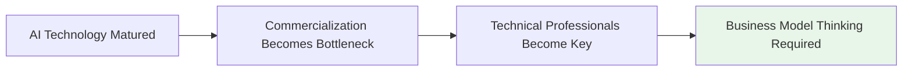
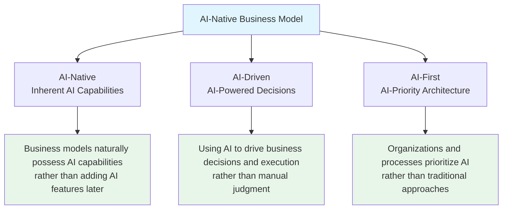
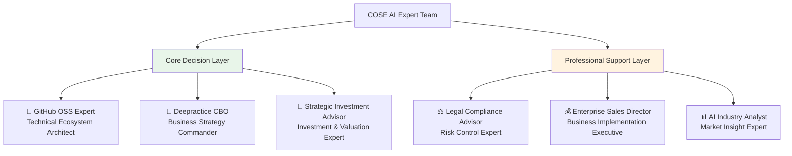
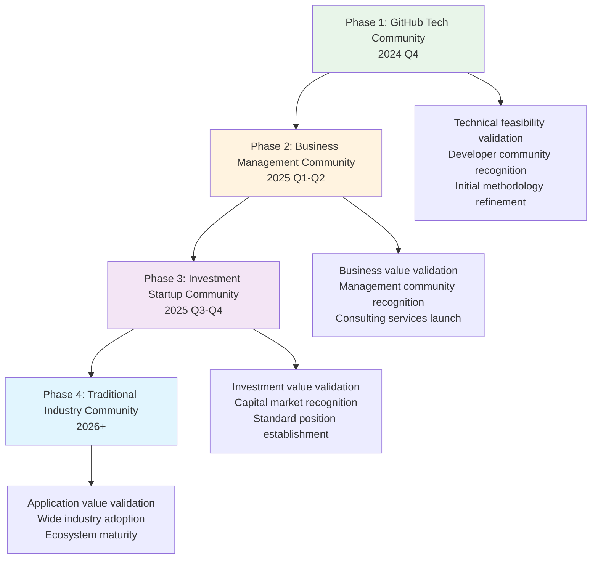

# COSE: AI-Native Open Source Business Plan by Deepractice Team

> **Commercial Open Source Engineering** - Open Source Business Model Methodology for the AI Era

[](https://github.com/deepractice/COSE/stargazers)
[](LICENSE)
[](docs/ai-native-guide.md)

## 🎯 One-Line Value Proposition

**Deepractice Team's open-sourced AI-Native business model methodology that enables technical professionals to design successful business models for the AI era.**

## 🔥 Why Should Technical Professionals Care About Business Models?



- **AI technology has become commoditized** - differentiation lies in business model innovation
- **Technical professionals are often the core drivers of enterprise AI transformation**
- **AI-Native business models require deep integration of technology and business**
- **Traditional business models need to be redesigned for the AI era**

## 🧠 Deepractice Team's Methodology Contribution

### **AI-Native Trinity Framework**



### **Core Innovations**

- 🚀 **Open Source Business Plans**: Not open source code, but open source business model design methodology
- 🚀 **Technical Implementation Guidance**: Provides concrete technical implementation solutions like DPML protocol
- 🚀 **Live Operating Examples**: 6 AI experts collaboration showcasing AI-Native organizational models
- 🚀 **Progressive Dissemination**: Starting from tech communities, gradually expanding to business, investment, and industry communities

## 💡 Quick Experience: Understanding AI-Native Business Models in 5 Minutes

### **Dogfooding Demonstration: 6 AI Experts Collaboration**

We created 6 AI professional roles using our own methodology, demonstrating actual AI-Native organizational operations:



**This is live evidence of AI-Native approach**:
- ✅ **24/7 Professional Consulting**: AI teams have no time zone limitations
- ✅ **Multi-role Parallel Collaboration**: Simultaneous analysis from 6 professional perspectives
- ✅ **Extremely High Cost Efficiency**: 90%+ cost reduction compared to traditional consulting teams
- ✅ **Continuous Learning Evolution**: Team capabilities continuously improve with project development

### **Technical Implementation: DPML Protocol**

```bash
# Quick experience of AI expert collaboration
git clone https://github.com/deepractice/COSE.git
cd COSE
npm install -g @deepractice/promptx

# Activate AI expert team
promptx action github-oss-expert
promptx action deepractice-cbo
promptx action strategic-investment-advisor
```

## 📚 In-Depth Learning Resources

### **Methodology Documentation**
- 📖 [AI-Native Business Model Design Guide](docs/ai-native-guide.md)
- 📖 [AI-Driven Decision Framework](docs/ai-driven-framework.md)
- 📖 [AI-First Organizational Architecture](docs/ai-first-organization.md)

### **Technical Implementation Documentation**
- 🔧 [DPML Protocol Technical Specification](docs/dpml-specification.md)
- 🔧 [PromptX Framework Usage Guide](docs/promptx-guide.md)
- 🔧 [AI Expert Role Development Tutorial](docs/ai-expert-development.md)

### **Practice Cases**
- 🏆 [COSE Project's Own AI-Native Practice](examples/cose-self-practice/)
- 🏆 [Traditional Enterprise AI Transformation Cases](examples/enterprise-transformation/)
- 🏆 [AI Startup Business Model Cases](examples/ai-startup-models/)

## 🌟 Value for Technical Communities

### **For Developers**
- 🎯 **Business Thinking Enhancement**: Technical professionals can also design business models
- 🎯 **AI Project Commercialization**: Methodology from technical demo to business success
- 🎯 **Career Development Path**: From technical expert to technology+business hybrid talent

### **For Technical Teams**
- 🎯 **AI-Native Organizational Design**: How to build truly AI-driven teams
- 🎯 **Technology Commercialization Strategy**: How to convert technical advantages into business value
- 🎯 **Open Source Business Models**: How to build sustainable business models on open source foundations

### **For Technical Managers**
- 🎯 **AI Transformation Methodology**: Systematic guidance for AI business transformation
- 🎯 **Investment Decision Support**: Business value assessment framework for technical projects
- 🎯 **Team Capability Building**: Cultivating technology+business hybrid talents

## 🚀 Contributing

### **Ways to Contribute**
- 💡 **Methodology Enhancement**: Share your AI-Native business model practices
- 🔧 **Technical Implementation**: Improve DPML protocol and PromptX framework
- 📝 **Case Sharing**: Provide actual success or failure cases
- 🌍 **Community Outreach**: Help spread the methodology across more communities

### **Quick Start**
```bash
# Fork this repository
git fork https://github.com/deepractice/COSE.git

# Create your feature branch
git checkout -b feature/your-contribution

# Commit your changes
git commit -am 'Add: your AI-Native practice'

# Push to the branch
git push origin feature/your-contribution

# Create a Pull Request
```

## 🌍 Global Market Strategy

### **Progressive Multi-Platform Dissemination**



### **Localized Value Propositions**

#### **Silicon Valley Tech Community**
- **Core Value**: Bridge between technical innovation and business success
- **Main Content**: Open methodology + technical implementation guidance
- **Business Model**: Free open source + enterprise-grade services

#### **European Business Community**
- **Core Value**: AI-era business model innovation for traditional enterprises
- **Main Content**: Methodology training + consulting services
- **Business Model**: Consulting services + training certification

#### **Asian Investment Community**
- **Core Value**: Investment decision support for AI projects
- **Main Content**: Investment analysis framework + due diligence tools
- **Business Model**: Professional services + platform tools

## 🏆 Success Stories & Benchmarks

### **Comparing with Successful Standards**

| Standard Setter | Technical Standard | Market Value | Monopoly Position |
|-----------------|-------------------|--------------|-------------------|
| Docker Inc | Containerization Standard | $20B+ | Cloud-native Foundation |
| CNCF/Google | Orchestration Standard | $100B+ | Container Ecosystem Core |
| **Deepractice** | **AI-Native Standard** | **$?B+** | **AI Business Infrastructure** |

### **COSE's Unique Competitive Advantages**

1. **Methodology First-Mover Advantage**: First systematic AI-Native business model methodology
2. **Practice Validation Advantage**: Creating actual value using our own methodology
3. **Open Source Ecosystem Advantage**: Rapidly establishing standards and influence through open source
4. **Technical Implementation Advantage**: Complete technical implementation solutions (DPML protocol)
5. **Team Capability Advantage**: Deepractice Team's systematic innovation capabilities

## 📊 Success Metrics

### **Short-term Metrics (3-6 months)**
- GitHub Stars: Target 1000+
- Active Community Contributors: Target 100+
- Methodology Downloads/Usage: Target 500+

### **Medium-term Metrics (6-12 months)**
- Enterprise Clients: Target 50+
- Commercial Revenue: Target $100K+
- Industry Influence Ranking: Target Top 10

### **Long-term Metrics (1-3 years)**
- Standard Adoption Rate: Target Industry Top 3
- Ecosystem Partners: Target 1000+
- Platform Total Value: Target $10M+

## 📞 Contact Deepractice Team

- 🌐 **Project Homepage**: https://github.com/deepractice/COSE
- 📧 **Business Cooperation**: carson@deepracticex.com
- 💬 **Technical Discussion**: [GitHub Discussions](https://github.com/deepractice/COSE/discussions)
- 📱 **Community Exchange**: Technical professionals who recognize AI-Native philosophy, welcome to engage in deep discussions through Issues

## 🇨🇳 Chinese Market Focus

While COSE aims for global impact, **Deepractice Team maintains strategic focus on the Chinese market as our fundamental base**:

- 🎯 **Deep Local Understanding**: Leveraging deep insights into Chinese enterprise AI transformation needs
- 🎯 **Cultural Adaptation**: AI-Native methodology adapted for Chinese business culture and practices
- 🎯 **Ecosystem Integration**: Close integration with China's AI industry ecosystem and investment landscape
- 🎯 **Regulatory Compliance**: Full compliance with Chinese data protection and business regulations

**Global Expansion Strategy**: Using international visibility to enhance domestic market credibility while building global influence for the AI-Native methodology standard.

## 📄 License

This project is licensed under the [MIT License](LICENSE).

---

**Deepractice Team** - Focused on AI-era business model innovation and practice

[](https://deepracticex.com)

---

## 🔗 Language Versions

- 🇨🇳 [中文版本 (Chinese)](README.md)
- 🇺🇸 [English Version](README_EN.md) 