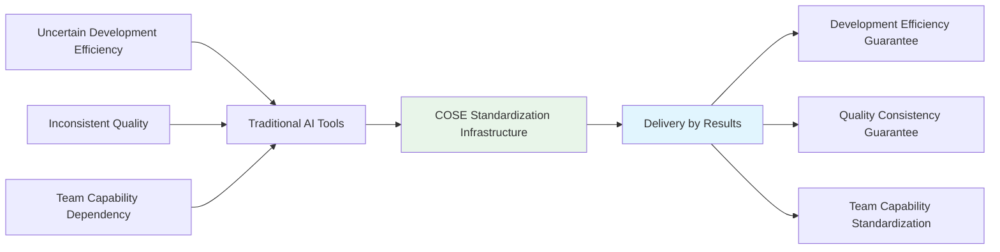
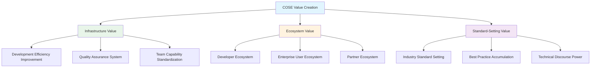
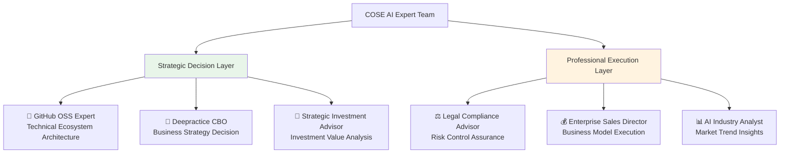

# COSE: Commercial Open Source Engineering

> **AI Application Development Standardization Infrastructure** - Becoming the "Rule Maker" in the Trillion-Dollar AI Market

## 🎯 Value Proposition

**COSE is committed to becoming the standardization infrastructure for AI application development, ensuring AI project delivery through engineering methods, making AI development as simple and reliable as building with blocks.**

## 🚀 Core Value: From "Selling Tools" to "Delivery by Results"

**Not selling tools, but guaranteeing results**:
- ✅ **Development Efficiency Guarantee**: Standardized processes ensure on-time project delivery
- ✅ **Quality Consistency Guarantee**: Engineering standards ensure stable product quality
- ✅ **Team Capability Standardization**: Professional role system ensures team effectiveness
- ✅ **Risk-Sharing Model**: Establish value-sharing partnerships with clients

## 🏗️ Technical Infrastructure

COSE builds AI application development standardization infrastructure based on two core technical standards:

### 🔧 **DPML Protocol** - AI Prompt Standardization
> **Deepractice Prompt Markup Language** - Making AI prompts as engineered as code

📖 **Complete Technical Documentation**: [@https://github.com/Deepractice/DPML](https://github.com/Deepractice/DPML)

**Core Value**:
- 🎯 **Structured Definition**: Three-component architecture (personality/principle/knowledge)
- 🎯 **Modular Reuse**: @reference mechanism for prompt componentization
- 🎯 **Version Management**: Managing AI capabilities like managing code
- 🎯 **Standardized Collaboration**: Unified AI development language for team collaboration

### 🤖 **PromptX Framework** - AI Professional Capability Modularization
> **AI Professional Role System** - Encapsulating professional capabilities into reusable AI roles

📖 **Complete Technical Documentation**: [@https://github.com/Deepractice/PromptX](https://github.com/Deepractice/PromptX)

**Core Value**:
- 🎯 **Professional Role Encapsulation**: Standardizing domain expert capabilities into AI roles
- 🎯 **One-Click Activation**: Simple invocation of complex professional capabilities
- 🎯 **Continuous Learning Evolution**: Continuous accumulation and optimization of role capabilities
- 🎯 **Ecosystem Expansion**: Building an open ecosystem of professional AI roles

## 💼 Business Model Innovation: Results Delivery Guarantor

### **Traditional Model vs COSE Model**

| Dimension | Traditional AI Tools | COSE Standardization Infrastructure |
|-----------|---------------------|-------------------------------------|
| **Positioning** | Tool Provider | Results Delivery Guarantor |
| **Relationship** | Transaction | Risk-Sharing Partnership |
| **Guarantee** | Feature Availability | Results Achievement |
| **Pricing** | Feature-based Fees | Results-based Revenue Sharing |
| **Responsibility** | Tool Maintenance | Project Success |

### **Three-Layer Value Creation**

## 🌟 Dogfooding Demonstration: AI-Native Organization Practice

**AI expert team built with COSE's own standards**, demonstrating the actual operation of AI-Native organizations:

**This is the living proof of COSE standardization**:
- ✅ **Standardized Professional Capabilities**: 6 expert roles built based on DPML protocol
- ✅ **Modular Collaboration Model**: Professional division of labor through PromptX framework
- ✅ **Replicable Success Model**: Other organizations can reuse the same AI expert configuration
- ✅ **Continuous Optimization Iteration**: Expert team capabilities continuously improve with project development

## 📊 Benchmark Analysis: Becoming the Docker of the AI Era

| Success Cases | Problem Solved | Standardization Value | Ecosystem Effect | Commercial Value |
|---------------|----------------|----------------------|------------------|------------------|
| **Docker** | Complex Application Deployment | Container Standards | Cloud-Native Ecosystem | $2B Valuation |
| **Kubernetes** | Container Orchestration Chaos | Orchestration Standards | Cloud Service Ecosystem | Infrastructure Standard |
| **GraphQL** | Inconsistent API Interfaces | Query Standards | Development Tool Ecosystem | Industry Standard |
| **COSE** | Non-Standard AI Development | AI Application Development Standards | AI Development Ecosystem | **Goal: AI Infrastructure** |

## 🎯 Market Opportunity: Infrastructure for the Trillion-Dollar AI Market

### **Market Size and Timing**
- 📈 **Global AI Market**: $184B in 2024, projected $1.8T by 2030
- 📈 **AI Application Development Market**: Rapid growth but low standardization
- 📈 **Enterprise AI Transformation Demand**: Urgent need for standardization solutions
- 📈 **Developer Ecosystem Opportunity**: Docker-style standard-setting window

### **Competitive Advantages**
- 🏆 **Technical First-Mover Advantage**: DPML protocol standardization innovation
- 🏆 **Open Source Ecosystem Strategy**: Community-driven standard promotion
- 🏆 **Engineering DNA**: Technical foundation of Deepractice team
- 🏆 **Business Model Innovation**: Differentiated positioning of delivery by results

## 📚 Learning Resources

### **Core Methodology**
- 📖 [AI-Native Business Model Guide](docs/ai-native-guide.md)
- 📖 [AI Expert Development Tutorial](docs/ai-expert-development.md)
- 📖 [COSE Contribution Guide](docs/contributing.md)

### **Business Plan Documents**
- 💼 [Business Model Design](BUSINESS-MODEL.md)
- 💼 [Investment Business Plan Structure](BP-STRUCTURE.md)
- 💼 [Expert Team Summary](EXPERT-SUMMARY.md)
- 💼 [Legal Compliance Framework](LEGAL-COMPLIANCE.md)

### **Practice Cases**
- 🏆 [COSE's Own AI-Native Practice](examples/cose-self-practice/)
- 🏆 [Enterprise AI Transformation Cases](examples/enterprise-transformation/)
- 🏆 [AI Startup Business Model Cases](examples/ai-startup-models/)

## 🤝 Participate in COSE Ecosystem

### **Developer Community**
- 💡 **Contribute to DPML Protocol**: Improve AI prompt standardization specifications
- 💡 **Develop PromptX Roles**: Create and share professional AI roles
- 💡 **Technical Tool Development**: Build development tools based on COSE standards
- 💡 **Best Practice Sharing**: Share successful AI application development experiences

### **Enterprise Users**
- 🎯 **Standardization Pilot**: Try COSE standards in AI projects
- 🎯 **Results Delivery Cooperation**: Experience the new model of delivery by results
- 🎯 **Customized Services**: Get professional AI transformation consulting services
- 🎯 **Ecosystem Partners**: Become strategic partners in the COSE ecosystem

### **Investment Institutions**
- 💰 **Infrastructure Investment**: Invest in AI era infrastructure standards
- 💰 **Ecosystem Value Investment**: Share long-term value of AI standardization ecosystem
- 💰 **Strategic Synergy Investment**: Form standardization synergy with portfolio companies

## 📞 Contact Deepractice Team

**Business Cooperation & Investment Matters**

**Contact Information**
- 🌐 **Project Homepage**: https://github.com/deepractice/COSE
- 📧 **Business Cooperation**: carson@deepracticex.com
- 💬 **Technical Discussion**: [GitHub Discussions](https://github.com/deepractice/COSE/discussions)
- 📱 **Investment Connection**: Investors who recognize COSE's vision are welcome for in-depth communication

## 📄 Open Source License

This project is licensed under the [MIT License](LICENSE).

---

**Deepractice Team** - Committed to becoming the standard setter of the AI era

---

## 🔗 Language Versions

- [中文 (Chinese)](README.md)
- [English Version](README_EN.md) 