# AI创业公司商业模式案例

> **AI-Native创业公司的商业模式设计与实践**

## 🎯 AI创业的新范式

AI创业公司天然具备AI-Native的基因，但如何设计可持续的商业模式仍然是关键挑战。本文档通过多个成功案例，展示AI-Native商业模式在创业公司中的应用。

### **AI创业的独特优势**

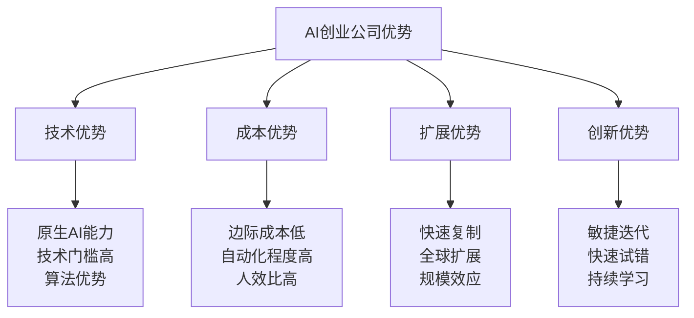

## 🚀 案例一：AI客服SaaS平台

### **公司背景**
- **成立时间**：2023年
- **团队规模**：15人
- **融资情况**：A轮500万美元
- **业务模式**：为企业提供智能客服解决方案

### **AI-Native商业模式设计**

#### **1. AI-Native：原生AI能力构建**

**核心AI能力**：
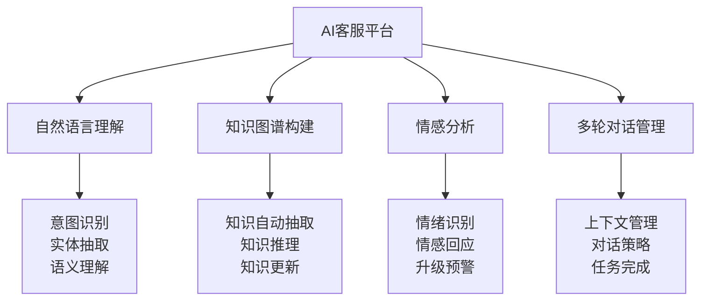

**价值主张**：
- **24/7服务**：无需人工值班，全天候响应
- **智能升级**：复杂问题自动转人工，无缝切换
- **持续学习**：基于对话数据持续优化服务质量
- **多语言支持**：一套系统支持全球化服务

#### **2. AI-Driven：数据驱动的产品迭代**

**数据驱动决策框架**：
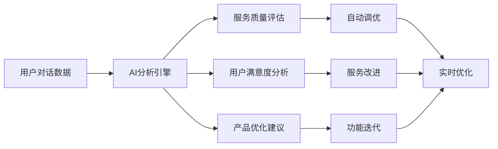

**关键指标**：
- **解决率**：AI独立解决问题的比例
- **满意度**：用户对AI服务的满意度评分
- **响应时间**：从问题提出到解决的平均时间
- **学习效率**：AI能力提升的速度

#### **3. AI-First：组织架构设计**

**团队结构**：
```
CEO（产品+商务）
├── AI团队（8人）
│   ├── 算法工程师（4人）
│   ├── 数据工程师（2人）
│   └── AI产品经理（2人）
├── 工程团队（4人）
│   ├── 后端工程师（2人）
│   ├── 前端工程师（1人）
│   └── DevOps工程师（1人）
└── 商务团队（2人）
    ├── 销售总监（1人）
    └── 客户成功（1人）
```

### **商业模式创新**

#### **收入模式**
1. **SaaS订阅**：按月/年收取基础服务费
2. **按量计费**：根据对话量收取费用
3. **效果分成**：基于客服效率提升收取分成
4. **定制开发**：为大客户提供定制化AI服务

#### **成本结构**
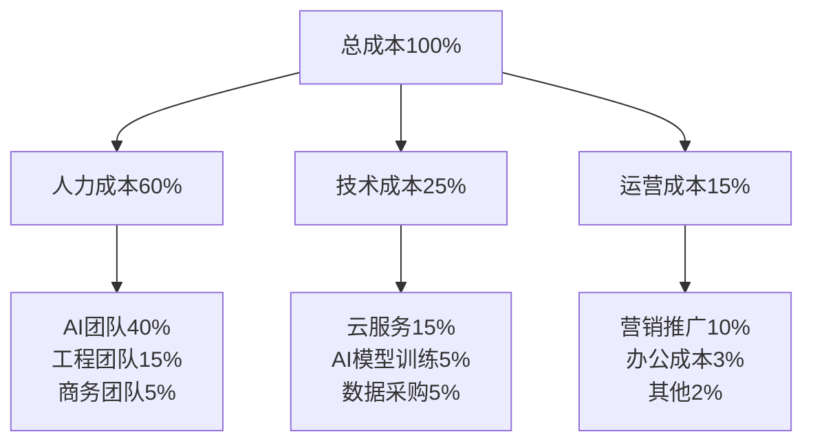

### **发展成果**

#### **业务指标**
- **客户数量**：从0增长到120家企业客户
- **月收入**：达到200万人民币
- **客户留存率**：95%（年留存率）
- **净推荐值（NPS）**：72分

#### **技术指标**
- **问题解决率**：从60%提升到85%
- **平均响应时间**：从30秒降低到3秒
- **客户满意度**：4.6/5.0
- **支持语言**：12种语言

## 🤖 案例二：AI代码生成工具

### **公司背景**
- **成立时间**：2022年
- **团队规模**：25人
- **融资情况**：B轮2000万美元
- **业务模式**：为开发者提供AI代码生成和优化工具

### **AI-Native商业模式设计**

#### **1. 产品核心能力**

**AI代码生成引擎**：
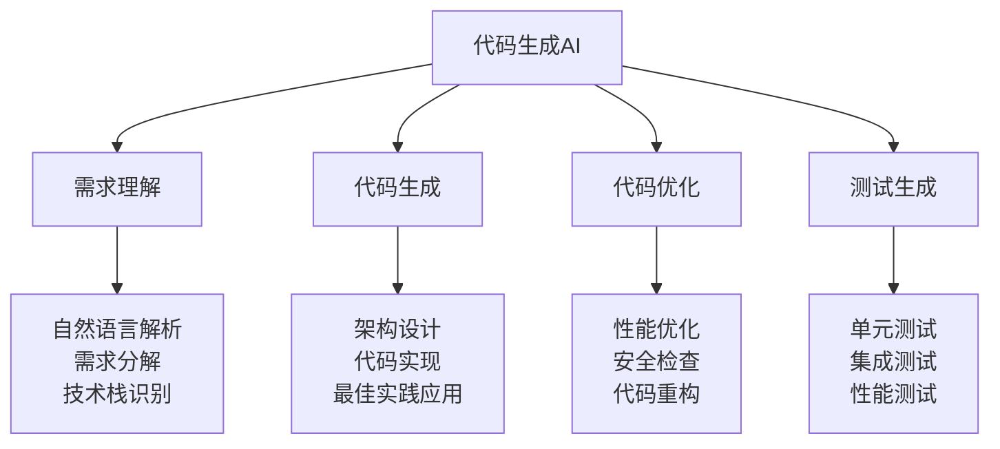

#### **2. 商业模式创新**

**多层次定价策略**：

| 版本 | 目标用户 | 价格 | 核心功能 |
|------|----------|------|----------|
| **免费版** | 个人开发者 | $0/月 | 基础代码生成，月限额100次 |
| **专业版** | 专业开发者 | $29/月 | 无限制使用，高级优化功能 |
| **团队版** | 开发团队 | $99/月/5人 | 团队协作，代码标准化 |
| **企业版** | 大型企业 | 定制定价 | 私有部署，定制化训练 |

#### **3. 增长策略**

**病毒式传播机制**：
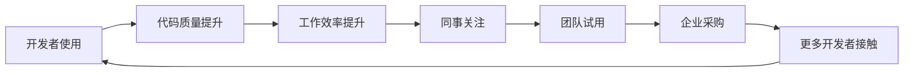

### **发展成果**

#### **用户增长**
- **注册用户**：50万+开发者
- **付费用户**：5万+（转化率10%）
- **企业客户**：500+家公司
- **月活跃用户**：20万+

#### **技术成果**
- **代码准确率**：85%+
- **性能提升**：帮助开发者提升40%编码效率
- **支持语言**：15种编程语言
- **代码库规模**：训练数据覆盖1000万+代码仓库

## 🎨 案例三：AI设计助手平台

### **公司背景**
- **成立时间**：2023年
- **团队规模**：20人
- **融资情况**：A轮800万美元
- **业务模式**：为设计师和企业提供AI设计工具

### **AI-Native商业模式设计**

#### **1. 核心AI能力**

**多模态AI设计引擎**：
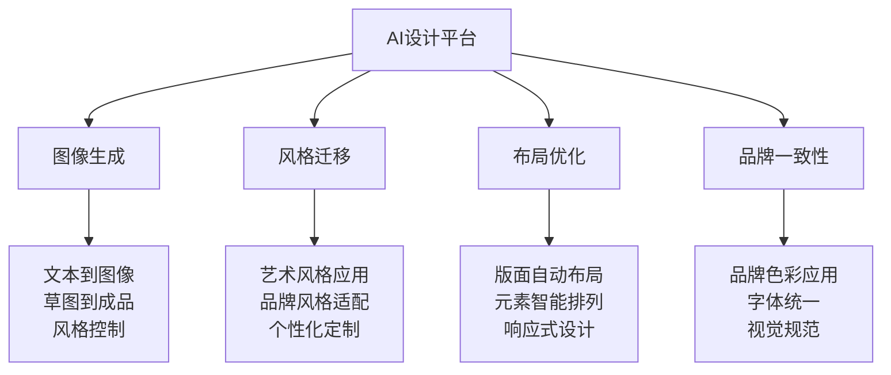

#### **2. 商业模式创新**

**按创作成果计费**：
- **免费层**：每月10个AI生成作品
- **创作者版**：$19/月，每月100个作品
- **专业版**：$49/月，无限制+高级功能
- **企业版**：$199/月/团队，品牌定制+商用授权

**版权和授权创新**：
- **AI生成内容**：用户获得完全商用权
- **素材库授权**：提供免版权素材
- **品牌保护**：确保生成内容不侵犯他人版权

#### **3. 生态建设**

**设计师社区平台**：
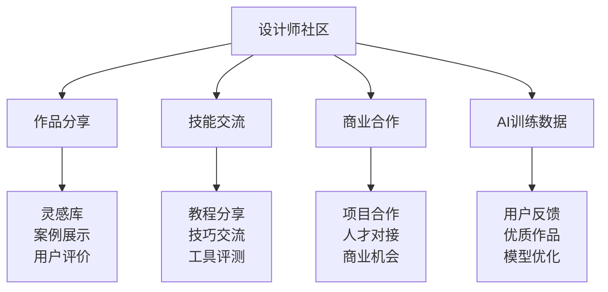

### **发展成果**

#### **平台数据**
- **注册设计师**：15万+
- **付费用户**：2万+
- **生成作品数**：500万+
- **企业客户**：200+家

#### **商业成果**
- **月收入**：300万人民币
- **用户留存率**：80%（月留存）
- **平均客单价**：$35/月
- **净利润率**：25%

## 📊 AI创业成功要素分析

### **1. 技术护城河构建**

#### **核心技术优势**
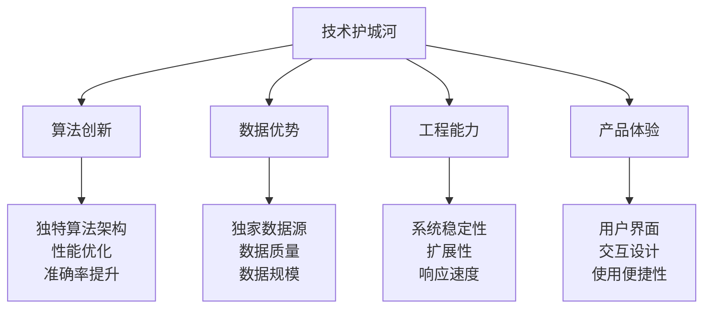

#### **技术发展策略**
1. **专注核心算法**：在特定领域做到最好
2. **数据飞轮效应**：用户使用→数据积累→模型优化→体验提升
3. **持续技术投入**：保持技术领先性
4. **开源社区建设**：通过开源获得技术影响力

### **2. 商业模式创新**

#### **定价策略创新**

| 策略类型 | 适用场景 | 优势 | 挑战 |
|----------|----------|------|------|
| **免费增值** | 用户基数大 | 快速获客，病毒传播 | 转化率控制 |
| **按使用量计费** | 使用差异大 | 公平定价，规模效应 | 成本预测难 |
| **效果分成** | 价值明确 | 风险共担，客户信任 | 效果衡量复杂 |
| **订阅模式** | 持续使用 | 收入稳定，客户粘性 | 价值持续证明 |

#### **收入模式组合**
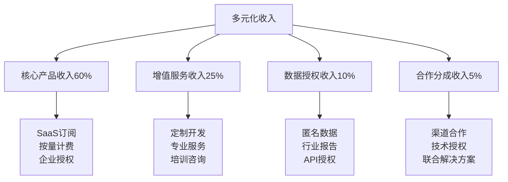

### **3. 团队建设策略**

#### **AI创业团队结构**
```
创始团队（2-3人）
├── 技术创始人（CTO）
├── 产品创始人（CEO）
└── 商务创始人（COO）

核心团队（10-15人）
├── AI/算法团队（40%）
├── 工程开发团队（30%）
├── 产品设计团队（15%）
└── 商务运营团队（15%）
```

#### **人才招聘策略**
1. **技术人才**：重点招聘有实际AI项目经验的工程师
2. **产品人才**：寻找理解AI技术的产品经理
3. **商务人才**：需要具备ToB销售经验
4. **文化建设**：建立学习型、创新型团队文化

### **4. 融资和发展策略**

#### **融资阶段规划**
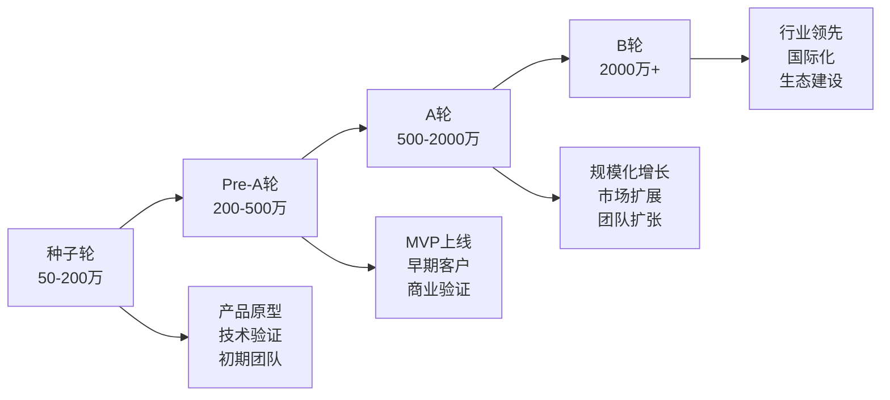

#### **发展里程碑**
- **6个月**：产品MVP，获得前10个付费客户
- **12个月**：月收入达到10万，完成Pre-A轮融资
- **18个月**：月收入达到50万，团队规模20人
- **24个月**：月收入达到200万，完成A轮融资

## ⚠️ 常见创业陷阱

### **1. 技术陷阱**

**过度追求技术完美**：
- **表现**：花费过多时间优化算法，忽视市场需求
- **后果**：产品上线时间延迟，错失市场机会
- **应对**：采用MVP方法，快速迭代

**技术栈选择错误**：
- **表现**：选择过于复杂或不成熟的技术
- **后果**：开发效率低，系统稳定性差
- **应对**：选择成熟稳定的技术栈

### **2. 商业陷阱**

**客户需求理解偏差**：
- **表现**：基于技术能力而非客户需求设计产品
- **后果**：产品市场匹配度低，获客困难
- **应对**：深度用户调研，持续客户反馈

**定价策略不当**：
- **表现**：定价过高或过低，商业模式不清晰
- **后果**：获客困难或盈利困难
- **应对**：基于价值定价，多种模式测试

### **3. 团队陷阱**

**技术团队比例过高**：
- **表现**：技术人员占比超过60%
- **后果**：产品商业化能力不足
- **应对**：平衡技术和商务团队比例

**创始人能力互补不足**：
- **表现**：创始团队背景过于单一
- **后果**：公司发展存在明显短板
- **应对**：寻找互补背景的联合创始人

## 🚀 COSE方法论在AI创业中的应用

### **1. 使用AI专家团队进行商业模式设计**

```bash
# 激活AI创业相关专家
promptx action deepractice-cbo strategic-investment-advisor enterprise-sales-director

# 进行商业模式分析
# - 市场机会评估
# - 竞争优势分析
# - 收入模式设计
# - 发展策略规划
```

### **2. 建立AI-Native创业方法论**

#### **标准化创业流程**
1. **市场调研**：AI驱动的市场分析和用户研究
2. **产品设计**：基于AI能力的产品架构设计
3. **技术开发**：AI-First的技术栈选择和开发
4. **商业验证**：数据驱动的商业模式验证
5. **规模化增长**：AI支持的运营和增长策略

#### **创业工具包**
- **商业计划模板**：基于AI-Native的商业计划书模板
- **技术架构模板**：AI创业公司的标准技术架构
- **融资材料模板**：投资人友好的AI项目展示模板
- **运营指标体系**：AI创业公司的关键指标定义

### **3. 创业社区和生态建设**

#### **AI创业者社区**
- **经验分享**：成功和失败案例分享
- **资源对接**：技术、人才、资金资源匹配
- **合作机会**：创业公司间的合作机会
- **导师指导**：行业专家的创业指导

#### **生态合作伙伴**
- **技术服务商**：AI基础设施和工具提供商
- **投资机构**：专注AI领域的投资基金
- **企业客户**：有AI需求的企业客户
- **渠道合作伙伴**：帮助AI产品推广的渠道商

## 📞 创业支持服务

### **COSE AI创业加速器**

**服务内容**：
- **商业模式设计**：基于AI-Native的商业模式咨询
- **技术架构指导**：AI产品的技术架构设计
- **融资支持**：投资人对接和融资材料准备
- **市场推广**：AI产品的市场营销策略

**参与方式**：
- **在线申请**：通过GitHub提交创业项目申请
- **评估筛选**：AI专家团队进行项目评估
- **加速服务**：3-6个月的深度加速服务
- **后续支持**：持续的创业指导和资源对接

**联系方式**：
- **项目申请**：在GitHub Issues中提交申请
- **咨询交流**：扫描README中的微信二维码
- **社区讨论**：加入AI创业者微信群

---

**深度实践团队** - 专注于AI时代的商业模式创新与实践

*AI创业的成功不仅需要技术创新，更需要商业模式创新。COSE方法论为AI创业者提供了系统性的商业设计框架和实践指导。* 