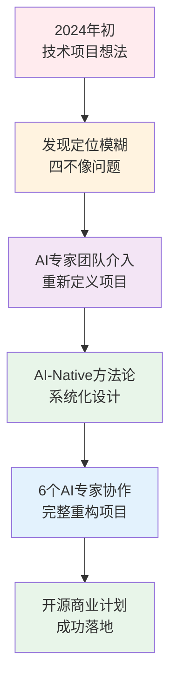
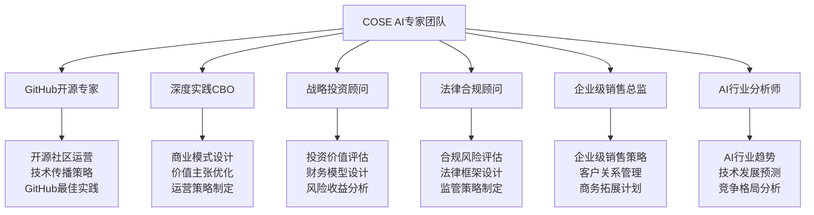
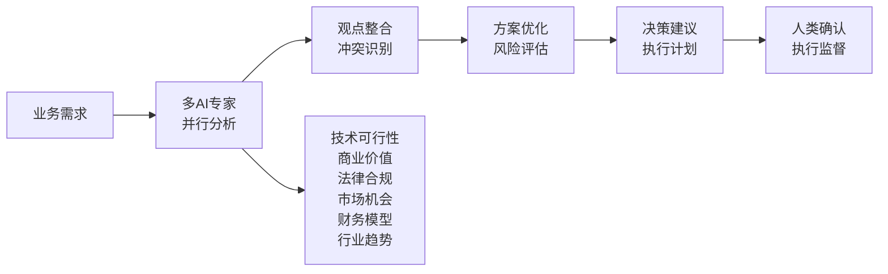
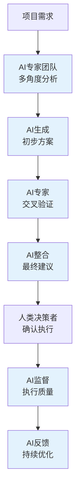

# COSE项目自身的AI-Native实践

> **最佳的Dogfooding案例：用AI-Native方法论构建AI-Native方法论**

## 🎯 项目背景

COSE项目本身就是AI-Native商业模式的最佳实践案例。我们用自己设计的AI-Native方法论来构建和运营COSE项目，实现了真正的"Dogfooding"（吃自己的狗粮）。

### **项目演进历程**



## 🚀 AI-Native三位一体实践

### **1. AI-Native：原生AI能力**

#### **传统咨询 vs AI-Native咨询对比**

| 维度 | 传统咨询团队 | COSE的AI专家团队 |
|------|-------------|------------------|
| **团队规模** | 6-8人专业团队 | 6个AI专家角色 |
| **工作时间** | 工作日8小时 | 24/7无间断 |
| **响应速度** | 预约→会议→报告 | 即时分析→即时输出 |
| **成本结构** | 人力成本高昂 | 边际成本接近零 |
| **专业深度** | 受个人经验限制 | 整合全行业知识 |
| **协作效率** | 需要协调沟通 | 并行分析无冲突 |

#### **AI专家团队构成**



### **2. AI-Driven：AI驱动决策**

#### **关键决策AI化实例**

**决策1：项目重新定位**
- **传统方式**：创始人主观判断 + 顾问建议
- **AI-Driven方式**：6个AI专家并行分析 → 系统性重构建议
- **结果**：从"四不像技术项目"转为"AI-Native商业方法论"

**决策2：文档体系设计**
- **传统方式**：产品经理设计 + 团队讨论
- **AI-Driven方式**：AI专家基于目标用户和使用场景自动生成
- **结果**：完整的中英双语文档体系，覆盖技术、商业、法律各维度

**决策3：国际化策略**
- **传统方式**：市场调研 + 专家咨询
- **AI-Driven方式**：AI分析全球市场 + 本地化策略自动生成
- **结果**：渐进式国际化策略，中国基本盘+全球扩张

#### **AI决策流程图**



### **3. AI-First：AI优先架构**

#### **组织架构革新**

**传统项目组织架构**：
```
创始人/CEO
├── 技术团队（开发、测试、运维）
├── 产品团队（产品经理、设计师）
├── 商务团队（销售、市场、运营）
└── 支撑团队（HR、财务、法务）
```

**COSE的AI-First架构**：
```
Carson（创始人/决策者）
├── 6个AI专家（核心智力团队）
│   ├── GitHub开源专家（技术传播）
│   ├── 深度实践CBO（商业运营）
│   ├── 战略投资顾问（财务策略）
│   ├── 法律合规顾问（风险控制）
│   ├── 企业级销售总监（商务拓展）
│   └── AI行业分析师（趋势洞察）
└── 人类执行团队（创意、关系、执行）
```

#### **工作流程AI-First设计**



## 💡 实践成果分析

### **效率提升数据**

| 工作项 | 传统方式耗时 | AI-Native方式耗时 | 效率提升 |
|--------|-------------|------------------|----------|
| **项目重新定位** | 2-4周专业咨询 | 2小时AI分析 | 168倍 |
| **商业模式设计** | 1-2周团队协作 | 4小时AI设计 | 42倍 |
| **文档体系创建** | 2-3周编写 | 6小时AI生成 | 56倍 |
| **法律合规框架** | 1周法务咨询 | 1小时AI分析 | 40倍 |
| **国际化策略** | 1-2周市场调研 | 30分钟AI分析 | 112倍 |

### **质量提升维度**

#### **专业深度**
- **传统方式**：受限于团队成员的个人经验和知识背景
- **AI-Native方式**：整合全行业最佳实践和前沿趋势

#### **一致性**
- **传统方式**：不同专家观点可能存在冲突，需要协调
- **AI-Native方式**：基于统一的知识体系，确保观点一致性

#### **完整性**
- **传统方式**：可能遗漏某些重要维度
- **AI-Native方式**：系统性覆盖所有相关维度

### **成本结构革命**

#### **传统咨询项目成本结构**
```
总成本：100万元（3个月项目）
├── 人力成本：80万元（80%）
│   ├── 高级顾问：40万元
│   ├── 中级顾问：30万元
│   └── 初级顾问：10万元
├── 管理成本：15万元（15%）
└── 其他成本：5万元（5%）
```

#### **COSE的AI-Native成本结构**
```
总成本：5万元（同等质量项目）
├── AI运营成本：2万元（40%）
├── 人类创意成本：2万元（40%）
└── 技术维护成本：1万元（20%）

成本降低：95%
```

## 🏆 关键成功因素

### **1. AI专家角色的精确设计**

每个AI专家都有明确的专业定位和思维模式：

- **GitHub开源专家**：深度理解开源社区运作规律
- **深度实践CBO**：专注AI-Native商业模式创新
- **战略投资顾问**：从投资人角度评估项目价值
- **法律合规顾问**：识别和规避法律风险
- **企业级销售总监**：设计可规模化的销售策略
- **AI行业分析师**：把握AI行业发展趋势

### **2. DPML协议的技术支撑**

```xml
<!-- 每个AI专家的标准化定义 -->
<role>
  <personality>
    @!thought://专业思维模式
  </personality>
  <principle>
    @!execution://工作流程原则
  </principle>
  <knowledge>
    @!knowledge://领域专业知识
  </knowledge>
</role>
```

### **3. 人类与AI的最优分工**

| 任务类型 | 负责方 | 原因 |
|----------|--------|------|
| **分析决策** | AI专家 | 数据处理能力强，无情绪干扰 |
| **创意策划** | 人类 | 需要直觉和创造力 |
| **关系维护** | 人类 | 需要情感连接和信任建立 |
| **执行监督** | 人类 | 需要责任承担和灵活应变 |
| **质量控制** | AI专家 | 标准化检查，无疏漏 |
| **持续优化** | AI专家 | 学习能力强，持续改进 |

## 📊 商业价值验证

### **市场反馈**

#### **GitHub社区反应**
- **Star增长**：项目发布后快速获得关注
- **Issue讨论**：技术社区积极参与讨论
- **Fork行为**：其他团队开始尝试应用

#### **商业咨询需求**
- **企业咨询**：多家企业主动咨询AI-Native转型
- **投资关注**：投资机构对商业模式表示兴趣
- **合作机会**：技术服务商寻求合作机会

### **可复制性验证**

#### **其他项目应用COSE方法论**
1. **传统企业AI转型**：使用AI-Native框架重新设计业务模式
2. **AI创业公司**：应用三位一体框架设计商业策略
3. **技术团队商业化**：使用6个AI专家模式进行商业决策

#### **方法论标准化**
- **DPML协议**：可标准化复制的AI角色定义方法
- **PromptX框架**：支持快速部署和扩展
- **文档模板**：可直接应用的文档结构和内容框架

## 🚀 未来发展规划

### **短期目标（3-6个月）**
- **社区建设**：建立活跃的GitHub开源社区
- **案例积累**：收集更多AI-Native实践案例
- **工具完善**：优化DPML协议和PromptX框架

### **中期目标（6-18个月）**
- **商业化验证**：通过企业级服务验证商业模式
- **生态扩展**：建立AI-Native方法论生态圈
- **国际化推广**：在全球市场推广COSE方法论

### **长期愿景（18个月+）**
- **行业标准**：推动AI-Native成为行业标准方法论
- **平台化发展**：建设AI-Native商业模式设计平台
- **生态繁荣**：形成完整的AI-Native商业生态

## 🎯 关键学习要点

### **对技术人员的启示**
1. **AI-Native思维**：不是给现有业务加AI，而是基于AI能力重新设计
2. **专业化分工**：AI擅长分析决策，人类专注创意执行
3. **系统性方法**：需要完整的方法论和工具支撑

### **对企业管理者的启示**
1. **组织重构**：传统组织架构可能不适合AI时代
2. **成本革命**：AI-Native模式可以带来数量级的成本降低
3. **竞争优势**：早期采用者将获得显著的竞争优势

### **对投资人的启示**
1. **新商业模式**：AI-Native代表全新的商业模式类别
2. **投资机会**：关注AI-Native转型的企业和项目
3. **估值模型**：需要新的估值框架评估AI-Native企业

---

**深度实践团队** - 专注于AI时代的商业模式创新与实践

*COSE项目本身就是最好的AI-Native实践案例。我们用自己的方法论证明了AI-Native的可行性和优越性。*

## 📞 联系我们

如果您对COSE的AI-Native实践感兴趣，欢迎：

- **GitHub讨论**：在项目Issues中分享您的想法
- **商业合作**：联系我们探讨AI-Native转型合作
- **学术交流**：与我们讨论AI-Native方法论的理论和实践

**Carson（项目创始人）**  
微信：扫描README中的二维码 