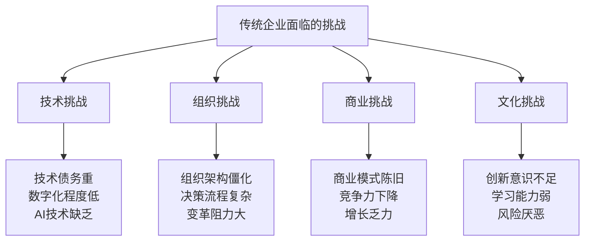
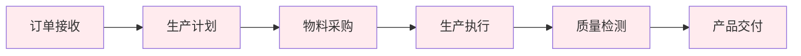
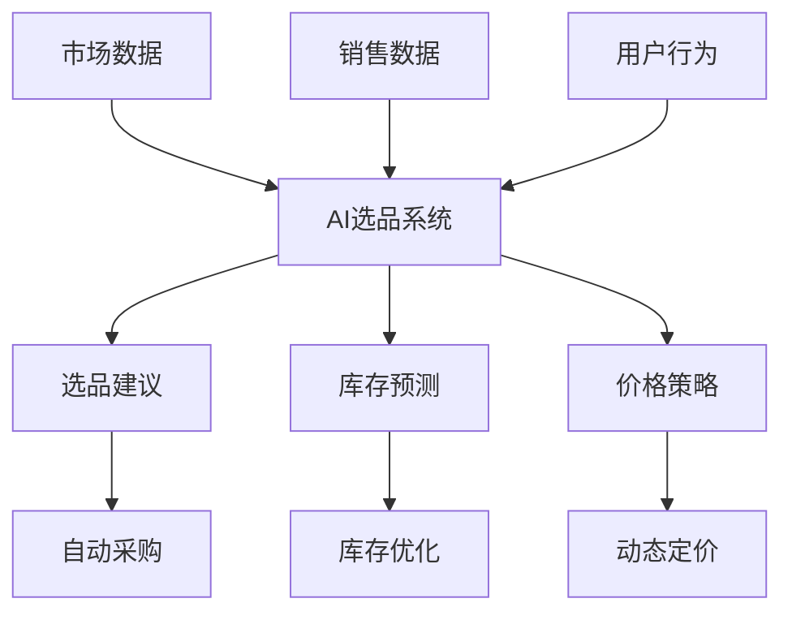
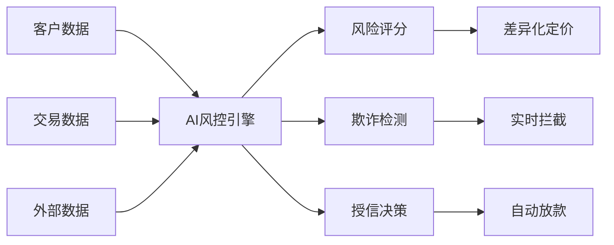
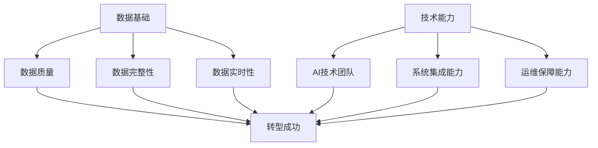
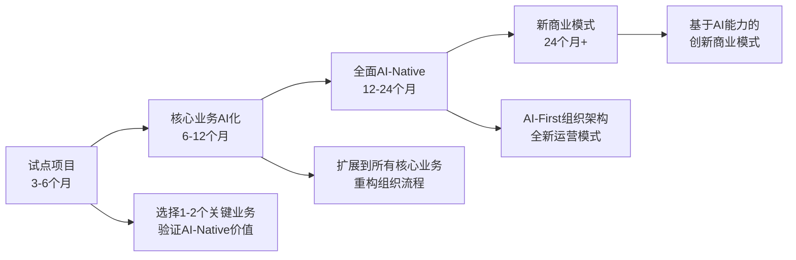

# 传统企业AI转型案例

> **从传统模式到AI-Native的企业转型实践指南**

## 🎯 案例背景

本文档汇总了多家传统企业应用COSE方法论进行AI-Native转型的实际案例，为其他企业提供可参考的转型路径和经验。

### **企业转型挑战**



## 🏭 案例一：制造业企业AI-Native转型

### **企业背景**
- **行业**：传统制造业
- **规模**：年营收50亿，员工3000人
- **痛点**：生产效率低、质量控制难、供应链管理复杂

### **转型前状态分析**

#### **传统运营模式**


**问题识别**：
- 人工制定生产计划，效率低下
- 质量检测依赖人工，误检率高
- 供应链管理缺乏预测能力
- 设备维护被动响应，成本高

### **AI-Native转型设计**

#### **1. AI-Native：原生AI能力重构**

**生产计划AI化**：
- **传统方式**：人工根据经验制定生产计划
- **AI-Native方式**：AI基于历史数据、市场需求、设备状态自动优化生产计划

**质量控制AI化**：
- **传统方式**：人工抽检+事后返工
- **AI-Native方式**：AI视觉检测+实时质量预警+自动调整

**供应链AI化**：
- **传统方式**：基于历史经验的库存管理
- **AI-Native方式**：AI预测需求+智能采购+动态库存优化

#### **2. AI-Driven：AI驱动决策**

**决策权重新分配**：

| 决策类型 | 传统决策者 | AI-Driven决策者 | 人类角色 |
|----------|------------|-----------------|----------|
| **生产排程** | 生产经理 | AI调度系统 | 异常处理 |
| **质量控制** | 质检员 | AI检测系统 | 标准制定 |
| **库存管理** | 采购经理 | AI预测系统 | 策略制定 |
| **设备维护** | 维修工 | AI诊断系统 | 执行维护 |

#### **3. AI-First：组织架构重构**

**新组织架构**：
```
总经理
├── AI运营中心（新设）
│   ├── AI生产调度系统
│   ├── AI质量控制系统
│   ├── AI供应链系统
│   └── AI设备管理系统
├── 人类创新团队
│   ├── 产品设计师
│   ├── 工艺工程师
│   └── 客户关系经理
└── 执行支撑团队
    ├── 生产执行
    ├── 设备维护
    └── 质量保证
```

### **转型实施过程**

#### **阶段1：基础设施建设（3个月）**
- 数据采集系统部署
- AI平台搭建
- 员工培训启动

#### **阶段2：AI系统上线（6个月）**
- 生产调度AI系统上线
- 质量检测AI系统部署
- 供应链预测系统启动

#### **阶段3：全面AI化（12个月）**
- 所有核心业务AI化
- 组织架构完全重构
- 新商业模式启动

### **转型成果**

#### **效率提升**
| 指标 | 转型前 | 转型后 | 提升幅度 |
|------|--------|--------|----------|
| **生产效率** | 100% | 145% | +45% |
| **质量合格率** | 95% | 99.2% | +4.2% |
| **库存周转率** | 6次/年 | 12次/年 | +100% |
| **设备利用率** | 75% | 92% | +23% |

#### **成本降低**
- **人力成本**：减少30%（重复性工作AI化）
- **质量成本**：减少60%（缺陷预防+早期发现）
- **库存成本**：减少40%（精准预测+动态优化）
- **维护成本**：减少35%（预测性维护）

#### **新商业模式**
- **按效果收费**：为客户提供生产效率保证服务
- **数据变现**：将生产数据和AI模型对外授权
- **平台化服务**：为同行业企业提供AI化解决方案

## 🏪 案例二：零售企业AI-Native转型

### **企业背景**
- **行业**：连锁零售
- **规模**：500家门店，年营收100亿
- **痛点**：库存管理困难、客户体验不佳、运营成本高

### **AI-Native转型设计**

#### **1. 智能选品系统**


#### **2. 个性化推荐引擎**
- **传统方式**：统一促销+人工推荐
- **AI-Native方式**：基于用户画像的个性化推荐+动态优化

#### **3. 智能客服系统**
- **传统方式**：人工客服+简单FAQ
- **AI-Native方式**：AI主导客服+人类情感支持+持续学习

### **转型成果**
- **销售额提升**：25%
- **客户满意度**：从75%提升到92%
- **库存周转率**：提升80%
- **运营成本**：降低35%

## 🏦 案例三：金融服务企业AI-Native转型

### **企业背景**
- **行业**：区域性银行
- **规模**：200个网点，资产规模2000亿
- **痛点**：风控能力不足、服务效率低、获客成本高

### **AI-Native转型设计**

#### **1. 智能风控系统**


#### **2. 智能投顾系统**
- **传统方式**：理财经理一对一服务
- **AI-Native方式**：AI投顾+人类专家+个性化服务

#### **3. 智能营销系统**
- **传统方式**：广撒网式营销
- **AI-Native方式**：精准营销+实时优化+效果预测

### **转型成果**
- **风控效率**：提升300%
- **客户获取成本**：降低40%
- **服务响应时间**：从24小时缩短到30分钟
- **投资收益率**：为客户提升15%

## 📊 转型成功关键因素分析

### **1. 领导层认知和决心**

**成功企业特征**：
- CEO深度理解AI-Native的战略价值
- 愿意投入足够的资源和时间
- 能够承受转型期的短期阵痛

**失败企业特征**：
- 把AI当作技术工具而非战略转型
- 期望立竿见影的效果
- 不愿意改变现有组织架构

### **2. 数据基础和技术能力**

**成功要素**：


### **3. 组织变革管理**

**变革管理框架**：
1. **愿景沟通**：让全员理解AI-Native转型的必要性
2. **能力建设**：培训员工适应新的工作方式
3. **激励调整**：调整KPI和薪酬体系
4. **文化重塑**：建立学习型、创新型组织文化

### **4. 渐进式转型策略**

**推荐转型路径**：


## ⚠️ 常见转型陷阱和应对策略

### **陷阱1：技术导向而非商业导向**

**表现**：
- 过分关注AI技术的先进性
- 忽视商业价值和ROI
- 为了AI而AI

**应对策略**：
- 始终以商业价值为导向
- 建立明确的ROI评估机制
- 优先选择有明确商业价值的AI应用场景

### **陷阱2：组织变革不到位**

**表现**：
- 技术系统升级了，但组织架构和流程没变
- 新旧系统并存，效率反而下降
- 员工抗拒新的工作方式

**应对策略**：
- 同步进行技术和组织变革
- 建立变革管理专项团队
- 设计有效的激励机制

### **陷阱3：期望过高，耐心不足**

**表现**：
- 期望AI立即解决所有问题
- 对转型期的效率下降缺乏容忍
- 频繁调整转型策略

**应对策略**：
- 设定合理的转型期望和时间表
- 建立阶段性成果展示机制
- 保持战略定力，持续投入

## 🎯 转型评估框架

### **转型准备度评估**

```bash
# 组织准备度评估 (1-5分)
□ 领导层AI认知水平 ___/5
□ 数据基础建设程度 ___/5
□ 技术团队能力 ___/5
□ 变革管理经验 ___/5
□ 资源投入意愿 ___/5

# 业务适配度评估 (1-5分)
□ 业务标准化程度 ___/5
□ 数据驱动决策文化 ___/5
□ 客户接受度 ___/5
□ 竞争压力程度 ___/5
□ 行业AI成熟度 ___/5

# 评估结果：
# 40-50分：适合激进转型
# 30-39分：适合渐进转型
# 20-29分：需要充分准备
# 20分以下：暂不建议转型
```

### **转型效果评估**

#### **量化指标**
- **效率指标**：生产效率、服务效率、决策效率
- **质量指标**：产品质量、服务质量、决策质量
- **成本指标**：运营成本、人力成本、错误成本
- **收入指标**：营收增长、利润率、新业务收入

#### **定性指标**
- **员工满意度**：工作体验、成长机会、工作成就感
- **客户满意度**：服务体验、产品满意度、推荐意愿
- **创新能力**：新产品开发、新模式探索、市场响应速度

## 🚀 转型加速器

### **COSE方法论应用**

#### **1. 使用AI专家团队进行转型规划**
```bash
# 激活相关AI专家
promptx action deepractice-cbo strategic-investment-advisor legal-compliance-advisor

# 进行转型可行性分析
# 设计转型路径和策略
# 评估风险和收益
```

#### **2. 建立企业专属AI专家团队**
- 基于企业特点定制AI专家角色
- 建立企业知识库和经验库
- 持续优化AI专家能力

#### **3. 应用DPML协议标准化转型经验**
- 将转型经验标准化为可复用的知识组件
- 建立企业转型方法论库
- 支持其他业务单元的快速转型

### **外部支持资源**

#### **技术合作伙伴**
- AI技术服务商
- 系统集成商
- 云服务提供商

#### **咨询服务**
- 战略咨询
- 组织变革咨询
- 技术架构咨询

#### **培训服务**
- 高管AI认知培训
- 技术团队能力建设
- 全员数字化素养提升

## 📞 转型支持服务

### **COSE转型咨询服务**

**服务内容**：
- AI-Native转型可行性评估
- 转型路径设计和规划
- 组织变革方案设计
- 转型过程监督和指导

**服务模式**：
- **评估阶段**：免费初步评估
- **设计阶段**：按项目收费
- **实施阶段**：按效果分成
- **运营阶段**：持续优化服务

**联系方式**：
- **项目咨询**：GitHub Issues讨论
- **商务合作**：扫描README中的微信二维码
- **技术交流**：加入COSE技术交流群

---

**深度实践团队** - 专注于AI时代的商业模式创新与实践

*传统企业AI-Native转型是一个系统性工程，需要技术、组织、文化的全面变革。COSE方法论为企业提供了完整的转型框架和实践指导。* 