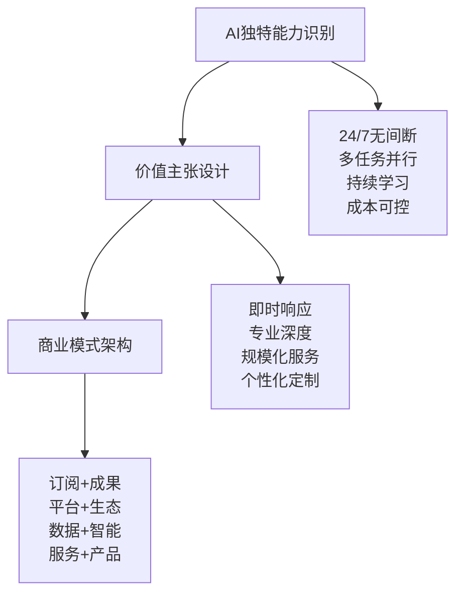
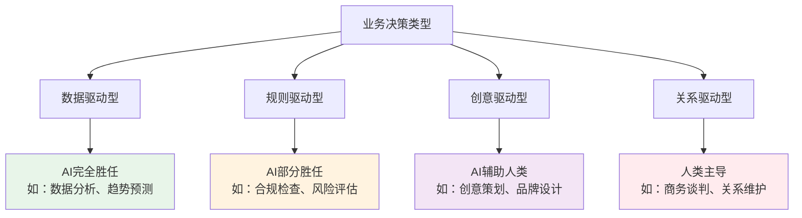
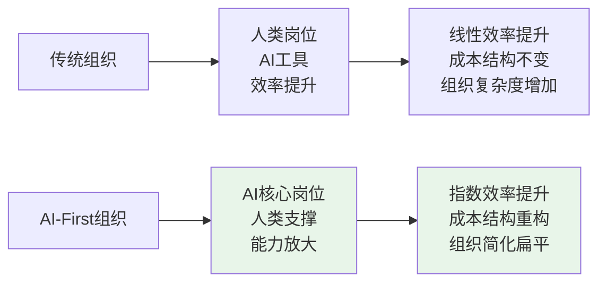
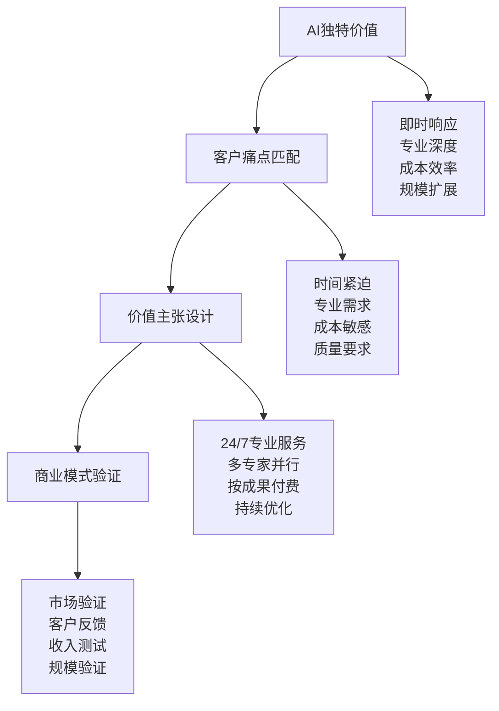
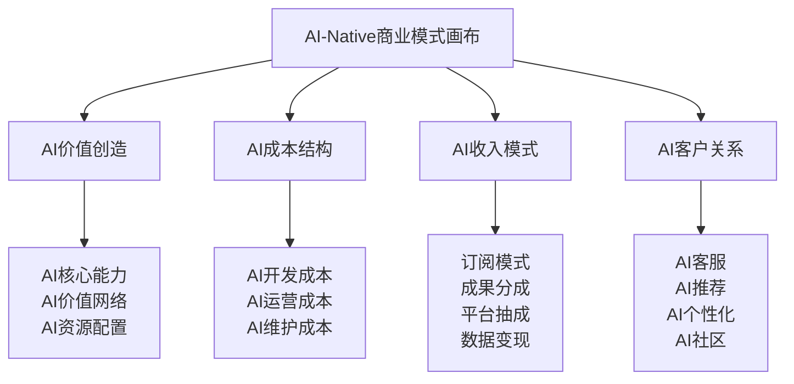
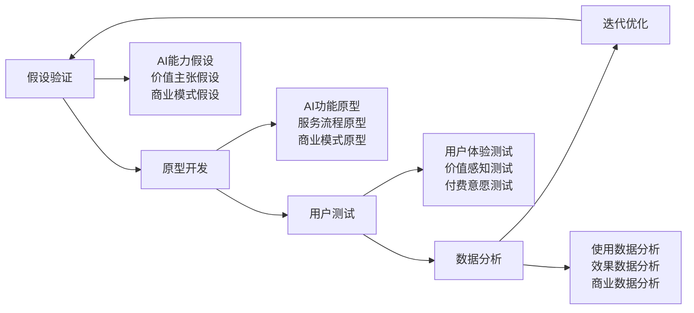
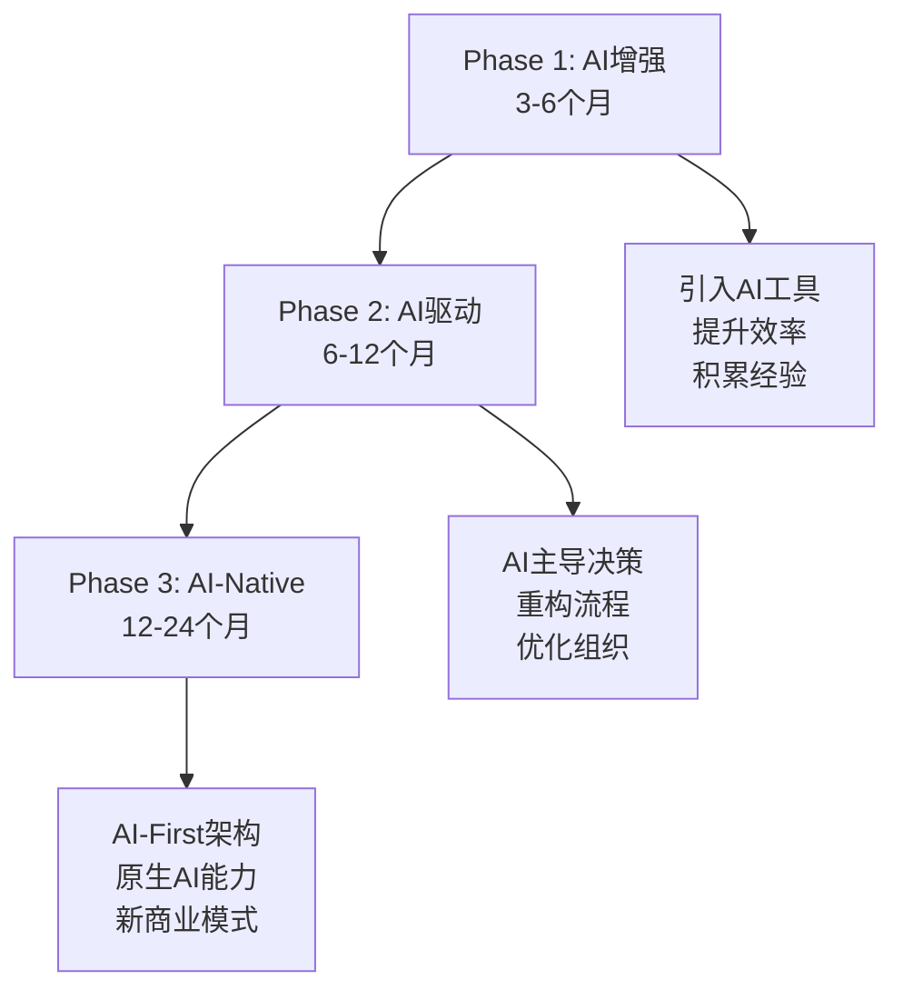

# AI-Native商业模式设计指南

> **从传统商业模式到AI-Native商业模式的完整转型指南**

## 🎯 什么是AI-Native商业模式？

AI-Native商业模式不是在传统商业模式上"加AI"，而是从AI的独特能力出发，设计只有AI才能实现的商业价值。

### **核心理念对比**

| 维度 | 传统模式 | AI增强模式 | AI-Native模式 |
|------|----------|------------|---------------|
| **设计起点** | 人类需求 | 传统模式+AI优化 | AI独特能力 |
| **价值创造** | 人类劳动 | 人类+AI协作 | AI主导+人类创意 |
| **组织架构** | 人类为中心 | 混合架构 | AI-First架构 |
| **决策机制** | 人类决策 | AI辅助决策 | AI驱动决策 |

## 🚀 AI-Native三位一体框架

### **1. AI-Native：原生AI能力**

**设计原则**：商业模式天然具备AI能力，而非后期添加



**实际案例：COSE的6个AI专家团队**
- **原生能力**：24/7专业咨询，多角色并行分析
- **价值主张**：即时获得6个领域专家的专业建议
- **商业模式**：方法论开源+企业级定制服务

### **2. AI-Driven：AI驱动决策**

**设计原则**：让AI驱动核心业务决策，而不是辅助人类决策

#### **AI决策能力评估矩阵**



#### **AI-Driven实施步骤**

1. **决策盘点**：列出所有关键业务决策
2. **能力匹配**：评估AI在每个决策中的胜任度
3. **流程重构**：重新设计决策流程，让AI承担主导角色
4. **反馈优化**：建立AI决策质量的反馈机制

### **3. AI-First：AI优先架构**

**设计原则**：组织和流程优先考虑AI的特点和能力

#### **AI-First组织设计模型**



#### **AI-First实施原则**

- **岗位设计**：优先设计AI可以胜任的岗位
- **流程设计**：优先考虑AI的处理方式和节奏
- **系统设计**：优先考虑AI的数据需求和接口
- **文化设计**：优先培养AI协作的组织文化

## 💡 AI-Native商业模式设计方法

### **第一步：AI能力盘点**

#### **AI独特能力清单**

| 能力类别 | 具体能力 | 商业价值 | 应用场景 |
|----------|----------|----------|----------|
| **认知能力** | 信息处理、模式识别、知识整合 | 专业咨询、决策支持 | 投资分析、法律咨询 |
| **执行能力** | 自动化处理、批量操作、精确执行 | 运营效率、质量保证 | 内容生成、数据处理 |
| **学习能力** | 持续改进、经验积累、适应变化 | 服务优化、产品迭代 | 个性化推荐、智能客服 |
| **协作能力** | 多任务并行、角色切换、团队协作 | 组织效率、专业深度 | 多专家咨询、项目管理 |

#### **能力评估工具**

```bash
# AI能力评估清单
□ 这项工作AI能比人类做得更好吗？
□ 这项工作AI能比人类做得更快吗？
□ 这项工作AI能比人类做得更便宜吗？
□ 这项工作AI能提供人类无法提供的价值吗？
□ 这项工作的规模化需求AI更适合吗？

# 如果3个以上回答"是"，考虑AI-Native设计
```

### **第二步：价值主张重构**

#### **AI-Native价值主张设计框架**



#### **价值主张模板**

```
对于 [目标客户群体]
他们面临 [核心痛点/需求]
我们的 [AI-Native解决方案]
提供 [AI独特价值]
不同于 [传统解决方案]
我们能够 [AI独有优势]
```

**COSE项目示例**：
```
对于 技术人员和企业管理者
他们面临 AI时代商业模式设计的挑战
我们的 6个AI专家协作咨询团队
提供 24/7多角度专业分析和方案设计
不同于 传统咨询公司的人力密集模式
我们能够 以极低成本提供顶级专家级服务质量
```

### **第三步：商业模式架构**

#### **AI-Native商业模式画布**



#### **收入模式创新**

**传统收入模式 vs AI-Native收入模式**：

| 模式 | 传统方式 | AI-Native方式 |
|------|----------|---------------|
| **时间计费** | 按小时/天收费 | 按问题解决速度收费 |
| **产品销售** | 一次性购买 | 持续服务订阅 |
| **服务提供** | 人力密集 | AI规模化+人类创意 |
| **成果交付** | 尽力而为 | AI保证+成果分成 |

## 🏆 AI-Native成功案例分析

### **案例1：COSE项目的AI-Native实践**

**背景**：深度实践团队需要专业咨询能力支撑商业模式创新

**AI-Native设计**：
- **AI-Native**：创建6个专业AI角色，天然具备24/7咨询能力
- **AI-Driven**：让AI专家主导分析和方案设计
- **AI-First**：组织架构以AI专家为核心，人类负责创意和决策

**商业价值**：
- 成本效率：相比传统咨询团队成本降低90%+
- 服务质量：6个专业角度并行分析，质量更高
- 响应速度：24/7即时响应，无时差限制
- 持续优化：AI专家能力随项目发展不断提升

### **案例2：AI-Native客服系统**

**传统模式**：人工客服 + AI辅助工具
**AI-Native模式**：AI主导客服 + 人类情感支持

**设计差异**：
- **组织架构**：以AI为主体，人类为支撑
- **服务流程**：AI优先处理，人类处理例外
- **价值主张**：24/7专业服务 + 情感温度
- **收入模式**：按问题解决效果收费

## 🛠️ AI-Native实施工具包

### **评估工具**

#### **AI-Native准备度评估**

```bash
# 组织准备度 (1-5分)
□ 数据基础建设 ___/5
□ 技术团队能力 ___/5  
□ 管理层认知 ___/5
□ 文化开放度 ___/5
□ 资源投入意愿 ___/5

# 业务适配度 (1-5分)
□ 业务数字化程度 ___/5
□ 决策标准化程度 ___/5
□ 客户接受度 ___/5
□ 竞争差异化需求 ___/5
□ 规模化潜力 ___/5

# 总分：___/50
# 35分以上：适合AI-Native转型
# 25-35分：需要准备期
# 25分以下：建议从AI增强开始
```

### **设计工具**

#### **AI-Native商业模式设计画布**

```
[AI核心能力]     [价值主张]     [客户关系]
    |              |              |
[关键合作伙伴] - [关键活动] - [目标客户]
    |              |              |
[成本结构]     [收入来源]     [渠道通路]
```

### **验证工具**

#### **AI-Native MVP验证框架**



## 📈 AI-Native转型路径

### **渐进式转型策略**



### **关键成功因素**

1. **领导层认知**：深度理解AI-Native的战略价值
2. **技术基础**：具备AI开发和部署的技术能力
3. **数据资产**：拥有高质量的业务数据
4. **组织文化**：开放、学习、实验的文化氛围
5. **持续投入**：长期的资源和耐心投入

## 🚀 开始你的AI-Native之旅

### **第一步：现状评估**
使用本指南的评估工具，了解你的AI-Native准备度

### **第二步：能力识别**
识别你的业务中AI可以创造独特价值的领域

### **第三步：价值设计**
基于AI独特能力重新设计你的价值主张

### **第四步：模式验证**
通过MVP快速验证你的AI-Native商业模式假设

### **第五步：渐进实施**
按照渐进式路径，逐步转向AI-Native模式

---

**深度实践团队** - 专注于AI时代的商业模式创新与实践

*本指南基于COSE项目的实际实践经验，持续更新完善中。欢迎通过GitHub Issues分享你的AI-Native实践经验。* 