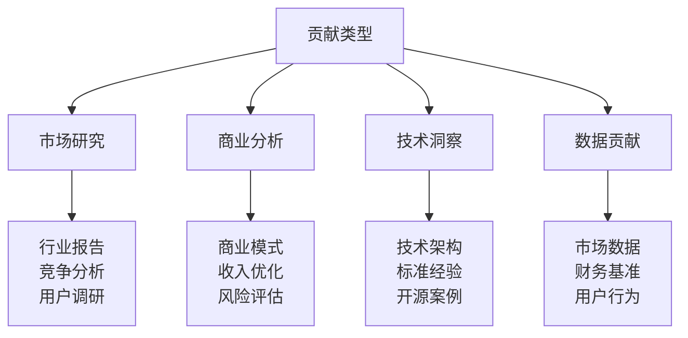

# 贡献指南

> 全球首个开源商业计划项目

## 🎯 贡献方式

### 💭 战略讨论
[GitHub Issues](https://github.com/deepractice/COSE/issues) 参与：
- AI标准化看法
- 商业模式建议
- 市场机会分析
- 风险评估讨论

### 📝 内容贡献
[Pull Requests](https://github.com/deepractice/COSE/pulls) 提交：
- 市场分析更新
- 案例研究添加
- 财务模型优化
- 全球市场洞察

## 📋 贡献类型

## 🚀 贡献流程

1. **选择方向** - 浏览项目结构，选择感兴趣领域
2. **创建Issue** - 讨论想法，获得反馈
3. **准备内容** - Fork仓库，创建分支
4. **提交PR** - 使用模板，详述价值
5. **协作完善** - 响应反馈，完善内容

## 🎯 质量标准

- ✅ **准确性** - 数据和分析准确
- ✅ **相关性** - 与COSE目标相关
- ✅ **原创性** - 提供独特洞察
- ✅ **可验证** - 提供可靠来源

## 🏆 贡献者认可

- **核心贡献者** - 项目决策参与
- **专业顾问** - 商业计划署名
- **社区贡献者** - 贡献者名单

---

**让我们一起创造商业计划制定的新模式！** 🚀 