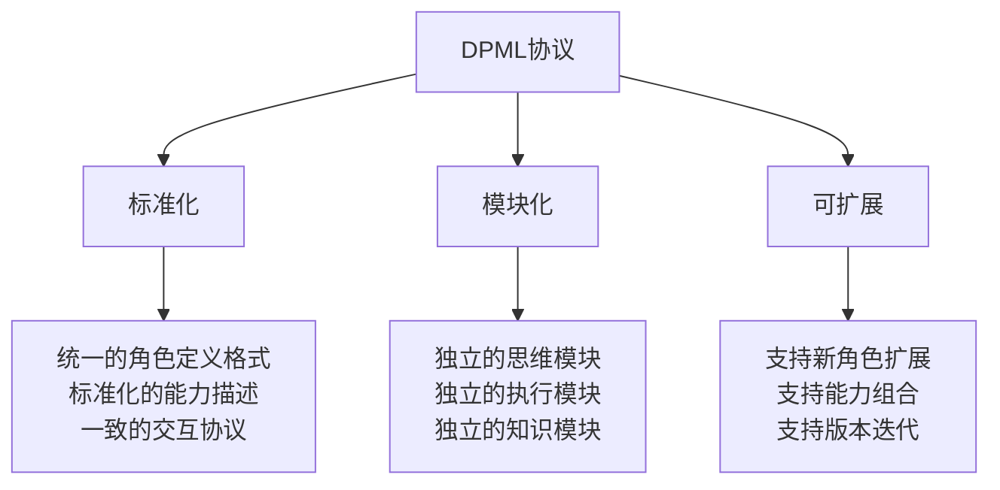

# DPML协议技术规范

> **Deepractice Prompt Markup Language - AI角色定义的标准化协议**

## 🎯 协议概述

DPML（Deepractice Prompt Markup Language）是深度实践团队设计的AI角色定义标准化协议，用于创建具有专业能力的AI角色。

### **设计理念**



## 📋 协议结构

### **核心三组件架构**

```xml
<role>
  <personality>
    @!thought://思维模式引用
    @!thought://思维模式引用
  </personality>
  <principle>
    @!execution://执行流程引用
    @!execution://执行流程引用
  </principle>
  <knowledge>
    @!knowledge://知识库引用
    @!knowledge://知识库引用
  </knowledge>
</role>
```

### **组件说明**

| 组件 | 作用 | 文件格式 | 引用方式 |
|------|------|----------|----------|
| **personality** | 定义AI的思维方式和认知模式 | `.thought.md` | `@!thought://文件名` |
| **principle** | 定义AI的执行原则和工作流程 | `.execution.md` | `@!execution://文件名` |
| **knowledge** | 定义AI的专业知识和经验库 | `.knowledge.md` | `@!knowledge://文件名` |

## 🧠 Thought组件规范

### **文件结构**

```markdown
<thought>
  <exploration>
    ## 思维探索过程
    ### 问题分析维度
    ### 思考框架
    ### 认知模式
  </exploration>
  
  <reasoning>
    ## 推理逻辑
    ### 分析方法
    ### 判断标准
    ### 决策框架
  </reasoning>
  
  <output>
    ## 输出格式
    ### 结构化表达
    ### 关键要素
    ### 质量标准
  </output>
</thought>
```

### **示例：法律推理思维**

```markdown
<thought>
  <exploration>
    ## 法律环境全景扫描
    
    ### 监管框架识别
    - **行业特定法规**：识别业务涉及的特殊行业监管要求
    - **跨地域法律差异**：分析不同司法管辖区的法律差异
    - **新兴业务监管空白**：评估创新业务模式的监管不确定性
  </exploration>
  
  <reasoning>
    ## 系统性法律分析框架
    
    ### 风险层级评估
    - **致命风险**：可能导致业务停止的重大合规问题
    - **重大风险**：可能导致重大损失的合规风险
    - **一般风险**：日常经营中的常规合规要求
  </reasoning>
  
  <output>
    ## 法律意见输出标准
    
    ### 结构化法律建议
    - **风险评估**：明确风险等级和影响范围
    - **合规建议**：具体的合规操作指导
    - **应急预案**：风险发生时的应对措施
  </output>
</thought>
```

## ⚙️ Execution组件规范

### **文件结构**

```markdown
<execution>
  <workflow>
    ## 工作流程
    ### 输入处理
    ### 执行步骤
    ### 输出交付
  </workflow>
  
  <principles>
    ## 执行原则
    ### 质量标准
    ### 效率要求
    ### 协作规范
  </principles>
  
  <tools>
    ## 工具方法
    ### 分析工具
    ### 执行工具
    ### 验证工具
  </tools>
</execution>
```

### **示例：GitHub项目迭代流程**

```markdown
<execution>
  <workflow>
    ## GitHub开源项目迭代流程
    
    ### 1. 需求分析
    - 收集社区反馈和issue
    - 分析用户需求和痛点
    - 评估技术可行性
    
    ### 2. 方案设计
    - 设计技术方案
    - 评估影响范围
    - 制定实施计划
    
    ### 3. 实施执行
    - 创建feature分支
    - 编写代码和文档
    - 进行测试验证
    
    ### 4. 发布部署
    - 代码审查
    - 合并主分支
    - 发布新版本
  </workflow>
  
  <principles>
    ## 执行原则
    
    ### 奥卡姆剃刀原则
    - 优先选择最简单的解决方案
    - 避免过度设计和复杂化
    - 保持代码和文档的简洁性
  </principles>
</execution>
```

## 📚 Knowledge组件规范

### **文件结构**

```markdown
<knowledge>
  <domain>
    ## 领域知识
    ### 核心概念
    ### 理论框架
    ### 最佳实践
  </domain>
  
  <experience>
    ## 实践经验
    ### 成功案例
    ### 失败教训
    ### 经验总结
  </experience>
  
  <resources>
    ## 资源库
    ### 工具清单
    ### 参考资料
    ### 学习资源
  </resources>
</knowledge>
```

### **示例：深度实践生态知识**

```markdown
<knowledge>
  <domain>
    ## 深度实践生态核心知识
    
    ### COSE项目架构
    - **项目定位**：AI-Native开源商业计划方法论
    - **核心价值**：帮助技术人员设计成功的AI时代商业模式
    - **技术实现**：DPML协议 + PromptX框架
    
    ### AI-Native三位一体框架
    - **AI-Native**：原生具备AI能力的商业模式
    - **AI-Driven**：AI驱动的商业决策和执行
    - **AI-First**：AI优先的组织架构和流程
  </domain>
  
  <experience>
    ## 项目实践经验
    
    ### 成功实践
    - **6个AI专家协作**：展示AI-Native组织的实际效果
    - **开源社区建设**：通过GitHub建立技术社区影响力
    - **国际化策略**：中英双语文档支持全球扩张
  </experience>
</knowledge>
```

## 🔗 引用机制

### **引用语法**

```
@!type://resource-name
```

**参数说明**：
- `type`：资源类型（thought/execution/knowledge）
- `resource-name`：资源文件名（不包含扩展名）

### **引用示例**

```xml
<role>
  <personality>
    @!thought://legal-reasoning
    @!thought://risk-assessment
    @!thought://compliance-thinking
  </personality>
  <principle>
    @!execution://legal-workflow
    @!execution://risk-mitigation
  </principle>
  <knowledge>
    @!knowledge://corporate-law
    @!knowledge://compliance-framework
  </knowledge>
</role>
```

## 📁 文件组织结构

### **标准目录结构**

```
.promptx/
└── resource/
    └── domain/
        └── role-name/
            ├── role-name.role.md          # 角色定义文件
            ├── thought/                   # 思维模式目录
            │   ├── thinking-1.thought.md
            │   └── thinking-2.thought.md
            ├── execution/                 # 执行流程目录
            │   ├── workflow-1.execution.md
            │   └── workflow-2.execution.md
            └── knowledge/                 # 知识库目录
                ├── domain-1.knowledge.md
                └── domain-2.knowledge.md
```

### **命名规范**

- **角色文件**：`{role-name}.role.md`
- **思维文件**：`{thinking-name}.thought.md`
- **执行文件**：`{workflow-name}.execution.md`
- **知识文件**：`{domain-name}.knowledge.md`

## ⚡ PromptX框架集成

### **激活命令**

```bash
# 激活单个角色
promptx action role-name

# 激活多个角色
promptx action role-1 role-2 role-3

# 查看可用角色
promptx welcome
```

### **运行时加载**


## 🔧 开发工具

### **角色创建模板**

```bash
# 创建新角色
mkdir -p .promptx/resource/domain/new-role/{thought,execution,knowledge}

# 创建角色定义文件
cat > .promptx/resource/domain/new-role/new-role.role.md << 'EOF'
<role>
  <personality>
    @!thought://core-thinking
  </personality>
  <principle>
    @!execution://main-workflow
  </principle>
  <knowledge>
    @!knowledge://domain-expertise
  </knowledge>
</role>
EOF
```

### **验证工具**

```bash
# 验证角色定义语法
promptx validate role-name

# 测试角色功能
promptx test role-name

# 查看角色依赖
promptx deps role-name
```

## 📈 版本管理

### **版本标识**

```xml
<role version="1.0.0">
  <!-- 角色定义 -->
</role>

<thought version="1.2.0">
  <!-- 思维定义 -->
</thought>
```

### **兼容性策略**

- **主版本**：不兼容的重大变更
- **次版本**：向后兼容的功能增加
- **修订版本**：向后兼容的问题修复

## 🚀 最佳实践

### **角色设计原则**

1. **单一职责**：每个角色专注于特定领域
2. **模块化**：思维、执行、知识相互独立
3. **可复用**：组件可以在不同角色间复用
4. **可扩展**：支持新能力的添加和组合

### **性能优化**

1. **延迟加载**：按需加载角色组件
2. **缓存机制**：缓存已解析的角色定义
3. **依赖优化**：最小化组件间的依赖关系

### **安全考虑**

1. **输入验证**：验证角色定义的合法性
2. **权限控制**：限制角色的操作权限
3. **沙箱隔离**：隔离不同角色的执行环境

---

**深度实践团队** - 专注于AI时代的商业模式创新与实践

*DPML协议是COSE项目的核心技术创新，持续演进中。欢迎通过GitHub Issues参与协议标准的讨论和完善。* 