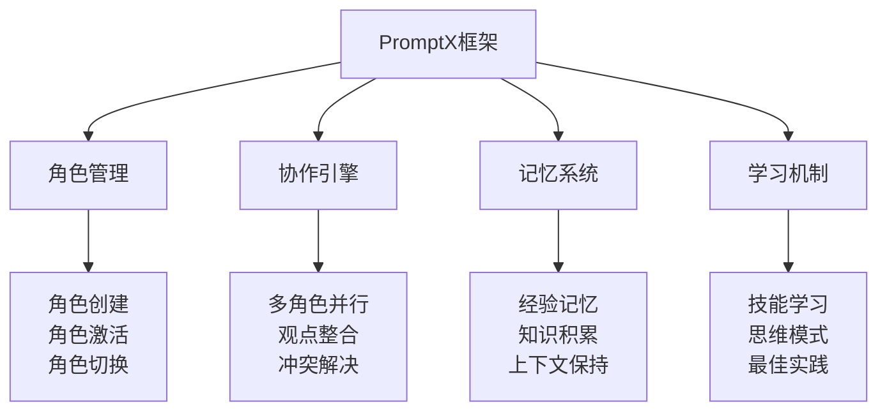
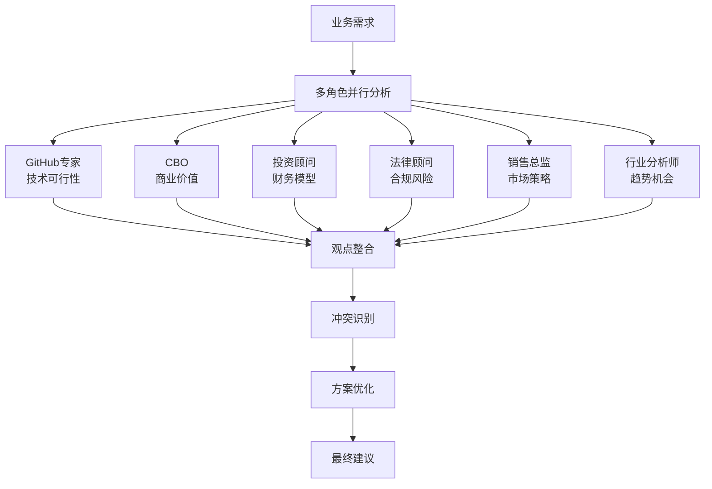
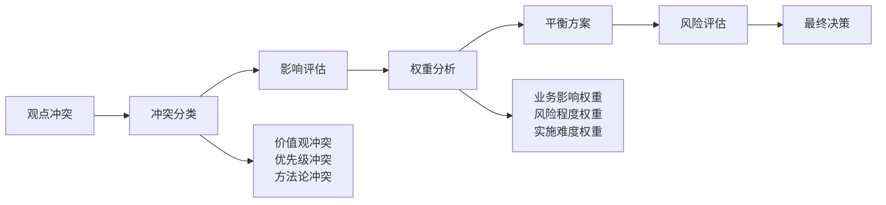

# PromptX框架使用指南

> **AI角色管理和协作的标准化框架**

## 🎯 框架概述

PromptX是深度实践团队开发的AI角色管理框架，基于DPML协议，提供AI角色的创建、管理、激活和协作功能。

### **核心特性**



## 🚀 快速开始

### **安装和初始化**

```bash
# 初始化PromptX环境
promptx init /path/to/your/project

# 查看可用角色
promptx welcome

# 激活单个角色
promptx action github-oss-expert

# 激活多个角色
promptx action github-oss-expert deepractice-cbo strategic-investment-advisor
```

### **基本使用流程**


## 📋 核心命令详解

### **1. 初始化命令**

```bash
promptx init [工作目录]
```

**功能**：
- 扫描项目环境
- 注册可用AI角色
- 建立工作上下文

**示例**：
```bash
promptx init /Users/carson/Desktop/COSE
```

### **2. 角色查看命令**

```bash
promptx welcome
```

**功能**：
- 显示所有可用AI角色
- 展示角色专业领域
- 提供角色选择建议

**输出示例**：
```
🎭 可用AI专家角色：

📊 商业策略类
├── deepractice-cbo (深度实践CBO)
├── strategic-investment-advisor (战略投资顾问)
└── enterprise-sales-director (企业级销售总监)

⚖️ 合规风控类
├── legal-compliance-advisor (法律合规顾问)
└── risk-management-expert (风险管理专家)

🔧 技术实现类
├── github-oss-expert (GitHub开源专家)
├── ai-industry-analyst (AI行业分析师)
└── technical-architect (技术架构师)
```

### **3. 角色激活命令**

```bash
promptx action [角色ID]
```

**功能**：
- 加载角色定义
- 激活专业思维模式
- 建立角色上下文

**示例**：
```bash
# 激活GitHub开源专家
promptx action github-oss-expert

# 激活多个角色进行协作
promptx action github-oss-expert deepractice-cbo legal-compliance-advisor
```

### **4. 记忆管理命令**

```bash
# 存储重要经验
promptx remember "重要的项目经验或知识"

# 回忆相关经验
promptx recall "关键词"

# 查看所有记忆
promptx recall
```

### **5. 学习命令**

```bash
# 学习思维模式
promptx learn thought://creativity

# 学习执行技能
promptx learn execution://best-practice

# 学习专业知识
promptx learn knowledge://scrum
```

## 🧠 AI角色系统

### **角色定义结构**

每个AI角色都遵循DPML协议标准：

```xml
<role>
  <personality>
    @!thought://核心思维模式
    @!thought://辅助思维模式
  </personality>
  <principle>
    @!execution://主要工作流程
    @!execution://质量控制流程
  </principle>
  <knowledge>
    @!knowledge://专业领域知识
    @!knowledge://实践经验库
  </knowledge>
</role>
```

### **COSE项目的6个AI专家**

#### **1. GitHub开源专家 (github-oss-expert)**

**专业领域**：
- 开源社区运营
- GitHub最佳实践
- 技术传播策略
- 开发者生态建设

**核心能力**：
- 项目结构优化
- 文档体系设计
- 社区互动策略
- 技术营销方案

#### **2. 深度实践CBO (deepractice-cbo)**

**专业领域**：
- AI-Native商业模式
- 价值主张设计
- 运营策略制定
- 商业模式创新

**核心能力**：
- 商业逻辑分析
- 市场机会识别
- 运营效率优化
- 商业模式验证

#### **3. 战略投资顾问 (strategic-investment-advisor)**

**专业领域**：
- 投资价值评估
- 财务模型设计
- 风险收益分析
- 融资策略规划

**核心能力**：
- 项目估值分析
- 投资逻辑构建
- 财务预测建模
- 投资人关系管理

#### **4. 法律合规顾问 (legal-compliance-advisor)**

**专业领域**：
- 法律风险评估
- 合规框架设计
- 监管策略制定
- 法律文件审核

**核心能力**：
- 合规风险识别
- 法律框架设计
- 监管应对策略
- 合同条款优化

#### **5. 企业级销售总监 (enterprise-sales-director)**

**专业领域**：
- 企业级销售策略
- 客户关系管理
- 商务拓展计划
- 销售流程优化

**核心能力**：
- 销售策略设计
- 客户需求分析
- 商务谈判支持
- 销售团队建设

#### **6. AI行业分析师 (ai-industry-analyst)**

**专业领域**：
- AI行业趋势分析
- 技术发展预测
- 竞争格局分析
- 市场机会识别

**核心能力**：
- 行业趋势洞察
- 技术发展预测
- 竞争对手分析
- 市场机会评估

## 🤝 多角色协作机制

### **并行分析模式**



### **协作工作流程**

1. **需求分析阶段**
   - 各角色从专业角度分析需求
   - 识别关键问题和挑战
   - 评估可行性和风险

2. **方案设计阶段**
   - 基于各自专业领域提出建议
   - 考虑跨领域的影响和约束
   - 形成初步解决方案

3. **观点整合阶段**
   - 汇总各角色的专业观点
   - 识别观点冲突和矛盾
   - 寻找最优平衡点

4. **方案优化阶段**
   - 基于整合结果优化方案
   - 考虑实施的优先级和步骤
   - 制定风险应对措施

5. **执行监督阶段**
   - 各角色监督执行质量
   - 提供持续的专业建议
   - 根据反馈调整策略

### **冲突解决机制**

当不同AI角色的建议存在冲突时，PromptX框架提供系统性的解决机制：



## 💾 记忆系统

### **记忆类型**

#### **1. 项目记忆**
- 项目关键决策和原因
- 重要里程碑和成果
- 失败教训和改进措施

#### **2. 方法论记忆**
- 成功的分析方法
- 有效的解决方案模式
- 最佳实践和经验总结

#### **3. 领域知识记忆**
- 行业专业知识更新
- 新技术和趋势信息
- 法规政策变化

### **记忆管理命令**

```bash
# 存储项目经验
promptx remember "COSE项目通过6个AI专家协作成功重构，证明AI-Native方法论的有效性"

# 存储方法论经验
promptx remember "AI-Native三位一体框架：AI-Native原生能力、AI-Driven驱动决策、AI-First优先架构"

# 按关键词回忆
promptx recall "AI-Native"

# 查看所有记忆
promptx recall
```

## 🎓 学习系统

### **学习资源类型**

#### **1. 思维模式 (thought://)**
- 创意思维：thought://creativity
- 系统思维：thought://systems-thinking
- 设计思维：thought://design-thinking
- 批判思维：thought://critical-thinking

#### **2. 执行技能 (execution://)**
- 最佳实践：execution://best-practice
- 项目管理：execution://project-management
- 质量控制：execution://quality-control
- 敏捷开发：execution://agile-development

#### **3. 专业知识 (knowledge://)**
- Scrum方法：knowledge://scrum
- AI技术：knowledge://artificial-intelligence
- 商业模式：knowledge://business-model
- 法律合规：knowledge://legal-compliance

### **学习命令示例**

```bash
# 学习创意思维模式
promptx learn thought://creativity

# 学习敏捷开发最佳实践
promptx learn execution://agile-development

# 学习AI技术知识
promptx learn knowledge://artificial-intelligence
```

## 🔧 自定义角色开发

### **创建新角色的步骤**

#### **1. 规划角色定位**
- 确定专业领域
- 定义核心能力
- 设计思维模式

#### **2. 创建目录结构**
```bash
mkdir -p .promptx/resource/domain/my-expert/{thought,execution,knowledge}
```

#### **3. 编写角色定义**
```xml
<!-- my-expert.role.md -->
<role>
  <personality>
    @!thought://domain-thinking
    @!thought://analytical-thinking
  </personality>
  <principle>
    @!execution://domain-workflow
    @!execution://quality-assurance
  </principle>
  <knowledge>
    @!knowledge://domain-expertise
    @!knowledge://industry-knowledge
  </knowledge>
</role>
```

#### **4. 创建组件文件**
- 思维模式文件：`domain-thinking.thought.md`
- 执行流程文件：`domain-workflow.execution.md`
- 知识库文件：`domain-expertise.knowledge.md`

#### **5. 测试和优化**
```bash
# 验证角色定义
promptx validate my-expert

# 测试角色功能
promptx test my-expert

# 激活新角色
promptx action my-expert
```

### **角色开发最佳实践**

1. **单一职责原则**：每个角色专注于特定领域
2. **模块化设计**：思维、执行、知识相互独立
3. **可复用组件**：组件可以在不同角色间复用
4. **持续迭代**：根据使用反馈不断优化

## 📊 性能监控和优化

### **性能指标**

#### **响应效率**
- 角色激活时间
- 分析响应时间
- 多角色协作延迟

#### **质量指标**
- 建议准确性
- 方案完整性
- 冲突解决效率

#### **用户体验**
- 操作便捷性
- 结果满意度
- 学习曲线

### **优化策略**

1. **缓存机制**：缓存常用角色和组件
2. **并行处理**：多角色并行分析和处理
3. **增量学习**：基于使用反馈持续优化
4. **资源管理**：合理分配计算资源

## 🚀 高级功能

### **批量操作**

```bash
# 批量激活多个角色
promptx action github-oss-expert deepractice-cbo legal-compliance-advisor

# 批量学习多个技能
promptx learn thought://creativity execution://best-practice knowledge://ai-technology
```

### **条件激活**

```bash
# 根据项目类型自动选择角色
promptx auto-select --project-type=open-source

# 根据问题领域智能推荐角色
promptx recommend --domain=business-model
```

### **协作模板**

```bash
# 使用预定义的协作模板
promptx template business-analysis
promptx template technical-review
promptx template investment-evaluation
```

## 🔒 安全和权限

### **访问控制**
- 角色权限管理
- 敏感信息保护
- 操作日志记录

### **数据安全**
- 记忆数据加密
- 本地存储优先
- 隐私信息脱敏

### **使用限制**
- 角色能力边界
- 操作权限限制
- 资源使用配额

---

**深度实践团队** - 专注于AI时代的商业模式创新与实践

*PromptX框架是COSE项目的核心技术实现，让AI角色协作变得简单高效。*

## 📞 技术支持

如果在使用PromptX框架过程中遇到问题：

- **GitHub Issues**：提交技术问题和功能建议
- **文档反馈**：帮助我们改进使用文档
- **社区讨论**：与其他用户交流使用经验

**技术交流群**：扫描README中的二维码加入微信群 